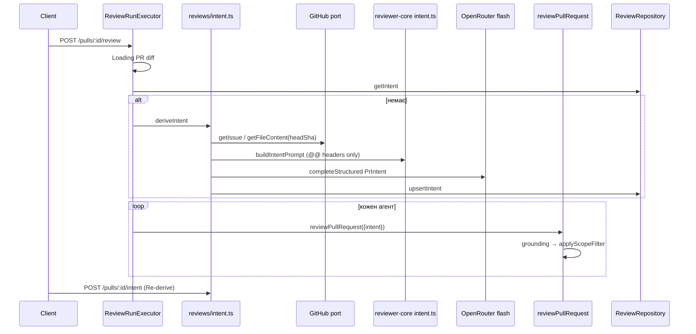

# Intent Layer — план реалізації

## Context
Рев'юер зараз бачить diff і сирий опис PR, але не знає, **навіщо** відкрито PR і що входить у його межі. Через це з'являються коментарі поза scope. Intent Layer робить окремий дешевий виклик (flash-модель через OpenRouter), який повертає структурований intent `{summary, in_scope[], out_of_scope[]}` + confidence + джерела. Intent зберігається для PR, показується карткою на Overview, ін'єктується в промпт рев'юера, а out-of-scope findings відсіюються: лишається максимум один critical як сигнал.

Заготовки вже є, але не підключені: контракт `Intent` (`vendor/shared/contracts/brief.ts`), таблиця `pr_intent` (`server/src/db/schema/reviews.ts:48`), `upsertIntent/getIntent` (`server/src/modules/reviews/repository/pull.repo.ts:47`), feature-model `review_intent` (`vendor/shared/contracts/platform.ts:52`), `resolveFeatureModel` (`server/src/modules/settings/feature-models.ts`, експорт з `settings/index.ts`), UI вибору моделей `SettingsModels.tsx` (уже рендерить `FEATURE_MODELS`), `getIssue` в octokit-адаптері, `wrapUntrusted` та `INJECTION_GUARD` (`reviewer-core/src/prompt.ts`).

**Рішення користувача:** посилання тягнемо лише з GitHub; модель тегує `in_scope`, а core фільтрує; дефолтна модель `openrouter / deepseek/deepseek-v4-flash`; intent рахується автоматично перед рев'ю (якщо його ще немає) + ручний Re-derive; hunk headers передаємо з function context, обрізаними до 160 символів; залишений сигнал отримує префікс `(out of scope) `; read-only агентам додаємо Bash-guard.

**INSIGHTS, що застосовуються:**
- `timeoutMs` не обмежує `completeStructured`, тому виклик обгортаємо в `Promise.race` за зразком `conventions/extract.ts:97`.
- Між модулями імпортуємо через `index.ts`.
- `:free`-моделі не використовуємо.
- Журнал міграцій лише доповнюємо (append-only).
- Дрейф `vendor/shared`: `adapters.ts` і `trace.ts` копіюємо server→client, бо client-копії є підмножиною.
- Label у `wrapUntrusted` є межею довіри.
- У клієнтських тестах `fireEvent`, а не user-event.

## Джерела даних
| kind | Звідки | Cap |
|---|---|---|
| `title` | `pull.title` | 300 символів |
| `description` | `pull.body` (якщо не порожній) | 4000 символів |
| `issue` | `#N`, `Fixes/Closes/Resolves #N`, URL issue/PR того ж репо → `github.getIssue` | ≤5 посилань, 8000 символів кожне |
| `plan_file` | blob-URL того ж репо, відносні шляхи `*.md` (`docs/plan.md`) → новий `github.getFileContent(repo, path, headSha)` | те саме |
| `issue`/`plan_file` зі статусом `unavailable` | Jira, Notion, чужі домени чи репо, 6-те посилання і далі, помилка fetch, немає токена | ≤10 джерел |
| `files` | `diff.raw`: лише рядки `^@@ `, по файлах | ≤100 файлів, ≤20 заголовків на файл, 160 символів |

Жодних довільних URL: SSRF виключено, owner і name беруться з рядка repo, а не з посилання. Шляхи з `..`, абсолютні шляхи й символи поза `[\w./-]` відхиляються.

## Послідовність викликів
1. `POST /pulls/:id/review` → `executeRuns`: `Loading PR diff` (як зараз).
2. `repo.getIntent(pull.id)`. Якщо intent є, лог `Using stored PR intent (head abc1234[, stale — PR head is now def5678])`. Якщо немає, запускається `deriveIntent`:
   1. `resolveFeatureModel(ws,'review_intent')` → `container.llm(provider)`.
   2. `extractIntentLinks(body, repoRef, number)`: чиста функція; GitHub-fetch лише для issue та plan_file, кожен fetch у власному try/catch.
   3. `buildIntentPrompt(...)` (reviewer-core) → `messages` + `sections[]` для логу.
   4. `completeStructured(IntentModelOutput, schemaName 'PrIntent', temperature 0)` у `Promise.race` з `INTENT_TIMEOUT_MS=60s`.
   5. `clampIntentOutput`, `deriveConfidence(sources)` (детерміновано, без самооцінки моделі) → `upsertIntent` з `head_sha`, `model`.
   6. Будь-яка помилка → `info "Intent unavailable — continuing without it: …"`, рев'ю йде далі без intent.
3. Для кожного агента: `reviewPullRequest({..., intent})`. Далі `assemblePrompt` (блок `## PR intent` + `SCOPE_RULE`), схема `ScopedReview`, grounding, `applyScopeFilter`, скор з відфільтрованого списку.
4. `POST /pulls/:id/intent` виконує `loadDiff` + `deriveIntent` синхронно (Re-derive).

## Зміни схеми
Файл `server/src/db/schema/reviews.ts` → `prIntent`:
- TS-властивість `summary: text('intent')`. Колонка в БД не перейменовується.
- Нові колонки:
  - `headSha text NOT NULL`
  - `model text NOT NULL`
  - `confidence text enum(high|medium|low) NOT NULL`
  - `sources jsonb default []`
  - `missingContext jsonb default []`
  - `createdAt now()`

Далі:
- `pnpm db:generate` → `0014_*.sql`, де лише `ADD COLUMN` (таблиця порожня, записувачів нема).
- `rows.ts`: додати `PrIntentRow`.
- `upsertIntent`/`getIntent` повертають рядок, а `toIntentRecord` у `reviews/helpers.ts` мапить його в DTO.

## API і контракти
Обидві копії `vendor/shared` мають бути побайтово однаковими: правимо server-копію й робимо `cp` у client.
- `brief.ts`:
  - `Intent.intent` → `summary`;
  - нові `IntentConfidence`, `IntentSourceKind` (`title|description|issue|plan_file|files`), `IntentSourceStatus` (`used|unavailable`), `IntentSource {kind, ref, status}`.
- `review-api.ts`: `PrIntentRecord = Intent.extend({pr_id, head_sha, model, confidence, sources, missing_context, created_at})`.
- `platform.ts`: для `review_intent` дефолт → `openrouter` / `deepseek/deepseek-v4-flash`.
- `trace.ts`: `PromptAssembly.intent: z.string().nullish()`.
- `adapters.ts`: `GitHubClient.getFileContent(repo, path, ref): Promise<string|null>`. Реалізація в `adapters/github/octokit.ts` (`repos.getContent`, base64; 404 чи не файл → `null`) і в `adapters/mocks.ts` (`files?: Record<string,string>`).
- Маршрути в `server/src/modules/reviews/routes.ts`, тонкі (`IdParams` → `getContext` → service):
  - `GET /pulls/:id/intent` → `PrIntentRecord | null`; 404, якщо PR не з цього workspace.
  - `POST /pulls/:id/intent` → re-derive, rate limit 10/хв (як у `/review`), помилка класифікатора → 502.
- `server/test/contracts.test.ts:73` → `summary`.

## reviewer-core (prompt builder, тег, фільтр)
Новий файл `reviewer-core/src/intent.ts`, чистий (лише zod і `@devdigest/shared`), експортується з `src/index.ts`:
- `IntentModelOutput {summary, in_scope, out_of_scope, missing_context}` без `.max()`; після парсингу `clampIntentOutput`: summary ≤600, списки ≤8×200, missing ≤5.
- `hunkHeaders(diff)`: єдине місце, яке гарантує, що в промпт не потрапляють тіла змін (лише рядки `^@@ `).
- `buildIntentPrompt({title, description, docs, diff})`: кожне джерело загорнуте через `wrapUntrusted` з label `pr-title`, `pr-description`, `issue:<ref>`, `plan_file:<ref>`, `changed-files`. Повертає `{messages, sections}`.
  - `INTENT_SYSTEM` вимагає: лише надані джерела, нічого не вигадувати; недоступне йде в `missing_context`; `out_of_scope` стосується лише feature scope і ніколи не безпеки чи якості; `<untrusted>` вважати даними.
- `deriveConfidence(sources)`:
  - high: є description, ≥1 issue/plan_file зі статусом used і нема unavailable;
  - medium: є description або issue/plan_file;
  - low: лише title і files.
- `renderIntentBlock(intent)`.
- `ScopedReview`: це `Review` з `findings[].in_scope: boolean`, локальний для reviewer-core. Спільний контракт `Finding` не змінюється.
- `applyScopeFilter(findings)`:
  - `in_scope===false` відкидається; якщо тегу нема, finding вважається in scope;
  - `signal` — out-of-scope CRITICAL з найвищою confidence, повертається з title `(out of scope) <title>`;
  - на виході `{kept, dropped, signal}`.

`prompt.ts`:
- `PromptParts.intent?`. Якщо intent є, system отримує `SCOPE_RULE` після `INJECTION_GUARD`, а в user-частині після опису PR з'являється `## PR intent (derived, unverified)` + `wrapUntrusted('pr-intent', …)`; також заповнюється `assembly.intent`.
- `SCOPE_RULE`: будь-який дефект, внесений рядками цього diff, завжди `in_scope: true`; scope ніколи не знижує severity.
- Без intent промпт і схема **побайтово як зараз**.

`review/run.ts`:
- `ReviewInput.intent?`; схема `ScopedReview`, якщо intent є (schemaName лишається `'Review'`).
- Після `groundFindings` виконується `applyScopeFilter` і пишуться події:
  - на кожен відкинутий finding: `info scope filter dropped "<title>" (out of scope)`;
  - підсумок: `result Scope filter: dropped N …; kept 1 critical as signal: "<title>"` або `; no signal kept`.
- `ReviewOutcome.scopeDropped`.

## Server-оркестрація
- `server/src/modules/reviews/helpers.ts` отримує `extractIntentLinks` (чиста функція, дедуплікація, пропускає власний номер PR).
- `constants.ts`: `MAX_INTENT_LINKS=5`, `MAX_INTENT_SOURCES=10`, `INTENT_TIMEOUT_MS=60_000`.
- Новий `server/src/modules/reviews/intent.ts`: `deriveIntent({container, repo, workspaceId, pull, repoRef, diff, log})` → `PrIntentRecord`.
  - Якщо `container.github()` падає, усі GitHub-джерела отримують статус `unavailable`.
  - `sessionId` дорівнює `owner/name#N:intent`.
- `run-executor.ts`:
  - після рядка з diff (≈106) у try/catch резолвимо `intent`; помилка тут ніколи не веде у `failAll`;
  - `runOneAgent(..., intent)` передає `...(intent ? {intent} : {})`;
  - `traceFromBuffer(..., intent)` виставляє `prompt_assembly.intent`.
- Правила onion: у нових файлах лише `import type` з `db/rows`, жодних нових value-імпортів `db/schema` у файлах із baseline, `resolveFeatureModel` через `../settings/index.js`.
- `service.ts`: `getIntent(ws, prId)` і `rederiveIntent(ws, prId, logger)`; другий будує `RunLogger` лише для pino (`[]` runIds).

## UI
- `client/src/lib/api/reviews.ts`:
  - `reviewKeys.intent(prId)`;
  - `useIntent` → `GET` з `PrIntentRecord.nullable()`;
  - `useRederiveIntent` → `POST`, після успіху `setQueryData`.
- `FindingsTab.tsx` `onRunDone`: також інвалідує `intent`.
- Новий компонент `…/pulls/[number]/_components/OverviewTab/_components/IntentCard/` (`IntentCard.tsx`, `index.ts`, `styles.ts`, `IntentCard.test.tsx`), презентаційний:
  - заголовок `INTENT` (`SectionLabel`), badge confidence (high зелений, medium бурштиновий, low приглушений);
  - summary як цитата, дві колонки IN SCOPE (✓) і OUT OF SCOPE (✗);
  - список джерел із бейджем `unavailable`, список `missing_context`, рядок `model · sha7`;
  - badge `stale`, що обчислюється під час рендеру: `head_sha !== pr.head_sha`;
  - кнопка `Re-derive`; у порожньому стані замість неї `Derive intent`.
  - Текст моделі рендериться як звичайний React-текст, без markdown.
- `OverviewTab.tsx` отримує пропси `{prId, headSha, prBody}` і рендерить `<IntentCard>` над Description (тобто перед результатами рев'ю). У `page.tsx:116` передаються нові пропси.
- i18n: у `client/messages/en/brief.json` додається об'єкт `intent.*` (`inScope`, `outOfScope`, `confidence.*`, `sources`, `sourceKind.*`, `unavailable`, `stale`, `rederive`, `derive`, `empty`, `missingContext`, `derivedWith`).

## Налаштування
`SettingsModels.tsx` уже показує `FEATURE_MODELS`, тож змінюється лише дефолт `review_intent`. Модель рев'ю лишається окремою (`agent.model`).

## Логування (через RunLogger, у Live Log кожного run)
- `tool` `Deriving PR intent…`
- `info` `intent: model openrouter/deepseek/deepseek-v4-flash`
- `info` `intent: prompt — system ~N tok, pr-title ~N tok, pr-description ~N tok, issue:#12 ~N tok, plan_file:docs/plan.md ~N tok, changed-files ~N tok (14 files, 37 hunk headers; no diff bodies)` — підрахунок через `container.tokenizer.count`.
- `info` `intent: sources — title used; description used; issue #12 used; plan_file docs/plan.md used; issue jira.example.com/browse/X-1 unavailable`
- `result` `Deriving PR intent done (Nms) — confidence medium, 3 in scope / 2 out of scope, cost $…`
- Помилка класифікатора логується як `info`, а не `error`, бо `error` викликає тост.

Не логуються: тексти body, issue, файлів і summary; diff; query-рядки URL; ключі. У `data` події жодного тексту, бо він дзеркалиться в pino.

## Guard для read-only агентів
- Новий `.claude/agents/scripts/readonly-bash-guard.sh`: PreToolUse-hook з matcher `Bash`, за зразком `path-guard.sh`.
  - Забороняє: перенаправлення `>`/`>>` (крім `>/dev/null`, `2>&1`), `tee`, `rm`, `mv`, `cp`, `touch`, `mkdir`, `sed -i`, `perl -i`, `git commit|add|push|checkout|reset|stash|apply`, `npm|pnpm install`, `db:migrate`, `db:generate`, `chmod`.
  - Відповідь `permissionDecision: deny` з поясненням.
- Тест `readonly-bash-guard.test.sh`, як `path-guard.test.sh`: дозволені приклади (`grep`, `git diff`, `pnpm test`, `pnpm arch`) і заборонені.
- Hook підключається у frontmatter `planner.md`, `researcher.md`, `architecture-reviewer.md`, `plan-verifier.md`; `.claude/agents/README.md` оновлюється одним рядком.

## Кроки
1. **Контракти й дефолтна модель.** Змінити 5 файлів `vendor/shared` (server, потім `cp` у client) і `contracts.test.ts`. Перевірка: `diff -r` цих файлів між копіями порожній.
2. **Схема БД.** Схема, `pnpm db:generate`, repo-методи, `toIntentRecord`.
3. **GitHub.** `getFileContent` в octokit і mock.
4. **reviewer-core `intent.ts`.** Модуль + `reviewer-core/test/intent.test.ts`, у якому:
   - рядок `+SECRET_BODY_LINE` не потрапляє в messages, а `@@` є;
   - `</untrusted>` екранується;
   - спрацьовують caps;
   - перевірено таблицю confidence;
   - перевірено `applyScopeFilter` для чотирьох кейсів, зокрема префікс сигналу.
5. **prompt і run.** Зміни `prompt.ts` та `run.ts`; розширити `prompt.test.ts` і `run.test.ts`: без intent промпт deep-equal з baseline; з intent є блок і `SCOPE_RULE`, WARNING відкидається, CRITICAL лишається; `scopeDropped`.
6. **Посилання.** `extractIntentLinks` + `server/test/intent-links.test.ts` (усі варіанти посилань, `../` відхиляється, Jira → external без query, cap, dedupe).
7. **Оркестрація.** `reviews/intent.ts` + інтеграція в `run-executor`.
8. **Service, routes, it-тест.**
   - Змінити service і routes.
   - `server/test/intent.it.test.ts` має показати:
     - рядок `pr_intent` з `head_sha` та моделлю;
     - `PrIntent`-запит не містить рядків `+`/`-`/контексту;
     - `docs/plan.md` отримує статус used;
     - GET і POST працюють;
     - без ключа рев'ю все одно `done`, у лозі є `Intent unavailable`;
     - повторний run не викликає класифікатор удруге.
   - `reviews.it.test.ts` (`appWith`): mock openrouter + github.
9. **Клієнтські хуки.** Хуки й інвалідація.
10. **UI.** `IntentCard` з тестом (повна картка + порожній стан), `OverviewTab`, `page.tsx`, i18n.
11. **e2e.** У `e2e/specs/02-repo-pulls-detail.flow.json` додати крок `wait --text <intent.empty>`.
12. **Агенти.** Read-only Bash-guard і його тест.

## Конвеєр агентів
1. Чернетку плану переносимо в `docs/cc-plans/2026-09-23+intent-layer.md`.
2. **implementer** виконує кроки 1–12 і запускає typecheck, test та arch.
3. **architecture-reviewer** і **plan-verifier** паралельно й незалежно перевіряють результат. Обидва read-only і вже під Bash-guard.
4. Виправляємо знахідки; якщо треба, повторюємо крок 3.
5. Ручна перевірка за чеклістом (див. «Перевірка»).
6. **doc-writer** документує вже перевірену реалізацію, звіряючи кожне твердження з кодом, а не з планом. Що він пише:
   - `server/docs/intent-layer.md`: потік від імпорту PR до рев'ю (Mermaid sequence), джерела контексту й ліміти, поведінка без опису, обробка plan і spec посилань та `unavailable`, кешування (`head_sha`, stale, Re-derive), правила scope-фільтра і critical-сигналу, формат логів і що в них редагується;
   - короткий розділ і посилання в `reviewer-core/docs/README.md` (`intent.ts`, `SCOPE_RULE`, `applyScopeFilter`);
   - рядок у `docs/architecture.md` у розділі «Data flow» (крок Intent перед Review).
   
   Правила: код, план, CLAUDE.md та INSIGHTS.md не редагує.
7. `/pr-self-review` → коміт (план у тому ж коміті) → PR у `otkachuk777/dev-digest`.
8. `/engineering-insights`.

## Ризики
- **Prompt injection через body/ticket → intent → рев'юер.** Захист:
  - `wrapUntrusted` на всіх входах, caps, clamp;
  - confidence рахує код, а не модель;
  - `SCOPE_RULE` + `INJECTION_GUARD`;
  - critical-сигнал не відсіюється.
  
  Out-of-scope WARNING про безпеку все ж може відсіятися; це свідомий наслідок специфікації.
- **Застарілий intent.** Рев'ю використовує збережений intent навіть після push; картка показує `stale`, користувач натискає Re-derive.
- **Вартість intent не входить у `agent_runs.cost_usd`**, лише в лог, тож колонка вартості PR трохи занижує суму.
- **NOT NULL-колонки** передбачають порожню `pr_intent`. Якщо в якомусь середовищі там є рядки, міграція впаде.
- **deepseek-v4-flash** не перевірено на strict json_schema, тому `.max()` не ставимо, а робимо clamp у коді. На старті варто зробити живу пробу.
- **Інші `*.it.test.ts`**, що запускають рев'ю, можуть піти в реальну мережу, якщо локально є ключі. Під час кроку 8 треба це перевірити.
- **Blob-посилання** тягнуться з head SHA, а не з `<ref>` у посиланні.
- **Bash-guard** працює на рівні шаблонів і не є пісочницею; заборонений список ширший за потрібне.

## Перевірка
Команди:
- `cd server && pnpm typecheck && pnpm test && pnpm arch` (потрібен Docker для `*.it.test.ts`)
- `cd reviewer-core && npm run typecheck && npm test`
- `cd client && pnpm typecheck && pnpm test && pnpm arch`
- `cd e2e && npm run typecheck && npm run e2e:hermetic`
- `bash .claude/agents/scripts/readonly-bash-guard.test.sh`

Ручний чекліст на живому застосунку (реальні OPENROUTER і GITHUB_TOKEN; PR, у body якого є `docs/plan.md`, `#N` і Jira-посилання):
1. Картка intent правильно описує мету PR; plan і issue мають статус used, Jira — unavailable, confidence ≤ medium.
2. Класифікатор працює на окремій дешевій моделі: у Live Log `intent: model …deepseek-v4-flash` відрізняється від моделі агента, а в OpenRouter видно дві сесії (`:intent` і агентська).
3. У запиті класифікатора немає тіл змін: у лозі `no diff bodies`, а it-тест №2 це доводить.
4. Plan чи spec з опису справді враховані: `plan_file docs/plan.md used`, і суть плану видно в summary та scope.
5. Read-only агенти не можуть змінювати файли: `disallowedTools` Write/Edit + Bash-guard; тест guard зелений; пробний запуск planner з `echo x > f` отримує deny.
6. Лог показує склад промпта (назви секцій, `~N tok`) без секретів, тексту й коду.
7. Після push картка показує `stale`, Re-derive його прибирає.
8. Скріншот картки й Live Log через браузер.

## Зміни під час реалізації (2026-09-23)
- **Дефолтна модель `review_intent` → `google/gemini-2.5-flash-lite`** (замість `deepseek/deepseek-v4-flash`). Живий замір на PR #31 quick-blog (74 файли, 97 hunk headers, ~2.7k tok промпта): deepseek ~71 с (двічі поспіль 502 через таймаут 60 с), gemini flash-lite ~2 с, якість intent порівнянна. Рішення користувача; таймаут лишився 60 с.
- **Root-level spec-файли:** `REL_MD_RE` не бачив `SPEC.md` без каталогу (знайдено на живому тесті). Тепер `(?<![\w./-])((?:[\w-]+\/)*[\w.-]+\.md)`; lookbehind не дає `../x.md` дати `x.md`. Тест додано.
- **Scope-фільтр лише з intent:** без intent не виконується й не пише подію (було `Scope filter: dropped 0` у кожному run). Тег `in_scope` вирізається з findings (`stripScope`).
- **Ліміт джерел:** останній слот із 10 зарезервовано для `files`.
- **Re-derive:** `created_at` оновлюється при upsert; сирі помилки SDK → `ExternalServiceError` (502).
- **it-тест:** додатково перевіряє відсутність `-`- і контекстних рядків diff у запиті класифікатора.
- Відоме обмеження: посилання на spec **всередині** тексту issue (другий рівень) не підтягуються; класифікатор чесно пише їх у `missing_context`.
- **Міграція (після PR-рев'ю):** `0014_busy_lionheart` видалено через `drizzle-kit drop` і замінено двома: `0014_clear_pr_intent_cache` (custom, `DELETE FROM pr_intent` — кеш, перераховується) + `0015_pr_intent_layer` (ADD COLUMN + `CHECK (confidence IN ('high','medium','low'))`). Причина: 16 гілок курсу пишуть у `pr_intent`, тож на їхній БД NOT NULL без DEFAULT падав. Перевірено на легасі-рядку.
