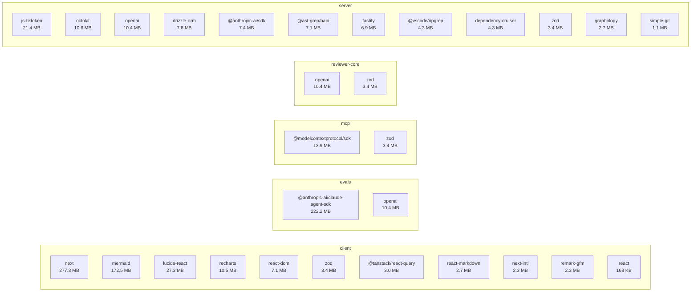
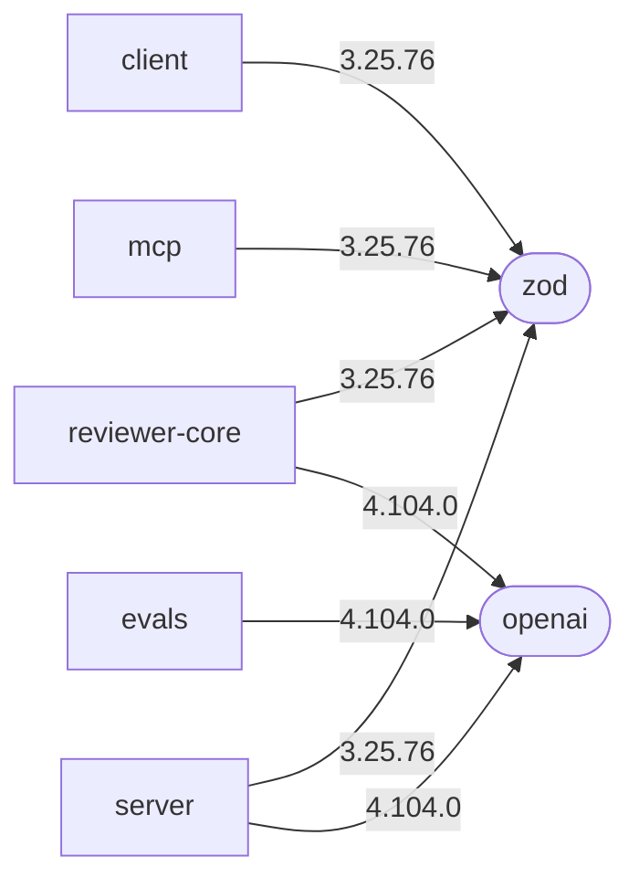
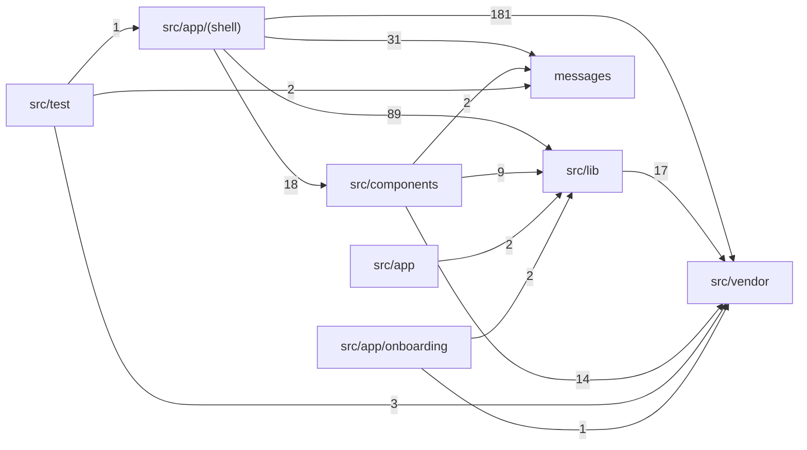
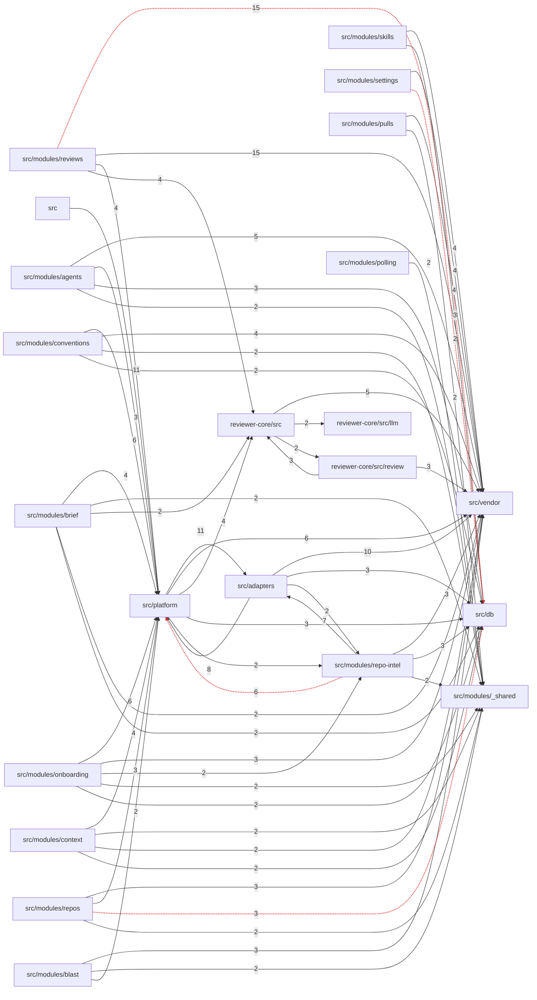

# Dependency report — 2026-10-07

## 1. Scope

Проаналізовано **6** пакетів: `client`, `e2e`, `evals`, `mcp`, `reviewer-core`, `server`. Код між пакетами спільний через tsconfig path alias (`@devdigest/*`), а не через workspace-залежності.

| Пакет | Менеджер | prod / dev deps | node_modules | audit | outdated | граф імпортів |
| --- | --- | --- | --- | --- | --- | --- |
| client | pnpm | 11 / 13 | 699.5 MB | ok | ok | ok |
| e2e | npm | 0 / 3 | 36.7 MB | ok | ok | skipped |
| evals | pnpm | 2 / 5 | 332.2 MB | ok | ok | skipped |
| mcp | npm | 2 / 5 | 82.9 MB | ok | ok | skipped |
| reviewer-core | npm | 2 / 4 | 156.3 MB | ok | ok | skipped |
| server | pnpm | 22 / 8 | 272.4 MB | ok | ok | ok |

| Метрика | Значення |
| --- | --- |
| node_modules сумарно (диск) | 1580.1 MB |
| Вразливостей (audit) | 151 |
| Пакетів з major-оновленням | 41 |
| Пакетів зі зсувом версій між модулями | 3 |
| Кандидатів на видалення (unused) | 2 |

### Limitations

- e2e.internal: skipped — no .dependency-cruiser.cjs in module
- evals.internal: skipped — no .dependency-cruiser.cjs in module
- mcp.internal: skipped — no .dependency-cruiser.cjs in module
- reviewer-core.internal: skipped — no .dependency-cruiser.cjs in module
- unused — евристика (текстовий пошук по коду й конфігах), не доказ: перевіряй перед видаленням.
- Розмір = місце на диску в node_modules, не розмір клієнтського бандла.
- Звіт — тест першого запуску skill: поради P1–P3 потребують перевірки розробниками перед виконанням.
- Модуль evals відсутній у root CLAUDE.md, але має package.json і підхоплений автоматично.
- Виправлено після перевірки: початкова порада «винести mermaid в dynamic import» була хибною — імпорт уже динамічний.

## 2. Dependency graph

### 2.1 Зовнішні (npm) залежності по пакетах — топ за розміром, з транзитивними

### 2.2 npm-пакети, спільні для кількох модулів (підпис ребра = встановлена версія)

### 2.3 Внутрішні залежності: модулі коду і зв'язки між пакетами

Внутрішні = код репозиторію (модулі, path-alias, імпорти між пакетами); окремо від зовнішніх npm-пакетів вище.

**client** — 462 файлів, циклів: 0, порушень правил: 0.

**server** — 200 файлів, циклів: 6, порушень правил: 29.

_Показано 60 найважчих зв'язків з 112; червоні пунктирні — порушення правил dependency-cruiser._

Імпорти між пакетами. `alias → index` йде через публічну точку входу; `relative` або глибокий шлях її обходить.

| Пакет-споживач | Специфікатор | Спосіб | Публічна точка входу | Файлів |
| --- | --- | --- | --- | --- |
| server | @devdigest/reviewer-core | alias | так | 11 |

Без внутрішнього графа: e2e: no .dependency-cruiser.cjs in module; evals: no .dependency-cruiser.cjs in module; mcp: no .dependency-cruiser.cjs in module; reviewer-core: no .dependency-cruiser.cjs in module.

## 3. Sizes

`Власний` — файли самого пакета. `З транзитивними` — пакет + усе, що він тягне (спільні транзитивні рахуються в кожному пакеті, тому сума рядків більша за підсумок модуля). `(lazy)` — пакет імпортується лише через `import()`, тож у початковий бандл не потрапляє.

### client

pnpm · node_modules на диску: **699.5 MB** · оголошені залежності разом з транзитивними: **603.3 MB** (473 пакетів) · dependencies: 11, devDependencies: 13

| Пакет | Тип | Версія | Власний | З транзитивними | Транзит. пакетів | % модуля | Імпорт (static/dynamic) |
| --- | --- | --- | --- | --- | --- | --- | --- |
| next | prod | 15.5.19 | 133.0 MB | 277.3 MB | 17 | 46% | 26/0 |
| mermaid | prod | 12.0.0 | 118.8 MB | 172.5 MB | 116 | 29% | 0/1 (lazy) |
| vitest | dev | 2.1.9 | 1.6 MB | 31.1 MB | 43 | 5% | 57/0 |
| lucide-react | prod | 0.469.0 | 27.3 MB | 27.3 MB | 0 | 5% | 1/0 |
| typescript | dev | 5.9.3 | 22.5 MB | 22.5 MB | 0 | 4% | — |
| @tailwindcss/postcss | dev | 4.3.0 | 97 KB | 15.7 MB | 22 | 3% | — |
| jsdom | dev | 25.0.1 | 3.0 MB | 13.2 MB | 59 | 2% | — |
| @vitejs/plugin-react | dev | 4.7.0 | 59 KB | 11.9 MB | 48 | 2% | — |
| recharts | prod | 2.15.4 | 4.4 MB | 10.5 MB | 40 | 2% | 2/0 |
| react-dom | prod | 19.2.7 | 7.0 MB | 7.1 MB | 1 | 1% | — |
| dependency-cruiser | dev | 18.3.1 | 999 KB | 4.7 MB | 43 | 1% | — |
| zod | prod | 3.25.76 | 3.4 MB | 3.4 MB | 0 | 1% | 12/0 |
| @tanstack/react-query | prod | 5.101.0 | 839 KB | 3.0 MB | 1 | 1% | 27/0 |
| react-markdown | prod | 9.1.0 | 51 KB | 2.7 MB | 81 | 0% | 1/0 |
| @types/node | dev | 22.19.19 | 2.3 MB | 2.4 MB | 1 | 0% | — |

### e2e

npm · node_modules на диску: **36.7 MB** · оголошені залежності разом з транзитивними: **35.9 MB** (7 пакетів) · dependencies: 0, devDependencies: 3

| Пакет | Тип | Версія | Власний | З транзитивними | Транзит. пакетів | % модуля | Імпорт (static/dynamic) |
| --- | --- | --- | --- | --- | --- | --- | --- |
| typescript | dev | 5.9.3 | 22.5 MB | 22.5 MB | 0 | 63% | — |
| tsx | dev | 4.23.13 | 520 KB | 10.9 MB | 3 | 30% | — |
| @types/node | dev | 22.20.3 | 2.3 MB | 2.4 MB | 1 | 7% | — |

### evals

pnpm · node_modules на диску: **332.2 MB** · оголошені залежності разом з транзитивними: **307.8 MB** (98 пакетів) · dependencies: 2, devDependencies: 5

| Пакет | Тип | Версія | Власний | З транзитивними | Транзит. пакетів | % модуля | Імпорт (static/dynamic) |
| --- | --- | --- | --- | --- | --- | --- | --- |
| @anthropic-ai/claude-agent-sdk | prod | 0.3.198 | 3.5 MB | 222.2 MB | 1 | 72% | — |
| vitest | dev | 2.1.9 | 1.6 MB | 31.1 MB | 43 | 10% | — |
| typescript | dev | 5.9.3 | 22.5 MB | 22.5 MB | 0 | 7% | — |
| tsx | dev | 4.22.4 | 506 KB | 21.0 MB | 3 | 7% | — |
| openai | prod | 4.104.0 | 4.0 MB | 10.4 MB | 38 | 3% | — |
| @types/node | dev | 22.20.0 | 2.3 MB | 2.4 MB | 1 | 1% | — |
| gray-matter | dev | 4.0.3 | 38 KB | 812 KB | 9 | 0% | — |

### mcp

npm · node_modules на диску: **82.9 MB** · оголошені залежності разом з транзитивними: **90.7 MB** (142 пакетів) · dependencies: 2, devDependencies: 5

| Пакет | Тип | Версія | Власний | З транзитивними | Транзит. пакетів | % модуля | Імпорт (static/dynamic) |
| --- | --- | --- | --- | --- | --- | --- | --- |
| vitest | dev | 2.1.9 | 1.6 MB | 31.2 MB | 43 | 34% | — |
| typescript | dev | 5.9.3 | 22.5 MB | 22.5 MB | 0 | 25% | — |
| tsx | dev | 4.23.15 | 388 KB | 20.9 MB | 3 | 23% | — |
| esbuild | dev | 0.28.2 | 10.2 MB | 20.3 MB | 1 | 22% | — |
| @modelcontextprotocol/sdk | prod | 1.30.1 | 4.1 MB | 13.9 MB | 93 | 15% | — |
| zod | prod | 3.25.76 | 3.4 MB | 3.4 MB | 0 | 4% | — |
| @types/node | dev | 22.20.4 | 2.3 MB | 2.4 MB | 1 | 3% | — |

### reviewer-core

npm · node_modules на диску: **156.3 MB** · оголошені залежності разом з транзитивними: **68.9 MB** (87 пакетів) · dependencies: 2, devDependencies: 4

| Пакет | Тип | Версія | Власний | З транзитивними | Транзит. пакетів | % модуля | Імпорт (static/dynamic) |
| --- | --- | --- | --- | --- | --- | --- | --- |
| typescript | dev | 5.9.3 | 22.5 MB | 22.5 MB | 0 | 33% | — |
| vitest | dev | 2.1.9 | 1.6 MB | 21.8 MB | 43 | 32% | — |
| tsx | dev | 4.23.13 | 520 KB | 10.9 MB | 3 | 16% | — |
| openai | prod | 4.104.0 | 4.0 MB | 10.4 MB | 38 | 15% | — |
| zod | prod | 3.25.76 | 3.4 MB | 3.4 MB | 0 | 5% | — |
| @types/node | dev | 22.20.3 | 2.3 MB | 2.4 MB | 1 | 3% | — |

### server

pnpm · node_modules на диску: **272.4 MB** · оголошені залежності разом з транзитивними: **228.9 MB** (422 пакетів) · dependencies: 22, devDependencies: 8

| Пакет | Тип | Версія | Власний | З транзитивними | Транзит. пакетів | % модуля | Імпорт (static/dynamic) |
| --- | --- | --- | --- | --- | --- | --- | --- |
| drizzle-kit | dev | 0.30.6 | 7.4 MB | 47.1 MB | 22 | 21% | — |
| vitest | dev | 2.1.9 | 1.6 MB | 31.1 MB | 43 | 14% | — |
| @testcontainers/postgresql | dev | 11.14.0 | 17 KB | 28.8 MB | 157 | 13% | — |
| testcontainers | dev | 11.14.0 | 243 KB | 28.8 MB | 156 | 13% | — |
| typescript | dev | 5.9.3 | 22.5 MB | 22.5 MB | 0 | 10% | — |
| js-tiktoken | prod | 1.0.21 | 21.4 MB | 21.4 MB | 1 | 9% | 1/0 |
| tsx | dev | 4.22.4 | 506 KB | 20.9 MB | 3 | 9% | — |
| octokit | prod | 4.1.4 | 50 KB | 10.6 MB | 32 | 5% | 1/0 |
| openai | prod | 4.104.0 | 4.0 MB | 10.4 MB | 38 | 5% | 3/0 |
| drizzle-orm | prod | 0.38.4 | 7.8 MB | 7.8 MB | 0 | 3% | 36/0 |
| @anthropic-ai/sdk | prod | 0.33.1 | 1.0 MB | 7.4 MB | 38 | 3% | 1/0 |
| @ast-grep/napi | prod | 0.43.0 | 352 KB | 7.1 MB | 1 | 3% | 1/0 |
| fastify | prod | 5.8.5 | 2.6 MB | 6.9 MB | 47 | 3% | 19/0 |
| @vscode/ripgrep | prod | 1.18.0 | 4 KB | 4.3 MB | 1 | 2% | — |
| dependency-cruiser | prod | 17.4.3 | 963 KB | 4.3 MB | 42 | 2% | 1/0 |

## 4. Findings & Priorities

### P0 — Негайно

| Що | Модуль | Чому (факти) | Дія | Зусилля |
| --- | --- | --- | --- | --- |
| Оновити simple-git до ≥4.0.1 | server | critical advisory у prod-залежності simple-git (@simple-git/argv-parser ≥2.0.1); фікс доступний. | bump simple-git (major 3.36→4.0.2) у server/package.json через pnpm, прогнати server-тести. | M |
| Закрити high-advisory fastify, drizzle-orm, fast-uri, find-my-way | server | усі в prod-замиканні; fix: fastify ≥5.12.2, drizzle-orm ≥0.45.2, fast-uri ≥3.1.4, find-my-way ≥9.7.0. | pnpm update цих пакетів (minor/patch), перевірити pnpm audit. | S |
| Оновити next ≥15.5.21 (і sharp ≥0.35.0) | client | high-advisory у next 15.5.19 та sharp, обидва ship у prod; next = 284 MB із транзитивними (46% замикання). | pnpm update next в межах 15.x; не стрибати на 16 в цьому ж PR. | S |
| npm audit fix для @modelcontextprotocol/sdk та form-data | mcp | high-advisory у prod-залежності @modelcontextprotocol/sdk; fixAvailable через npm audit fix (reviewer-core: form-data, аналогічно). | npm audit fix у mcp і reviewer-core; перевірити diff lock-файлу. | S |

### P1 — Найближчий спринт

| Що | Модуль | Чому (факти) | Дія | Зусилля |
| --- | --- | --- | --- | --- |
| Вирівняти версії між модулями | усі | @types/node 22.19.19…22.20.4 у 6 модулях, tsx 4.22.4 vs 4.23.15, dependency-cruiser 18.3.1 (client) vs 17.4.3 (server). | одна версія на пакет; для dependency-cruiser підняти server до 18.x разом з перевіркою pnpm arch. | S |
| Розібрати 6 циклів і порушення arch у server | server | depcruise: 6 циклічних залежностей, 29 порушень правил. | виправити імпорти за skill onion-architecture; baseline не регенерувати. | L |

### P2 — Планово

| Що | Модуль | Чому (факти) | Дія | Зусилля |
| --- | --- | --- | --- | --- |
| Оновити vitest 2→5 одним PR у всіх модулях | усі | vitest 2.1.9 у 5 модулях; tinypool/vite critical+high тягнуться через нього (mcp, reviewer-core, evals); ≈22–32 MB на модуль. | окремий PR на vitest 5 + vite ≥6.4.3, без feature-змін. | M |
| Планові major-міграції: zod 3→4, openai 4→7, typescript 5→7 | client, server, mcp, reviewer-core, evals | zod/openai/typescript відстають на major у 4–6 модулях; zod у client+server+mcp+reviewer-core, openai у server+reviewer-core+evals. | спочатку reviewer-core і server (спільний vendor/shared), потім решта; читати changelog. | L |

### Info — До відома, без дій зараз

| Що | Модуль | Чому (факти) | Дія | Зусилля |
| --- | --- | --- | --- | --- |
| Прибрати @anthropic-ai/claude-agent-sdk із критичного шляху evals або не ставити в CI | evals | 227 MB із транзитивними = 72% замикання evals. | перевірити, чи потрібен у CI; інакше optional install. | S |
| Перевірити, що mermaid лишається в окремому chunk | client | ≈172 MB із транзитивними (28% замикання client), але імпорт уже динамічний (MermaidDiagram.tsx:55); виносити нічого. | після next build переглянути, що mermaid не в initial JS (@next/bundle-analyzer), інакше нічого не робити. | S |

### Evidence: вразливості

| Модуль | Пакет | Severity | Prod? | Опис | Фікс |
| --- | --- | --- | --- | --- | --- |
| client | vitest | critical | dev | When Vitest UI server is listening, arbitrary file can be read and executed | >=3.2.6 |
| client | next | critical | так | Next.js: Unauthenticated Remote Code Execution on windows-hosted servers | >=15.5.24 |
| client | next | critical | так | Next.js: Unauthenticated Remote Code Execution in Image Optimization API when AVIF files are used | >=15.5.24 |
| client | tinypool | critical | dev | Tinypool: Prototype Pollution gadget in worker options leads to Remote Code Execution | >=2.1.1 |
| client | tinypool | critical | dev | Tinypool: Prototype Pollution Gadget to RCE in run() options | >=2.1.2 |
| evals | vitest | critical | dev | When Vitest UI server is listening, arbitrary file can be read and executed | >=3.2.6 |
| evals | proxy-addr | critical | dev | proxy-addr vulnerable to IP spoofing via IPv4-mapped IPv6 trust subnet | >=2.0.8 |
| evals | tinypool | critical | dev | Tinypool: Prototype Pollution gadget in worker options leads to Remote Code Execution | >=2.1.1 |
| evals | tinypool | critical | dev | Tinypool: Prototype Pollution Gadget to RCE in run() options | >=2.1.2 |
| mcp | tinypool | critical | dev | Tinypool: Prototype Pollution gadget in worker options leads to Remote Code Execution | vitest@5.0.3 |
| mcp | vitest | critical | dev | When Vitest UI server is listening, arbitrary file can be read and executed | vitest@5.0.3 |
| reviewer-core | tinypool | critical | dev | Tinypool: Prototype Pollution gadget in worker options leads to Remote Code Execution | vitest@5.0.3 |
| reviewer-core | vitest | critical | dev | When Vitest UI server is listening, arbitrary file can be read and executed | vitest@5.0.3 |
| server | vitest | critical | dev | When Vitest UI server is listening, arbitrary file can be read and executed | >=3.2.6 |
| server | @simple-git/argv-parser | critical | так | simple-git: `VISUAL` editor environment variable is omitted from unsafe editor detection | >=2.0.1 |
| server | simple-git | critical | так | simple-git unsafe-operation guard does not block trailer command configuration | >=4.0.1 |
| server | tinypool | critical | dev | Tinypool: Prototype Pollution gadget in worker options leads to Remote Code Execution | >=2.1.1 |
| server | tinypool | critical | dev | Tinypool: Prototype Pollution Gadget to RCE in run() options | >=2.1.2 |
| server | shell-quote | critical | dev | shell-quote: `quote()` command injection via a line terminator in a token after a `{ comment }` token | >=1.11.0 |
| client | form-data | high | dev | form-data: CRLF injection in form-data via unescaped multipart field names and filenames | >=4.0.6 |
| client | vite | high | dev | vite: `server.fs.deny` bypass on Windows alternate paths | >=6.4.3 |
| client | sharp | high | так | sharp inherited vulnerabilities in libvips: CVE-2026-33327, CVE-2026-33328, CVE-2026-35590, CVE-2026-35591 | >=0.35.0 |
| client | next | high | так | Next.js: Denial of Service in App Router using Server Actions | >=15.5.21 |
| client | next | high | так | Next.js: Server-Side Request Forgery in Server Actions on custom servers | >=15.5.21 |
| client | next | high | так | Next.js: Server-Side Request Forgery in rewrites via attacker-controlled destination hostname | >=15.5.21 |
| client | postcss | high | так | PostCSS: Arbitrary file read and information disclosure via attacker-controlled sourceMappingURL in CSS comments | >=8.5.12 |
| client | nanoid | high | так | nanoid: non-secure generators can loop indefinitely with negative size | >=3.3.16 |
| client | nanoid | high | так | nanoid: custom generators can loop indefinitely when size is zero | >=3.3.18 |
| client | postcss | high | так | PostCSS: Path Traversal in Previous Source Map Auto-Loading (sourceMappingURL) leads to Arbitrary .map File Disclosure | >=8.5.18 |
| client | browserslist | high | dev | Browserslist: Unbounded memory growth (no cache eviction) via distinct query results, leading to eventual OOM | >=4.28.7 |
| client | browserslist | high | dev | Browserslist: Uncaught crash / prototype write via untrusted browserslist-stats.json custom stats (normalizeStats) | >=4.28.7 |
| client | sharp | high | так | sharp: Vulnerabilities in libheif: GHSA-g89c-p67h-r497 and GHSA-2jg2-4ch7-h545 | >=0.35.4 |
| client | source-map-js | high | так | source-map-js allows event-loop denial of service through indexed source-map section offsets | >=1.2.2 |
| client | sharp | high | так | sharp : Vulnerability in librsvg dependency CVE-2026-96889 | >=0.35.5 |
| evals | vite | high | dev | vite: `server.fs.deny` bypass on Windows alternate paths | >=6.4.3 |
| evals | fast-uri | high | dev | fast-uri vulnerable to host confusion via literal backslash authority delimiter | >=3.1.4 |
| evals | fast-uri | high | dev | fast-uri vulnerable to host confusion via backslash authority introducer | >=3.1.5 |
| evals | ip-address | high | dev | ip-address: Address4 decodes leading-zero octets as decimal while resolvers decode them as octal, allowing SSRF and trust-boundary bypass | >=10.3.1 |
| evals | js-yaml | high | dev | JS-YAML: Quadratic CPU consumption in !!omap resolution (3.x and 4.x) — CVE-2026-59870 fix not backported | >=3.15.1 |
| evals | nanoid | high | dev | nanoid: non-secure generators can loop indefinitely with negative size | >=3.3.16 |
| evals | nanoid | high | dev | nanoid: custom generators can loop indefinitely when size is zero | >=3.3.18 |
| evals | postcss | high | dev | PostCSS: Path Traversal in Previous Source Map Auto-Loading (sourceMappingURL) leads to Arbitrary .map File Disclosure | >=8.5.18 |
| evals | fast-uri | high | dev | fast-uri vulnerable to host confusion via skipped IDN canonicalization on scheme-relative references | >=3.1.6 |
| evals | fast-uri | high | dev | fast-uri vulnerable to server-side request forgery via malformed IPv6 normalization | >=3.1.6 |
| evals | fast-uri | high | dev | fast-uri vulnerable to server-side request forgery via repeated hostname percent-decoding | >=3.1.6 |
| evals | fast-uri | high | dev | fast-uri vulnerable to host confusion via percent-encoded scheme normalization | >=3.1.6 |
| evals | js-yaml | high | dev | js-yaml: maxTotalMergeKeys does not limit CPU use for empty merge sources | >=3.15.2 |
| evals | fast-uri | high | dev | fast-uri vulnerable to authority injection via an unvalidated port in serialize | >=3.1.7 |
| evals | source-map-js | high | dev | source-map-js allows event-loop denial of service through indexed source-map section offsets | >=1.2.2 |
| evals | @modelcontextprotocol/sdk | high | dev | MCP TypeScript SDK: OAuth client could send credentials to an authorization server chosen by the MCP server | >=1.31.0 |
| mcp | @modelcontextprotocol/sdk | high | так | MCP TypeScript SDK: OAuth client could send credentials to an authorization server chosen by the MCP server | npm audit fix |
| mcp | source-map-js | high | dev | source-map-js allows event-loop denial of service through indexed source-map section offsets | npm audit fix |
| mcp | vite | high | dev | Vite Vulnerable to Path Traversal in Optimized Deps `.map` Handling | vitest@5.0.3 |
| reviewer-core | form-data | high | так | form-data: CRLF injection in form-data via unescaped multipart field names and filenames | npm audit fix |
| reviewer-core | nanoid | high | dev | nanoid: non-secure generators can loop indefinitely with negative size | npm audit fix |
| reviewer-core | postcss | high | dev | PostCSS: incomplete fix of GHSA-6g55-p6wh-862q — attacker-controlled sourceMappingURL reads arbitrary .map files when `from` is unset | npm audit fix |
| reviewer-core | source-map-js | high | dev | source-map-js allows event-loop denial of service through indexed source-map section offsets | npm audit fix |
| reviewer-core | vite | high | dev | Vite Vulnerable to Path Traversal in Optimized Deps `.map` Handling | vitest@5.0.3 |
| server | drizzle-orm | high | так | Drizzle ORM has SQL injection via improperly escaped SQL identifiers | >=0.45.2 |
| server | form-data | high | так | form-data: CRLF injection in form-data via unescaped multipart field names and filenames | >=4.0.6 |
| server | vite | high | dev | vite: `server.fs.deny` bypass on Windows alternate paths | >=6.4.3 |
| server | brace-expansion | high | dev | brace-expansion: DoS via exponential-time expansion of consecutive non-expanding {} groups | >=2.1.2 |
| server | shell-quote | high | dev | shell-quote: Quadratic-complexity Denial of Service in `parse()` (CWE-407) | >=1.9.0 |
| server | fast-uri | high | так | fast-uri vulnerable to host confusion via literal backslash authority delimiter | >=3.1.4 |
| server | find-my-way | high | так | find-my-way: DDoS with HTTP2 | >=9.7.0 |
| server | brace-expansion | high | dev | brace-expansion: DoS via unbounded expansion length causing an out-of-memory process crash | >=2.1.3 |
| server | fast-uri | high | так | fast-uri vulnerable to host confusion via backslash authority introducer | >=3.1.5 |
| server | brace-expansion | high | dev | brace-expansion: DoS via unbounded intermediate arrays, bypassing the CVE-2026-14257 mitigation | >=2.1.4 |
| server | nanoid | high | dev | nanoid: non-secure generators can loop indefinitely with negative size | >=3.3.16 |
| server | nanoid | high | dev | nanoid: custom generators can loop indefinitely when size is zero | >=3.3.18 |
| server | postcss | high | dev | PostCSS: Path Traversal in Previous Source Map Auto-Loading (sourceMappingURL) leads to Arbitrary .map File Disclosure | >=8.5.18 |
| server | fast-uri | high | так | fast-uri vulnerable to server-side request forgery via malformed IPv6 normalization | >=3.1.6 |
| server | fast-uri | high | так | fast-uri vulnerable to server-side request forgery via repeated hostname percent-decoding | >=3.1.6 |
| server | fast-uri | high | так | fast-uri vulnerable to host confusion via percent-encoded scheme normalization | >=3.1.6 |
| server | fast-uri | high | так | fast-uri vulnerable to host confusion via failed IDN canonicalization | >=3.1.3 |
| server | fast-uri | high | так | fast-uri vulnerable to authority injection via an unvalidated port in serialize | >=3.1.7 |
| server | brace-expansion | high | dev | brace-expansion: DoS via uncontrolled recursion on nested brace groups causing stack exhaustion | >=2.1.6 |
| server | brace-expansion | high | dev | brace-expansion: DoS via uncontrolled recursion in parseCommaParts causing stack exhaustion | >=2.1.5 |
| server | @grpc/grpc-js | high | dev | @grpc/grpc-js: In certain configurations, getAuthContext can return unauthorized certificates as though they were authorized | >=1.14.5 |
| server | fastify | high | так | fastify vulnerable to request body replacement via an async validation result collision | >=5.12.2 |
| server | fastify | high | так | fastify vulnerable to authentication bypass via malformed URLs reaching encapsulated not-found handlers | >=5.12.2 |
| server | fastify | high | так | fastify vulnerable to request validation bypass via skipped boolean false schemas | >=5.12.2 |
| server | fastify | high | так | fastify vulnerable to header validation bypass via incomplete schema case normalization | >=5.12.2 |
| server | simple-git | high | так | simple-git allows command execution through unblocked Git configuration includes | >=4.0.0 |
| server | simple-git | high | так | simple-git: unsafe-operations plugin bypass via git long-option abbreviation (--receive-p/--exe) -> command execution (residual of CVE-2026-28291) | >=4.0.0 |
| server | source-map-js | high | dev | source-map-js allows event-loop denial of service through indexed source-map section offsets | >=1.2.2 |
| client | esbuild | moderate | dev | esbuild enables any website to send any requests to the development server and read the response | >=0.25.0 |
| client | vite | moderate | dev | Vite Vulnerable to Path Traversal in Optimized Deps `.map` Handling | >=6.4.2 |
| client | postcss | moderate | так | PostCSS has XSS via Unescaped </style> in its CSS Stringify Output | >=8.5.10 |
| client | next-intl | moderate | так | next-intl has an open redirect vulnerability | >=4.9.1 |
| client | next-intl | moderate | так | next-intl has prototype pollution with `experimental.messages.precompile` via attacker-controlled translation catalog keys | >=4.9.2 |
| client | vite | moderate | dev | launch-editor: NTLMv2 hash disclosure via UNC path handling on Windows | >=6.4.3 |
| client | next | moderate | так | Next.js: Cache confusion of response bodies for requests with bodies | >=15.5.21 |
| client | next | moderate | так | Next.js: Cache confusion of response bodies for requests with bodies containing invalid UTF-8 byte sequences | >=15.5.21 |
| client | next | moderate | так | Next.js: Unbounded Server Action payload in Edge runtime | >=15.5.21 |
| client | next | moderate | так | Next.js: Denial of Service in the Image Optimization API using SVGs | >=15.5.21 |
| client | next | moderate | так | Next.js: Unauthenticated disclosure of internal Server Function endpoints | >=15.5.21 |
| client | postcss | moderate | так | PostCSS: incomplete fix of GHSA-6g55-p6wh-862q — attacker-controlled sourceMappingURL reads arbitrary .map files when `from` is unset | >=8.5.23 |
| client | vitest | moderate | dev | Vitest: Path Traversal / Arbitrary File Read via @vitest/mocker Redirect Mock | >=4.1.11 |
| client | @vitest/mocker | moderate | dev | Vitest: Path Traversal / Arbitrary File Read via @vitest/mocker Redirect Mock | >=4.1.11 |
| client | baseline-browser-mapping | moderate | dev | baseline-browser-mapping process termination on invalid input causes denial of service | >=2.11.0 |
| evals | esbuild | moderate | dev | esbuild enables any website to send any requests to the development server and read the response | >=0.25.0 |
| evals | vite | moderate | dev | Vite Vulnerable to Path Traversal in Optimized Deps `.map` Handling | >=6.4.2 |
| evals | vite | moderate | dev | launch-editor: NTLMv2 hash disclosure via UNC path handling on Windows | >=6.4.3 |
| evals | postcss | moderate | dev | PostCSS: incomplete fix of GHSA-6g55-p6wh-862q — attacker-controlled sourceMappingURL reads arbitrary .map files when `from` is unset | >=8.5.23 |
| evals | ip-address | moderate | dev | ip-address: a CIDR suffix on the parsed address suppresses special-use classification and can bypass SSRF and trust-boundary checks | >=10.2.2 |
| evals | ip-address | moderate | dev | ip-address: misclassification of IPv4-mapped/NAT64 IPv6 addresses can bypass SSRF and trust-boundary checks | >=10.2.1 |
| evals | hono | moderate | dev | Hono: ReDoS in CORS middleware via Access-Control-Request-Headers | >=4.12.34 |
| evals | hono | moderate | dev | Hono: `memo()` retains SSR output across requests, leading to cross-user data disclosure | >=4.12.34 |
| evals | hono | moderate | dev | Hono: Algorithmic Complexity DoS in Language Middleware | >=4.12.34 |
| evals | @hono/node-server | moderate | dev | Node.js Adapter for Hono: Path traversal in `serve-static` on Windows via encoded backslash (`%5C`) | >=1.19.15 |
| evals | qs | moderate | dev | qs array-limit bypass via bracket-key comma parsing | >=6.16.0 |
| evals | qs | moderate | dev | qs: Denial of Service via Attacker Controlled isBuffer | >=6.16.0 |
| evals | vitest | moderate | dev | Vitest: Path Traversal / Arbitrary File Read via @vitest/mocker Redirect Mock | >=4.1.11 |
| evals | @vitest/mocker | moderate | dev | Vitest: Path Traversal / Arbitrary File Read via @vitest/mocker Redirect Mock | >=4.1.11 |
| evals | hono | moderate | dev | Hono: Incomplete fix for CVE-2026-39408: `toSSG()` still writes files outside the output directory | >=4.13.5 |
| evals | hono | moderate | dev | Hono: Unbounded dot-notation nesting in `parseBody()` can cause memory exhaustion | >=4.13.5 |
| evals | hono | moderate | dev | Hono: Query parser reads parameters after the URL fragment, causing cache-key and proxy interpretation differentials | >=4.13.5 |
| evals | ip-address | moderate | dev | ip-address: Address6.isLinkLocal() recognizes fe80::/64 rather than fe80::/10, allowing SSRF and trust-boundary bypass to on-link hosts | >=10.5.1 |
| evals | ip-address | moderate | dev | ip-address: no classifier recognizes the NAT64 local-use range 64:ff9b:1::/48, allowing SSRF and trust-boundary bypass | >=10.5.1 |
| evals | fast-uri | moderate | dev | fast-uri vulnerable to inconsistent host case normalization via percent-encoded octets | >=3.1.8 |
| evals | ip-address | moderate | dev | ip-address: isInSubnet() and isHostInSubnet() compare addresses of different families as if they shared an address space, allowing an allowlist check to admit an address outside its range | >=10.7.1 |
| evals | ip-address | moderate | dev | ip-address: Address6 builds a parse diagnostic proportional to the input with no length bound, allowing a single long string to stall or crash the process | >=10.7.1 |
| evals | hono | moderate | dev | hono/jsx renders plain strings unescaped in boundary components, leading to XSS | >=4.13.7 |
| evals | sprintf-js | moderate | dev | sprintf-js vulnerable to denial of service through unbounded precision specifiers | — |
| mcp | @vitest/mocker | moderate | dev | Vitest: Path Traversal / Arbitrary File Read via @vitest/mocker Redirect Mock | vitest@5.0.3 |
| mcp | esbuild | moderate | dev | esbuild enables any website to send any requests to the development server and read the response | vitest@5.0.3 |
| mcp | vite-node | moderate | dev | transitive via vite | vitest@5.0.3 |
| reviewer-core | @vitest/mocker | moderate | dev | Vitest: Path Traversal / Arbitrary File Read via @vitest/mocker Redirect Mock | vitest@5.0.3 |
| reviewer-core | esbuild | moderate | dev | esbuild enables any website to send any requests to the development server and read the response | vitest@5.0.3 |
| reviewer-core | vite-node | moderate | dev | transitive via vite | vitest@5.0.3 |
| server | esbuild | moderate | dev | esbuild enables any website to send any requests to the development server and read the response | >=0.25.0 |
| server | vite | moderate | dev | Vite Vulnerable to Path Traversal in Optimized Deps `.map` Handling | >=6.4.2 |
| server | uuid | moderate | dev | uuid: Missing buffer bounds check in v3/v5/v6 when buf is provided | >=11.1.1 |
| server | vite | moderate | dev | launch-editor: NTLMv2 hash disclosure via UNC path handling on Windows | >=6.4.3 |
| server | protobufjs | moderate | dev | protobufjs : Schema-derived names can shadow runtime-significant properties | >=7.6.3 |
| server | protobufjs | moderate | dev | protobufjs: Denial of Service via infinite loop in .proto option parsing | >=7.6.5 |
| server | postcss | moderate | dev | PostCSS: incomplete fix of GHSA-6g55-p6wh-862q — attacker-controlled sourceMappingURL reads arbitrary .map files when `from` is unset | >=8.5.23 |
| server | fastify | moderate | так | fastify vulnerable to schema validation bypass via root primitive coercion mismatch | >=5.12.1 |
| server | fastify | moderate | так | fastify vulnerable to X-Forwarded-* spoofing under trustProxy hop-count | >=5.12.1 |
| server | vitest | moderate | dev | Vitest: Path Traversal / Arbitrary File Read via @vitest/mocker Redirect Mock | >=4.1.11 |
| server | @vitest/mocker | moderate | dev | Vitest: Path Traversal / Arbitrary File Read via @vitest/mocker Redirect Mock | >=4.1.11 |
| server | fast-uri | moderate | так | fast-uri vulnerable to inconsistent host case normalization via percent-encoded octets | >=3.1.8 |
| server | brace-expansion | moderate | dev | brace-expansion: Quadratic-time expansion of the `{a},b}` rewrite causes CPU denial of service | >=2.1.7 |
| server | fastify | moderate | так | fastify vulnerable to Denial of Service via unhandled exception on HTTP/2 trailer responses | >=5.12.5 |
| server | fast-copy | moderate | dev | fast-copy: Stack exhaustion in fast-copy when copying deeply-nested values | >=4.1.0 |
| client | katex | low | так | KaTeX: Existing prototype pollution can bypass trust restrictions | >=0.18.2 |
| e2e | esbuild | low | dev | esbuild allows arbitrary file read when running the development server on Windows | npm audit fix |
| evals | hono | low | dev | Hono: Proxy Helper does not remove response headers listed in the `Connection` header | >=4.12.34 |
| server | esbuild | low | dev | esbuild allows arbitrary file read when running the development server on Windows | >=0.28.1 |
| server | @grpc/grpc-js | low | dev | @grpc/grpc-js: The server transmits some error messages thrown by method handlers to the client in status messages | >=1.14.5 |

### Evidence: застарілі пакети (major — перші)

| Модуль | Пакет | Поточна | Остання |
| --- | --- | --- | --- |
| client | @testing-library/jest-dom | 6.9.1 | 7.0.1 |
| client | @types/node | 22.19.19 | 26.6.4 |
| client | @vitejs/plugin-react | 4.7.0 | 6.1.2 |
| client | jsdom | 25.0.1 | 30.1.2 |
| client | lucide-react | 0.469.0 | 1.52.0 |
| client | next | 15.5.19 | 16.4.0 |
| client | next-intl | 3.26.5 | 4.14.9 |
| client | react-markdown | 9.1.0 | 10.1.0 |
| client | recharts | 2.15.4 | 3.10.1 |
| client | typescript | 5.9.3 | 7.0.2 |
| client | vitest | 2.1.9 | 5.0.3 |
| client | zod | 3.25.76 | 4.6.5 |
| e2e | @types/node | 22.20.3 | 26.6.4 |
| e2e | typescript | 5.9.3 | 7.0.2 |
| evals | @types/node | 22.20.0 | 26.6.4 |
| evals | openai | 4.104.0 | 7.28.0 |
| evals | typescript | 5.9.3 | 7.0.2 |
| evals | vitest | 2.1.9 | 5.0.3 |
| mcp | @types/node | 22.20.4 | 26.6.4 |
| mcp | typescript | 5.9.3 | 7.0.2 |
| mcp | vitest | 2.1.9 | 5.0.3 |
| mcp | zod | 3.25.76 | 4.6.5 |
| reviewer-core | @types/node | 22.20.3 | 26.6.4 |
| reviewer-core | openai | 4.104.0 | 7.30.0 |
| reviewer-core | typescript | 5.9.3 | 7.0.2 |
| reviewer-core | vitest | 2.1.9 | 5.0.3 |
| reviewer-core | zod | 3.25.76 | 4.6.5 |
| server | @fastify/cors | 10.1.0 | 11.3.0 |
| server | @testcontainers/postgresql | 11.14.0 | 12.2.0 |
| server | @types/node | 22.19.19 | 26.6.4 |
| server | dependency-cruiser | 17.4.3 | 18.5.0 |
| server | dotenv | 16.6.1 | 18.0.5 |
| server | fastify-type-provider-zod | 4.0.2 | 7.0.0 |
| server | octokit | 4.1.4 | 5.0.5 |
| server | openai | 4.104.0 | 7.28.0 |
| server | p-queue | 8.1.1 | 9.3.3 |
| server | simple-git | 3.36.0 | 4.0.2 |
| server | testcontainers | 11.14.0 | 12.2.0 |
| server | typescript | 5.9.3 | 7.0.2 |
| server | vitest | 2.1.9 | 5.0.3 |
| server | zod | 3.25.76 | 4.6.5 |

Ще 27 пакетів з minor/patch-оновленнями — у `facts.json`.

### Evidence: кандидати на видалення (unused)

| Модуль | Пакет | Тип | Звільнить |
| --- | --- | --- | --- |
| server | testcontainers | dev | 28.8 MB |
| server | @fastify/autoload | prod | 171 KB |

### Evidence: дублікати та зсув версій між модулями

| Пакет | Версії по модулях |
| --- | --- |
| @types/node | client: 22.19.19 · e2e: 22.20.3 · evals: 22.20.0 · mcp: 22.20.4 · reviewer-core: 22.20.3 · server: 22.19.19 |
| tsx | e2e: 4.23.13 · evals: 4.22.4 · mcp: 4.23.15 · reviewer-core: 4.23.13 · server: 4.22.4 |
| dependency-cruiser | client: 18.3.1 · server: 17.4.3 |

### Recommendations

- **Версійна гігієна** — Тримати @types/node і tsx однаковими в усіх модулях: різні patch-версії множать розмір node_modules без користі. (`@types/node`, `tsx`)
- **Оновлення major** — Не змішувати major-міграції з feature-роботою: один пакет — один PR, спочатку reviewer-core.
- **Архітектура** — Цикли в server виправляти зміною імпортів; baseline dependency-cruiser не регенерувати, щоб приховати нові порушення. (`dependency-cruiser`)
- **Важкі клієнтські пакети** — Перед порадою «зроби lazy-load» перевір, чи імпорт уже динамічний; розмір на диску ≠ внесок у бандл. lucide-react (≈27 MB, 1 файл імпорту): переконайся, що імпортуються іменовані іконки. (`lucide-react`, `mermaid`)

## 5. Summary

- server має prod-вразливості: simple-git [critical, fix ≥4.0.1] та fastify, drizzle-orm, fast-uri, find-my-way, form-data [high] — усе з доступним фіксом.
- client: next 15.5.19 має high-advisory (fix ≥15.5.21); next і mermaid разом ≈ 460 MB з транзитивними із 618 MB замикання client.
- mermaid (≈172 MB на диску) імпортується в 1 файлі й уже вантажиться ліниво (await import у MermaidDiagram.tsx) — на клієнтський бандл не тисне, лише на node_modules.
- 12 major-відставань у client і 14 у server (typescript 5→7, vitest 2→5, zod 3→4, openai 4→7) — брати окремими PR.
- Зсув версій між модулями: @types/node (6 модулів), tsx (5), dependency-cruiser (client 18.3.1 vs server 17.4.3); у server depcruise знайшов 6 циклів.
