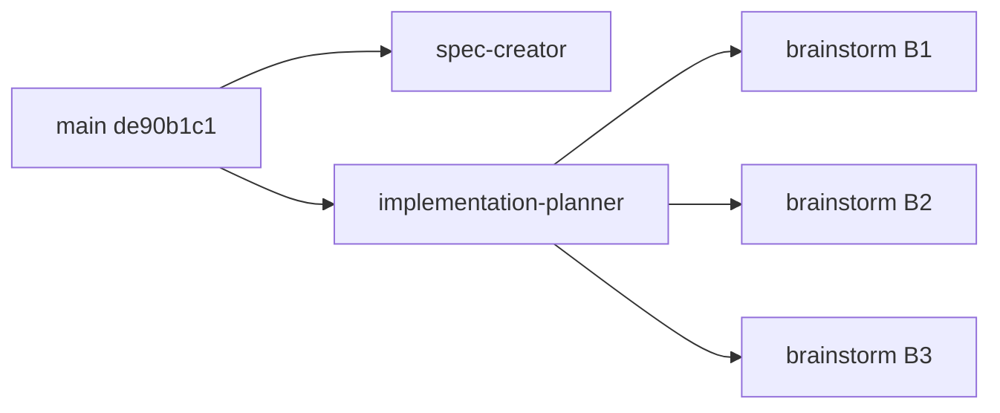

# Workflow retro: spec-01

- Date: 2026-10-01 · first run of `/workflow-retro` (dry run of the skill)
- Sessions: `de90b1c1` (branch `L05-lab`, phase spec+plan). `/impl SPEC-01` has not run yet → build, gate and review phases are absent.
- Digest: `python3 .claude/skills/workflow-retro/scripts/collect.py SPEC-01`

## Summary

- Spec and plan phases took **16.2M processed tokens**: main session 4.1M (26%), subagents 12.1M. Subagent cache hit 93% — prompt prefixes are stable.
- **spec-creator** (5.5M, peak 177K) and **implementation-planner** (4.4M, peak 175K) both ran close to the context window; together they are 82% of subagent tokens.
- The three **brainstorms ran in parallel** (same second, ~3 min each) — the planner's fan-out works as designed.
- Biggest friction: **`readonly-bash-guard` denies any `>`**, also inside quoted code (`node -e '…a>b…'`, `grep -v '=>'`) — 5 denied calls in spec-creator and brainstorm B1.
- Biggest duplication: all 5 agents read `INSIGHTS.md`, `server/INSIGHTS.md` and the spec; planner and spec-creator re-read the module `INSIGHTS.md` files twice each.

## Metrics

| # | agent | type | model | turns | processed | peak | cache hit | tools | errors |
|---|---|---|---|---|---|---|---|---|---|
| 1 | a831283a4 | spec-creator | opus | 55 | 5.52M | 176.6K | 94% | Bash 47, Read 8, Edit 7, Write 1 | exit-code 3, hook-denied 2 |
| 2 | a3d0bdd02 | implementation-planner | opus | 46 | 4.37M | 174.8K | 96% | Bash 44, Agent 3, Read 1 | exit-code 3 |
| 3 | a7b92d960 | brainstorm B1 (glob) | opus | 17 | 643K | 53.0K | 92% | Bash 16, WebFetch 1 | exit-code 1, hook-denied 3 |
| 4 | aeec575e1 | brainstorm B2 (schema) | opus | 14 | 449K | 51.2K | 89% | Bash 13 | — |
| 5 | a3a359ff7 | brainstorm B3 (tokens) | opus | 16 | 616K | 60.2K | 90% | Bash 16, WebFetch 2, WebSearch 1 | exit-code 2 |

Main session: 28 turns, 4.14M processed, peak 165.5K, 7 human prompts (6 interventions).

## Timeline

```mermaid
gantt
  dateFormat HH:mm:ss
  axisFormat %H:%M
  section spec
  spec-creator (rounds via SendMessage)   :a1, 16:43:19, 18:53:30
  section plan
  implementation-planner                  :a2, 18:19:55, 18:29:43
  brainstorm B1                           :b1, 18:25:03, 18:28:00
  brainstorm B2                           :b2, 18:25:03, 18:27:52
  brainstorm B3                           :b3, 18:25:03, 18:28:29
```

spec-creator's span (16:43–18:53) includes idle time between Discovery rounds while the user answered; it is not compute time.

## Per agent

### spec-creator
- **Easy:** wrote a lint-clean spec (6 US, 47 AC, 15 EC, 7 NFR) and listed the two defaults it set without the user.
- **Struggled:** two `readonly-bash-guard` denials while extracting the design HTML with `python3 -c "…"` (the code contains `>`); one `spec-lint` failure ("8,000" inside an IF clause) fixed and retried — expected use of the linter.
- **Missing input:** re-read `server/INSIGHTS.md`, `reviewer-core/INSIGHTS.md`, `walk.ts`, `nav.ts`, `platform.ts` twice each — slice reads across Discovery rounds.
- **Model fit:** keep opus (design analysis, 47 ACs).

### implementation-planner
- **Easy:** verified the caller's "known code facts" and added new ones (prompt slot already wired, `repo_index_state.updated_at` vs `last_polled_at`); fan-out of 3 brainstorms in one message.
- **Struggled:** `rg` is not installed — first call hit the grep shim ("invalid option -- g"), second `rtk proxy rg` failed; 2 wasted calls. `reviewer-core/src/prompt.ts` read 3×, five `INSIGHTS.md` files 2× each.
- **Missing input:** the prompt already pasted the key code facts, yet the planner re-read `prompt.ts` and `run-executor.ts` (verifying is right, three reads is not).
- **Model fit:** keep opus.

### brainstorm B1 / B2 / B3
- **Easy:** B2 (schema) — 14 turns, no errors, found the existing non-transactional `setSkills` as a real precedent.
- **Struggled:** B1 lost 3 calls to guard denials (`node -e` probe of `path.matchesGlob` with `>` in the code; a `grep -v '=>'`). B3 hit `rg`-style patterns returning no matches.
- **Missing input:** each brainstorm re-read the whole spec and both INSIGHTS files; its prompt carried the question and options but not the relevant AC/EC text.
- **Model fit:** B2 and B3 — candidates for **sonnet** (≤16 turns, read-only, mechanical comparison) `(single observation)`; B1 keep opus (ran experiments).

## Duplication

- Read by all 5 agents: `specs/SPEC-01-project-context-folder.md`, `INSIGHTS.md`, `server/INSIGHTS.md`.
- Read by planner + spec-creator: `client/INSIGHTS.md`, `reviewer-core/{CLAUDE,INSIGHTS}.md`, `reviewer-core/src/prompt.ts`, `server/src/db/schema/context.ts`, `prompt-log.ts`, `messages/en/context.json`.
- Read by planner + brainstorm: `server/src/db/schema/{agents,repos,skills}.ts`, `simple-git.ts`, `run-executor.ts`, `walk.ts`, `config.ts`.
- Reviewers-style independent reading is fine; for brainstorm the planner already had the facts.

## Rework and human interventions

- No rework loops (no gate / review yet). brainstorm ×3 = planned fan-out, not rework.
- Interventions:
  1. 16:41 — interrupted the main session and asked which agents it ran → main started working inline instead of delegating.
  2. 16:42 — "run spec-creator, and from now on run it for such tasks or ask" → now a memory rule ("Specs via spec-creator").
  3. 16:56 — "ask questions through the choice UI" → main relayed spec-creator questions as plain text instead of `AskUserQuestion`; the agents README already says to use `AskUserQuestion`.
  4. 18:19 — approval; 18:19 — "commit first, then run the planner" → no rule says to commit the approved spec before planning.

## Proposed changes

### P1. `.claude/agents/scripts/readonly-bash-guard.sh` — ignore `>` inside quotes
Evidence: 5 `hook-denied` calls (spec-creator ×2, B1 ×3), all `>` inside `python3 -c "…"`, `node -e '…'` or a grep pattern; `node -e 'console.log(a>b)'` reproduces the deny.
Current: > `if printf '%s' "$STRIPPED" | grep -q '>'; then deny "redirection to a file is not allowed…"`
Proposed: > strip single- and double-quoted strings from `$STRIPPED` before the `>` check (keep heredoc bodies denied unless the heredoc feeds an interpreter's stdin with no `>` outside quotes); add cases to `readonly-bash-guard.test.sh`: `node -e 'a>b'` allow, `grep -v '=>' f` allow, `echo x > f` deny, `cat <<'EOF' > f` deny.
Expected effect: hook-denied errors in read-only agents 5 → 0 per comparable run.

### P2. `.claude/agents/{implementation-planner,brainstorm,researcher}.md` — no `rg`
Evidence: planner lost 2 calls to `rg` (not installed; the grep shim rejects `-g`).
Current: (new)
Proposed: > Search with `/usr/bin/grep -rnE` (`rg` is not installed here; `grep` is a shim — see root `INSIGHTS.md`).
Expected effect: `rg` failures → 0.

### P3. `.claude/agents/implementation-planner.md` — carry the facts into each `B<n>` request
Evidence: all 3 brainstorms re-read the full spec and two INSIGHTS files the planner had already read.
Current: B<n> request = question + options seen.
Proposed: > Each B<n> request also quotes the AC/EC/NFR ids and text it must satisfy and the 1–3 INSIGHTS entries that bear on it; brainstorm reads further only to verify.
Expected effect: brainstorm processed tokens −20–30%, spec reads by brainstorms 3 → 0–1.

### P4. `.claude/skills/impl/SKILL.md` / agents README runbook — commit the approved spec before the planner `(single observation)`
Evidence: intervention 4.
Proposed: > After the user approves the spec: commit it (`docs(specs): SPEC-NN … (approved)`), then run implementation-planner with the commit sha.

### P5. brainstorm model — try sonnet for comparisons without experiments `(single observation)`
Evidence: B2 14 turns / 449K, B3 16 turns / 616K, no experiments needing deep reasoning.
Proposed: > implementation-planner passes `model: "sonnet"` for a B<n> that is a design comparison over existing code, opus when the request needs experiments or external research.
Expected effect: brainstorm cost ↓; verify quality on the next run before keeping.

## Applied (2026-10-02, user approved P1–P5)

- **P1** — `readonly-bash-guard.sh` drops single-quoted strings, double-quoted strings without `$(`/backticks and quoted-delimiter heredoc bodies before the `>` check; fails closed without `perl`. +13 cases in `readonly-bash-guard.test.sh` (81 ok). All 5 commands denied in this run now pass; `"$(cmd > f)"` and `<<EOF` with substitution stay denied.
- **P2** — root cause was different from the proposal: `rg` exists (Claude Code shell function) but the RTK hook rewrites it to a **non-recursive BSD grep**, so `rg … -g/--glob` and `rg pattern <dir>` both fail. Every agent that listed `rg` now lists `grep -rnE` with the reason; the planner's spec search and spec-creator's ID lookup use `grep -r --include='SPEC-*.md' … specs */specs` (verified).
- **P3** — planner's `B<n>` request carries `requirements:` (quoted AC/EC/NFR), `insights:` and `code facts:`; brainstorm starts from them and re-reads only to verify.
- **P4** — agents README runbook and `/impl` prerequisites: commit the approved spec and give the planner that sha.
- **P5** — planner passes `model: "sonnet"` for design-comparison forks, opus for experiments / external research. Check brainstorm quality in the next retro before keeping it.
