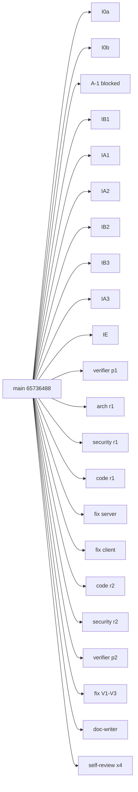

# Workflow retro: spec-01 (impl)

- 2026-10-02 · sessions `de90b1c1` (L05-lab, spec+plan, retro'd in [2026-10-01+spec-01](2026-10-01+spec-01.md)) and `65736488` (`feat/spec-01-project-context-folder`, /impl) · `python3 .claude/skills/workflow-retro/scripts/collect.py SPEC-01`
- This report judges the **/impl** session (agents 6–30). PR [otkachuk777/dev-digest#15](https://github.com/otkachuk777/dev-digest/pull/15).

## Summary

- **Went well:**
  - 13 implementer spawns delivered 91 files with no plan-blocking gap. Gate pass 1 found 0 Not met, and the review loop exited after round 2.
  - Groups A and B really ran in parallel: agent wall-clock was 10,381 s against 18,365 s summed.
  - Subagent cache hit was 94%.
- **Biggest friction:** worktree isolation.
  - The planned parallel layout (one worktree per group) cannot work. An implementer spawned from an isolated session can only write to that session's worktree, so 2 spawns came back `blocked` (a59cee8b1, a900a938d first pass).
  - The RTK `git` → `rtk git` rewrite is refused inside an isolated worktree. Every prompt and every main-session commit had to use `/usr/bin/git`, and any compound git command was refused.
- **Biggest cost:** the e2e implementer (ad9489d08). It ran 97 turns, processed 8.72M tokens and took 1,406 s.
  - It had to install `agent-browser` and find the drawer-scroll and checkbox selector quirks.
  - It also found a real bug the plan's file list missed: `VALID_TABS` in `AgentEditorView` and `SkillsView`.
- **Late defects:** the browser check at G3 found 3 layout bugs (V1–V3) that no unit test or reviewer could see. They cost one more fix round after G3 approval.
- **Mid-run decision:** the user changed the base from `origin/main` to `L05-lab` after chunk 0a. A rebase absorbed it cleanly.

## Metrics

Impl session: 36.11M processed in the main session, peak 333.4K, 99% cache hit. Subagents in the impl session: 25 spawns.

| # | type | model | dur s | turns | processed | peak | note |
|---|---|---|---|---|---|---|---|
| 6 | implementer 0a | sonnet | 208 | 23 | 1.66M | 90K | done |
| 7 | implementer 0b | sonnet | 172 | 19 | 1.47M | 92K | done |
| 8 | implementer A-1 | sonnet | 42 | 8 | 0.28M | 41K | **blocked: isolation** |
| 9 | implementer B-1 | sonnet | 191 | 20 | 1.13M | 78K | blocked first, then resumed and done |
| 10 | implementer A-1 retry | sonnet | 144 | 11 | 0.69M | 79K | done |
| 11 | implementer A-2 | sonnet | 245 | 19 | 1.81M | 122K | done |
| 12 | implementer B-2 | sonnet | 201 | 18 | 1.31M | 98K | done; changed one copy string (AC-26) |
| 13 | implementer B-3 | sonnet | 7382* | 19 | 0.95M | 71K | rate limit, then resumed |
| 14 | implementer A-3 | sonnet | 7468* | 28 | 2.24M | 106K | rate limit, then resumed |
| 15 | implementer E (+fix) | sonnet | 1406 | 97 | 8.72M | 141K | found the `VALID_TABS` bug |
| 16 | plan-verifier p1 | sonnet | 196 | 15 | 1.07M | 119K | 0 Not met |
| 17–19 | arch, security (opus), code-reviewer | — | 46–113 | 7–15 | 0.16–0.96M | — | 0, 0 and 6 findings |
| 20–21 | implementer fix r1 | sonnet | 41–70 | 5–8 | 0.17–0.26M | — | fixed |
| 22–24 | code-reviewer r2, security r2, verifier p2 | sonnet | 10–49 | 2 | ~0.03M each | — | all clean |
| 25 | implementer fix V1–V3 | sonnet | 63 | 9 | 0.31M | 38K | fixed |
| 26 | doc-writer | sonnet | 105 | 10 | 0.60M | 80K | done |
| 27–30 | self-review groups | sonnet | 17–45 | 4–8 | 0.25–0.60M | — | 0 critical |

\* duration includes the ~2 h usage-limit pause.

## Timeline

```mermaid
gantt
  dateFormat HH:mm
  axisFormat %H:%M
  section Group 0
  0a :09:33, 4m
  0b :09:39, 3m
  section A ∥ B
  A-1 blocked :09:42, 1m
  B-1 :09:42, 4m
  A-1 retry :09:43, 3m
  A-2 :09:46, 4m
  B-2 :09:46, 4m
  B-3 (limit) :09:50, 123m
  A-3 (limit) :09:51, 124m
  section E + gate
  E :11:55, 23m
  verifier p1 :12:19, 3m
  section Review
  r1 x3 :12:23, 2m
  fixes r1 :12:25, 1m
  r2 + p2 :12:27, 1m
  section G3
  browser fixes :13:05, 1m
  doc-writer :13:07, 2m
  self-review x4 :13:10, 1m
```

## Per agent

- **Implementers 0a and 0b.**
  - Easy, with 19–23 turns each.
  - 0a never saw red on the contracts tests; it reported this honestly as a deviation.
  - 0b broke two server test fixtures that `tsc` cannot see, because `server/tsconfig` covers only `src`. It found and fixed them.
  - Model: keep sonnet.
- **A-1 and B-1, first spawns.**
  - Missing input: neither could write outside the session worktree. Both stopped correctly instead of routing around the guard.
  - The A-1 spawn (0.28M) was waste. B-1 was resumed with `SendMessage` and kept its reading, which was cheap.
- **A-1 retry, A-2 and A-3.**
  - Easy. All three got behavioral reds after the prompt asked for them ("register the route returning 501 first").
  - A-3 deviated from the plan by counting tokens on the content as read, with no cache. This was correct and reported.
  - Keep sonnet.
- **B-2.**
  - It changed AC-26's copy string to work around a missing prop, and reported it.
  - The main session sent the fix back through B-3 instead of accepting the deviation.
  - Missed vs spec: AC-26.
- **B-3.**
  - Easy once resumed.
  - It wired the tab but missed the `VALID_TABS` allowlist. This is a plan gap: that file was not in the owned list. Unit tests render `AgentEditor` with `tab="context"` directly, so they could not catch it.
- **E (ad9489d08).**
  - Struggled. It needed 97 turns for one flow plus a fix round, and its 9 `other` errors came from agent-browser setup and selector quirks.
  - It caught a real product bug and refused to weaken the flow. That is a high-value result.
  - Keep sonnet.
- **plan-verifier p1 and p2.**
  - Easy. p1 reported the out-of-scope `VALID_TABS` and `SkillEditor/styles.ts` changes correctly.
  - It could not see layout bugs, which by design are not verifiable here.
- **Reviewers r1.**
  - Arch and security both returned 0 findings and are trustworthy for scope (security on opus traced every untrusted input).
  - The code-reviewer had no shell. It said "I had no shell, so I could not run `/usr/bin/git diff`" and read whole files instead. All 6 of its findings were real; C1 was a major tokenizer bug.
- **r2 re-reviews.** Cheap (~30K each), which is the intended shape.
- **doc-writer.** Its claims are checked against code with line references. It wrote an ADR and a module doc. Keep.
- **Self-review groups.**
  - 0 critical and 1 major (a ContextTab refactor).
  - The `pr-self-review` scripts hard-code `main` as the base, so the main session had to scope the diff to `L05-lab` by hand.

## Duplication

- The plan was read by 11 agents. That is expected: each chunk needs it, and it is the plan's purpose.
- `ContextTab.tsx` was read by 6 agents and `reviewer-core/src/prompt.ts` by 8. Those are reviewers plus fixers, which is legitimate.
- No identical Bash command ran across agents.

## Rework and human interventions

- **Rework:**
  - 2 blocked spawns (isolation).
  - 1 e2e fix round (`VALID_TABS`).
  - Review round 1 fixes (C1–C3, C5).
  - G3 browser fixes (V1–V3).
- **Root causes:**
  - Isolation: an /impl instruction contradicts the harness.
  - `VALID_TABS`: plan file list incomplete.
  - V1–V3: no browser check before G3.
- **Interventions:**
  - Base switch to `L05-lab`. A decision to make at /impl start: the user's `/impl` args said `origin/main`.
  - The usage-limit resume, which was environmental.
  - The G3 approval itself.

## Proposed changes

### P1. `.claude/skills/impl/SKILL.md` — parallel groups run in the session's own worktree
Evidence: a59cee8b1 and a900a938d both blocked with "This session is isolated in the worktree …spec-01-project-context-folder"; the retry in one shared worktree with disjoint module ownership worked (A ∥ B, no conflicts).
Current: > - Parallel mode: one implementer per group, `isolation: "worktree"`, merged in the plan's order.
Proposed: > - Parallel mode: groups whose owned files are disjoint (e.g. server-only vs client-only) run in parallel **in the session's own worktree** — each prompt names the other group's module as off-limits; commit each chunk with explicit paths. Implementers cannot write to another worktree from an isolated session, and `isolation: "worktree"` branches from `origin/main` (loses earlier groups' commits). Groups that share files run serially.
Expected effect: blocked implementer spawns 2 → 0.

### P2. `.claude/skills/impl/SKILL.md` — git under worktree isolation
Evidence: every git write in the main session and every agent prompt needed `/usr/bin/git`; compound git commands (`cmd && git …`, `cd … && git`) were refused 6 times in the main session.
Current: > Every phase ends with `git commit -m "SDD(SPEC-NN): <phase>" -- <explicit paths>`
Proposed: append > In an isolated worktree the RTK hook's `rtk git` rewrite is refused: call `/usr/bin/git` directly, one git command per Bash call (no `&&` chains, no `cd`), commit message via `-F <scratchpad file>`. Tell agents the same in their prompt.
Expected effect: refused git commands in the main session 6 → 0.

### P3. `.claude/skills/impl/SKILL.md` Phase 2 — browser check before the gate when the client changed
Evidence: V1–V3 (preview grid overflow, ContextTab path overflow, number format) were found only in the G3 click-through and needed an extra fix round after approval; unit tests and 3 reviewers could not see layout.
Current: > ## Phase 2 — Gate
Proposed: add as step 0 > If the change touches `client/`, the main session runs the app from the worktree on spare ports (preview_start, never over the user's dev server) and clicks through every new screen at 1024 px; layout/behavior bugs go to an implementer in fix mode before plan-verifier.
Expected effect: post-G3 fix rounds 1 → 0.

### P4. `.claude/agents/implementation-planner.md` — owned files include URL/tab allowlists (single observation)
Evidence: `AgentEditorView.tsx:16` `VALID_TABS` and `SkillsView.tsx` were not in the plan's file list; found only by e2e (ad9489d08), costing a fix round.
Current: > (new)
Proposed: > When a step adds a tab, route or enum value, grep for allowlists of the sibling values (`VALID_TABS`, `switch`, `includes(`) and list those files in the step.
Expected effect: e2e-found wiring bugs 1 → 0.

### P5. `.claude/skills/impl/references/review-loop.md` — give feature-dev:code-reviewer a diff file
Evidence: af62c1c3a "I had no shell, so I could not run `/usr/bin/git diff`" (that agent has no Bash); it read whole files instead (22 Reads).
Current: > `feature-dev:code-reviewer` has no re-review mode: give it the delta diff and the prior list in the prompt
Proposed: > `feature-dev:code-reviewer` has no Bash: in every round write the diff to the scratchpad (`git diff <range> > …/review-<n>.patch`) and pass that path; in re-review rounds also the prior list.
Expected effect: code-reviewer full-file reads 22 → diff-scoped.

### Decisions (user, 2026-10-02)
- **P3 applied:** `/impl` Phase 2 step 0 adds a browser check before the gate.
- **P4 applied:** `implementation-planner.md` Steps template lists sibling allowlists.
- **P5 applied, variant 2:**
  - Added a new project agent `.claude/agents/code-reviewer.md`. It is read-only, has Bash under `readonly-bash-guard.sh`, runs `git diff` itself and has a re-review mode.
  - It replaces `feature-dev:code-reviewer` in `/impl`, `review-loop.md`, `.claude/agents/README.md` and `collect.py` `READONLY_TYPES`.
- **P1 and P2 deferred.** The user wants per-agent worktrees branched from the session branch and merged back after validation. The design was discussed but not applied:
  - set `worktree.baseRef: "head"`;
  - implementers commit in their isolated worktree;
  - the main session runs `git merge --no-ff`;
  - the RTK hook skips `git` under `.claude/worktrees/`.

Outside the allowed targets (note only): `.claude/skills/pr-self-review/scripts/{changed-files,fingerprint,guards}.sh` hard-code `main`. A `BASE` env override would fit PRs whose base is not `main`.
