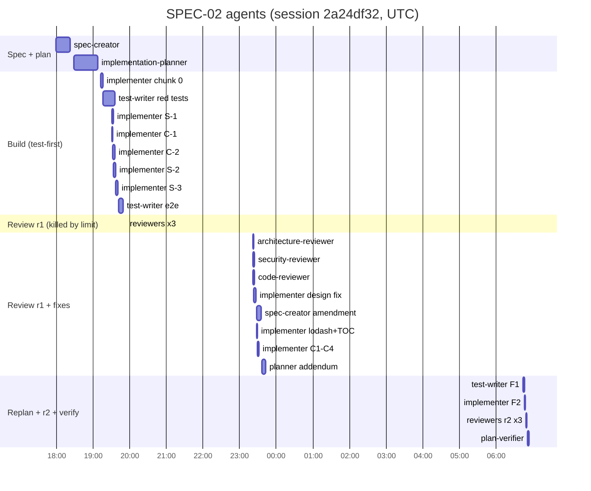
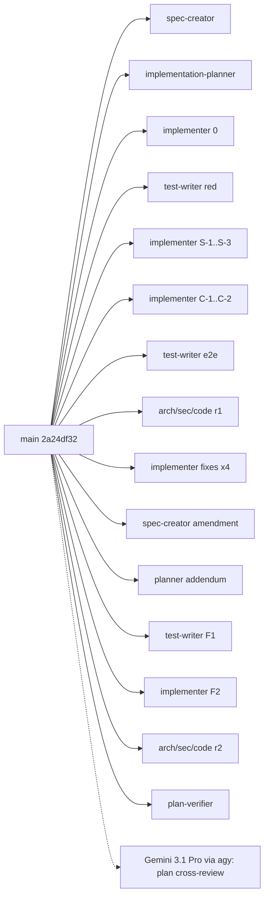

# Workflow retro: spec-02

- 2026-10-03 · sessions: `2a24df32` (L05-lab → `feat/spec-02-onboarding-generator`, spec+plan+impl+review+verify), `fe1895d6` and `0a9714a0` (feature branch, 1 prompt each, matched by a diff prompt mentioning SPEC-02 — side sessions, 1.0M processed together, not part of the pipeline) · `python3 .claude/skills/workflow-retro/scripts/collect.py SPEC-02`
- Run shape: full SDD pipeline in one session, one stage commit per phase on `L05-lab` (spec `ebfa7e1`, plan `412cda0`, code `009336a`, tests & review `accf9be`, verification `4fed5a5`); chunks committed as `SDD(SPEC-02)` markers on the feature branch and folded into the stage commits.

## Summary

- **Went well:** test-first held end to end — test-writer's red tests (149 server + 54 client red) turned green chunk by chunk with only one test bug (line vs char index). Per-group worktrees (`spec-02-server`, `spec-02-client` cut from the red-tests commit, merged back with `git merge`) worked with **0 refused writes** — the deferred P1 idea from the spec-01 retro is now validated. Reviewers in round 2 were cheap (80K–245K each) and all passed.
- **Biggest cost:** the orchestrator — 48.90M processed (57% of the run, peak 421K). It drove the browser gate, the final demo, plan-addendum application, design extraction and stage-commit folding itself.
- **Biggest friction:** two quality gaps surfaced only at the end, by the user or a real run, not by any agent: (1) the tour UI did not match design N5 (user: "дизайн не схожий на скріншот") although spec-creator had decoded the design source in discovery; (2) the spec's ranking formula produced a leaf-utility-first reading path on a real repo → spec amendment + replan + F1/F2 chunks.
- Round-1 reviewers were all killed by the account session limit (3 agents, 109K wasted) and re-launched 3.5 h later; not a workflow defect.

## Metrics

Sessions 3 · agents 28 · processed main 48.90M / sub 36.64M · orchestrator 57% · sub cache hit 91% · human interventions 10 · tool errors 18 · review rounds 2 · plan-verifier runs 1.

| # | type | model | dur s | turns | processed | peak | cache | errors | note |
|---|---|---|---|---|---|---|---|---|---|
| 1 | spec-creator | opus | 1408 | 45 | 3.92M | 168.5K | 90% | exit-code:2 | discovery + SPEC-02 write |
| 2 | implementation-planner | opus | 2359 | 60 | 9.76M | 294.7K | 89% | exit-code:3 | plan + cross-model fixes |
| 3 | implementer | sonnet | 187 | 17 | 1.53M | 112.2K | 93% | exit-code:1 | chunk 0 Skeleton |
| 4 | test-writer | sonnet | 1216 | 47 | 7.76M | 262.3K | 93% | exit-code:1 | red tests S+C |
| 5 | implementer | sonnet | 174 | 15 | 842K | 77.2K | 91% |  | S-1 (own worktree) |
| 6 | implementer | sonnet | 94 | 7 | 302K | 54.1K | 83% |  | C-1 (own worktree) |
| 7 | implementer | sonnet | 176 | 13 | 746K | 82.2K | 90% | exit-code:1 | C-2 |
| 8 | implementer | sonnet | 204 | 12 | 668K | 73.4K | 90% |  | S-2 |
| 9 | implementer | sonnet | 153 | 15 | 1.18M | 101.1K | 92% | hook-denied:1 | S-3 |
| 10 | test-writer | sonnet | 455 | 17 | 744K | 54.1K | 94% | permission:1 | e2e flow 09 |
| 11–13 | arch / security / code reviewers r1 | sonnet/opus/sonnet | 8–10 | 3–4 | 109K total | ≤23.5K | ≤52% |  | killed by session limit |
| 14 | architecture-reviewer | sonnet | 51 | 10 | 246K | 31.5K | 87% |  | r1 relaunch: pass, 4 minor |
| 15 | security-reviewer | opus | 174 | 25 | 1.18M | 78.3K | 93% | exit-code:1 | r1: 1 major (lodash-es) |
| 16 | code-reviewer | sonnet | 112 | 13 | 622K | 69.4K | 89% |  | r1: 5 minor + ranking question |
| 17 | implementer | sonnet | 159 | 18 | 1.04M | 75.0K | 93% | exit-code:1 | design fidelity fix |
| 18 | implementer | sonnet | 35 | 3 | 97K | 36.5K | 70% | user-rejected:1 | C1–C4, stopped by accident |
| 19 | spec-creator | opus | 429 | 27 | 1.73M | 98.6K | 94% |  | ranking amendment |
| 20 | implementer | sonnet | 69 | 10 | 307K | 34.4K | 91% |  | lodash override + sticky TOC |
| 21 | implementer | sonnet | 140 | 11 | 374K | 39.0K | 91% |  | C1–C4 resume |
| 22 | implementation-planner | opus | 386 | 21 | 1.36M | 134.4K | 90% | hook-denied:1 | fix plan addendum |
| 23 | test-writer | sonnet | 95 | 7 | 319K | 65.8K | 79% |  | F1 red tests |
| 24 | implementer | sonnet | 74 | 5 | 246K | 66.7K | 74% |  | F2 |
| 25–27 | code / arch / security r2 | sonnet | 20–48 | 4–10 | 421K total | ≤29.3K | 69–88% |  | all pass |
| 28 | plan-verifier | sonnet | 171 | 16 | 1.13M | 106.3K | 91% | hook-denied:2 | matrix, 0 Not met |

## Timeline

All agents are depth 1 (spawned by the main session); planner and spec-creator spawned no brainstorm/researcher agents.

## Per agent

**spec-creator (#1, discovery + write)** — Easy: decoded the gzip+base64 design bundle and found the real N5 screen source; 12 well-defaulted questions answered in two AskUserQuestion rounds; spec-lint OK first time after flattening multi-line ACs. Struggled: one restart (user stopped it to change the branch base). Missing input: re-read `specs/SPEC-01-…` ×4 and `server/INSIGHTS.md` ×5 (slice reads). Missed: it located the design source but neither saved it nor turned layout into ACs — the visual contract stayed implicit, which surfaced later as the design-fidelity intervention. Model fit: keep (opus) — discovery quality was high.

**implementation-planner (#2)** — Easy: no brainstorm needed; chose `llmNoRetry` without a reviewer-core change; complete AC→step→test table (verifier found 0 gaps). Struggled: 60 turns / 9.76M / peak 295K — the largest agent; read skill files ×3 each (`react-testing-library`, `next-best-practices`). Missing input: planned C-steps without the design source (no reference to the decoded screen in the plan). Model fit: keep.

**implementer chunk 0 (#3)** — Easy: skeleton + seams green in 17 turns. Struggled: `repo-intel/service.ts` read ×4. Model fit: keep.

**test-writer red tests (#4)** — Easy: 149 server + 54 client tests red for behaviour reasons; verified the HTTP stub really intercepts SDKs. Struggled: 47 turns, 7.76M, peak 262K (wrote 12 test files in one chunk); created and removed a throwaway tsconfig to typecheck server tests. Missed: one wrong assertion (`md.indexOf` char offset vs `lines.indexOf` line index) caught by implementer C-2. Model fit: keep, but the chunk was too large (peak > 150K).

**implementers S-1…S-3, C-1, C-2 (#5–#9)** — Easy: each 7–17 turns, ≤ 1.18M, all made their red tests green; per-group worktrees accepted writes. Struggled: S-1 and S-2 skipped reading INSIGHTS/skills ("did not read INSIGHTS.md for this chunk") until the prompt demanded it for S-2/S-3. Missed: C-2 consolidated section bodies into `TourBody.tsx` instead of the planned component folders — reported by plan-verifier, not by the implementer. Model fit: keep (sonnet).

**test-writer e2e (#10)** — Easy: flow 09 green with a real fail-proof (wrong heading first). Struggled: `agent-browser` not installed → installed into scratchpad prefix (permission:1). Model fit: keep.

**reviewers r1 (#11–#16)** — Easy: architecture invariants table (assignment requirement) delivered with evidence; security found the only major (lodash-es via mermaid, introduced by the change); code-reviewer correctly classified leaf-first ranking as spec-correct and traced it to edge direction. Missed: no reviewer judged the UI against the design (out of their scope by definition). Model fit: keep (opus for security r1 justified by the dependency finding).

**implementer design fix (#17)** — Easy: 11 gaps closed from the decoded design source in 18 turns, 262/262 green. Struggled: icons file read ×4; first attempt remounted the h1 and broke a test, fixed by splitting `TourToc`. Model fit: keep.

**implementers C1–C4 (#18, #21), lodash+TOC (#20)** — #18 was stopped by accident (user) and could not be resumed (`SendMessage` refused: "stopped by the user and won't be resumed"); #21 restarted from the partial diff. #20 found that pnpm 12 ignores `pnpm.overrides` in package.json and used `pnpm-workspace.yaml`; it also ran one `git checkout` against its rules (self-reported). Model fit: keep.

**spec-creator amendment (#19)** — Easy: ran the candidate ranking options against the real quick-blog index in Postgres (read-only) and produced expected outputs, which became EC-20. Model fit: keep.

**implementation-planner addendum (#22)** — Struggled: `readonly-bash-guard` denied `cat >> docs/cc-plans/...` (hook-denied:1); it wrote the addendum to `~/.claude/plans/` with 7 manual replacement instructions that the main session applied. Model fit: down candidate (21 turns, mechanical addendum) — single observation.

**test-writer F1 (#23), implementer F2 (#24)** — Easy: 7 and 5 turns; 13 red → green, T10 timing guard 0.9 s / 2 s. Model fit: keep.

**reviewers r2 (#25–#27)** — Easy: delta-only re-review, all prior ids resolved/accepted, 421K total. Model fit: keep.

**plan-verifier (#28)** — Easy: full 95-row matrix, honest Partially met for NFR-2/NFR-6/AC-58, reported the TourBody consolidation as an unreported deviation. Struggled: hook-denied:2 — tried to redirect test output to a file and `git stash list` (forbidden for read-only agents). Model fit: keep.

## Duplication

- `docs/cc-plans/2026-10-02+spec-02-…md` read by 10 agents and **12×** by the addendum planner (slice reads of an 836-line plan). Expected for implementers (it is their input), but the addendum planner only needed the tables it edited.
- `server/INSIGHTS.md` read by 9 agents, `client/INSIGHTS.md` by 7 — by design (session protocol), but several agents read it 2–5× in slices.
- The decoded design source (`scratchpad/design/bundle1.txt`) was rediscovered: spec-creator decoded it in discovery (round 1), the main session decoded it again after the user's intervention, and only then did an implementer get it.

## Rework and human interventions

| Intervention | Root cause | Artifact that should have carried it |
|---|---|---|
| "стой" + branch must be from L05-lab, 5 stage commits | memory said "worktrees from main"; assignment-specific commit layout | captured now in memory (`onboarding-generator-branching`) |
| "plan без план мода не побачу?" | plan lived in `~/.claude/plans/` outside the file pane | /impl / CLAUDE.md flow: present the draft via plan mode (ExitPlanMode) |
| "дизайн не схожий на скріншот" | visual contract not in spec/plan; Gate 0 browser check verified behaviour, not design | spec-creator should persist the design screen source and cite it; planner should reference it in client steps; Gate 0 should compare against it |
| ranking amendment (user chose "change the spec") | spec formula never exercised on a real repo before approval | spec-creator: worked example on a real/fixture graph for algorithmic ACs |
| "ок" ×3, "продовжуй" ×2 | approvals and resumption after the rate limit | — |

Rework loops: 1 design-fidelity fix chunk, 1 replan (spec amendment → addendum → F1 → F2), 1 test bug, 1 accidental stop + restart. Review rounds: 2.

Previous proposals: **P1 (spec-01, deferred — per-group worktrees branched from the session branch and merged back)** — applied manually this run: blocked implementer spawns 2 → **0**. **P3 (browser check before the gate)** — ran (screens, overflow, console), found no behaviour bug, but did not catch the design mismatch → extend it (P2 below). **P5 (project code-reviewer)** — used in both rounds; re-review cost 245K.

## Proposed changes

### P1. `.claude/skills/impl/SKILL.md` — make per-group worktrees the documented parallel mode
Evidence: S-1/S-2/S-3 and C-1/C-2 wrote in `.claude/worktrees/spec-02-{server,client}` (cut from the red-tests commit with `git worktree add`) with 0 refused writes; merged back with `git merge` without conflicts; agent wall 7321 s vs sum 8445 s.
Current: > - Parallel mode: one implementer per group, `isolation: "worktree"`, merged in the plan's order.
Proposed: > - Parallel mode: after `red-tests` (or `skeleton` for inline), the main session creates one worktree per group from that commit (`git worktree add -b feat/spec-NN-<group> .claude/worktrees/spec-NN-<group> <sha>`), passes the absolute path in each implementer prompt ("work ONLY there; if writes are refused, stop and report"), commits each chunk there with explicit paths, then `git merge` the group branches into the feature branch in plan order and runs the full verify. Do not use `isolation: "worktree"` (root INSIGHTS: refused writes).
Expected effect: blocked implementer spawns stay 0; parallel groups usable without per-run improvisation.

### P2. `.claude/skills/impl/SKILL.md` Phase 2 step 0 — compare the UI against the design source, not only behaviour
Evidence: user intervention 23:22 "дизайн не схожий на скріншот на початку сесії" after Gate 0 passed; fix needed 11 visual gaps (#17).
Current: > clicks through every new screen and state at 1024 px (`read_page` / `javascript_tool` for overflow: `scrollWidth > clientWidth`).
Proposed: > clicks through every new screen and state at 1024 px (`read_page` / `javascript_tool` for overflow: `scrollWidth > clientWidth`) **and screenshots each against the design reference named in the spec/plan (design file screen or image); list visual gaps (layout, component kinds, colours/badges, header actions) and send them to implementer fix mode before plan-verifier.**
Expected effect: design-fidelity interventions after the gate 1 → 0.

### P3. `.claude/agents/spec-creator.md` — persist the design screen source and cite it (single observation)
Evidence: spec-creator #1 decoded `screen_tour_context.jsx` from the gzip+base64 bundle in discovery, but the spec only described behaviour; the main session had to decode it again later for the fix.
Current: > (new)
Proposed: > When a design source is an encoded bundle (e.g. `docs/designs/*.html`), save the decoded screen component(s) the spec covers to `docs/designs/extracted/<screen>.jsx` and reference that path (and the screen name) in the spec's design section, so planner and implementers get the exact layout.
Expected effect: decoded design source rediscovered 2× → 0; planner client steps cite a concrete layout file.

### P4. `.claude/agents/spec-creator.md` — worked example for algorithmic ACs (single observation)
Evidence: AC-28/AC-30 (PageRank × (1+hotness)) passed spec, plan, tests and three reviewers, and failed only on a real run (leaf utilities first) → amendment, addendum, F1, F2 (~3.7M processed). The amendment round itself showed the fix: spec-creator ran the options on the real index and recorded EC-20.
Current: > (new)
Proposed: > For any AC that ranks, scores or selects items by a formula, add an EC with a worked example: the expected output on a small real or fixture input (run read-only against the local index when a repo is available), so the formula's behaviour is reviewed before approval.
Expected effect: spec amendments after implementation for ranking/scoring features 1 → 0.

### P5. `.claude/skills/impl/references/review-loop.md` — the replan addendum is written by the main session from the planner's text
Evidence: planner #22 hook-denied writing `docs/cc-plans/...` (`readonly-bash-guard: redirection to a file is not allowed`), fell back to `~/.claude/plans/…-fix-entry-points.md` with 7 replacement instructions applied by hand.
Current: > `replan` | the fix changes a Test seam, a contract, or more than one module, or contradicts the plan | implementation-planner **fix plan addendum** → short user approval → its steps become the fix chunks |
Proposed: > `replan` | … | implementation-planner **fix plan addendum**, written to `~/.claude/plans/<plan-name>-addendum.md` (the planner cannot write `docs/`), with a ready-to-append section and exact table-row replacements → short user approval → the main session appends it to the archived plan and commits → its steps become the fix chunks |
Expected effect: planner hook-denied 1 → 0; no improvised hand-off format.
