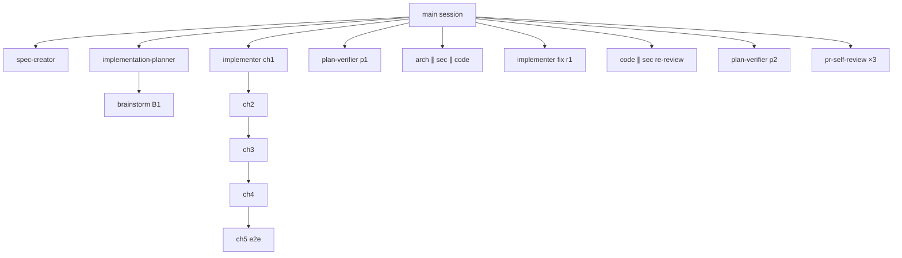

# Workflow retro: spec-03

- 2026-10-03 · sessions: `f18139d9` (main → L05-HW worktree, spec+plan+impl, 142 turns), `93dff4c0` (L05-HW, one extra session, 9 turns) · digest: `python3 .claude/skills/workflow-retro/scripts/collect.py SPEC-03`

## Summary

- **Went well:** full SDD chain in one sitting (spec → plan → cross-model review → 5 chunks → gate → review → PR). Implementers were cheap and clean (chunks 1, 3: 15–19 turns, 0–1 errors). Reviews found real bugs (toast lost on unmount, surrogate cut → jsonb 500) that tests had not. plan-verifier pass 1 and 2 both `satisfied`.
- **Biggest cost:** the two opus agents — implementation-planner 10.84M processed (65 turns, peak 322K) and spec-creator 8.52M (63 turns) — = 55% of subagent tokens. Orchestrator share is 48% (main session did measurements, UI gate, e2e rerun, PR and video itself).
- **Biggest friction:** chunk 5 (e2e flow) took **1971 s** (33 min) for a 49-line flow: `agent-browser` was not on PATH, stale `next-server` on :3100 caused EADDRINUSE/hangs, and the user had to ask twice what was going on ("статус чанку 5? вже 28 хвилин").
- **Quality gap:** chunk-3 implementer admitted it skipped `INSIGHTS.md`; architecture- and code-reviewer reports say "INSIGHTS not read" too.

## Metrics

Sessions 2 · agents 19 · processed main 32.85M / subagents 35.24M (orchestrator 48%, subagent cache hit 92%) · human interventions 8 · tool errors 9 · review rounds 1 full + 1 delta re-review (digest counts 2 `review-n` commits) · plan-verifier runs 2.

| # | agent | model | dur s | turns | processed | peak | cache | errors |
|---|---|---|---|---|---|---|---|---|
| 1 | spec-creator | opus | 7030 (idle in Q&A) | 63 | 8.52M | 213K | 91% | 2 |
| 2 | implementation-planner | opus | 1517 | 65 | 10.84M | 322K | 95% | 2 |
| 3 | brainstorm (B1) | sonnet | 46 | 4 | 71K | 20K | 72% | 0 |
| 4–8 | implementer chunks 1–5 | sonnet | 202 / 445 / 271 / 341 / **1971** | 15 / 33 / 19 / 32 / 40 | 1.0M / 3.8M / 1.2M / 3.9M / 2.1M | ≤170K | 92–96% | 0/1/0/0/2 |
| 9, 16 | plan-verifier pass 1 / 2 | sonnet | 126 / 92 | 9 / 8 | 476K / 187K | 76K / 33K | 84% | 0 |
| 10–12 | architecture ∥ security(opus) ∥ code review r1 | | 25 / 88 / 112 | 4 / 11 / 13 | 68K / 446K / 638K | | | 0 |
| 13 | implementer fix r1 (F1–F4) | sonnet | 141 | 14 | 660K | 59K | 91% | 1 |
| 14, 15 | code ∥ security re-review (delta) | sonnet | 35 / 19 | 6 / 4 | 131K / 84K | | | 1 |
| 17–19 | pr-self-review groups client/server/data | sonnet | 38 / 22 / 16 | 5 / 6 / 2 | 469K / 483K / 128K | 123K / 92K / 74K | 74 / 81 / **42**% | 0 |

## Timeline

```mermaid
gantt
  dateFormat HH:mm
  axisFormat %H:%M
  section Spec + plan
  spec-creator (Q&A idle incl.) :16:24, 16:46
  implementation-planner        :16:46, 17:12
  section Build
  implementer ch1-4             :17:17, 17:40
  implementer ch5 (e2e)         :crit, 17:40, 18:13
  section Gate + review
  plan-verifier p1              :18:21, 18:23
  review r1 (3 parallel)        :18:23, 18:25
  fix r1 + re-review            :18:25, 18:29
  plan-verifier p2              :18:29, 18:30
  section PR
  pr-self-review (3 parallel)   :18:38, 18:39
```

## Per agent

**spec-creator** — Easy: Discovery round returned 12 well-prioritised questions with defaults; the user answered 8 blocking ones in two batches. Struggled: it cannot create a branch/worktree (bash read-only) — spec was first written on `main` and had to be moved by the main session; `SPEC-03` re-read 7×, `SPEC-02` 5× (slice reading). A lint failure ("commas in the list break the IF parser") cost one rewrite of AC-57. Missing input: the branch name was told only after round 1. Model fit: keep (opus; a spec needs judgement).

**implementation-planner** — Easy: one brainstorm (B1) that changed the plan (seed instead of fake-LLM mode); the plan was accurate enough that 5 chunks ran with only 3 recorded deviations. Struggled: highest processed (10.84M) and peak 322K — re-read `seed.ts`×4, `app.ts`×3, skills `security`×4, `react-best-practices`×3. Missed: two spec gaps surfaced only after the cross-model review (lock race, AC-30 order). Model fit: keep, but consider reading each file once (single observation).

**implementer ch1–ch4** — Easy: ch1 and ch3 (15 and 19 turns, 0–1 errors); all reported Deviations honestly (e.g. EC-12 reading, `history` stripping). Struggled: ch2 and ch4 (≈3.9M each, peak 166–170K) — large multi-step chunks; ch4 hit BSD `sed` on a path with brackets ("sed rejects the path (brackets/parens); use python"). Missing input: **ch3 did not read INSIGHTS.md** ("Not read: I skipped INSIGHTS.md … breaks the read-first rule") — the ch3 prompt did not demand it; ch4 and ch5 prompts said "name the entries — this is mandatory" and both complied. Missed vs plan: ch1 wrote contract edits before the Step-1 tests (no red proof for that step, disclosed). Model fit: keep.

**implementer ch5 (e2e)** — Struggled badly: 1971 s, 40 turns, `other:2` errors, `Monitor:1`; its report lists `agent-browser` not on PATH, stale `next-server` on :3100 and EADDRINUSE from its own aborted runs, a first run failing on upper-cased heading text (`text-transform`), and BSD `sed` again ("BSD sed failed … Use Edit"). Result was correct (10/10) but the user saw 28+ silent minutes. Missing input: no preflight for the e2e runner. Model fit: keep sonnet; the problem is environment, not capability.

**implementer fix r1** — Easy: 4 findings fixed test-first in 141 s, each red→green proven; read relevant INSIGHTS. One signature deviation (`useGenerateBrief(prId, onError?)`) disclosed.

**plan-verifier (p1, p2)** — Easy: both `satisfied`, re-ran all suites, listed out-of-scope changes (`.gitignore`, OQ commit). Struggled: pass 2 *inferred* the F1–F4 → fix mapping from the diff and mislabelled it (its F1 = surrogate cut, actual F1 = injection guard) because the commit message carried no finding ids; it also could not read some `[verify: …]` tags (truncated grep). Model fit: keep.

**architecture-reviewer** — Easy: 25 s, 4 turns, ran the deterministic checks and judged only imports. Missed: it states it did not read INSIGHTS.md nor full diffs of `service.ts`/`BriefCard` — its "pass" covers edges, not logic. Model fit: keep (cheap).

**security-reviewer (opus r1, sonnet r2)** — Easy: found the one real prompt-injection gap (`INJECTION_GUARD`), read the relevant INSIGHTS entries, traced source→sink with concrete files. Model fit: keep opus for round 1; sonnet for re-review was enough.

**code-reviewer (r1, re-review)** — Easy: three findings with concrete scenarios — the unmount-toast bug and the surrogate/jsonb 500 were both real and not caught by the 555 tests. It did not read INSIGHTS. Model fit: keep.

**pr-self-review ×3 (general-purpose)** — Easy: 16–38 s each. Struggled: `data` agent cache hit 42% (cold prefix, prompt differs early because the shared prefix is not byte-identical enough) — single observation. Overlap with the preceding architecture/security/code round is high (0 critical in both; 10 minors mostly style); only 3 of 10 minors were new.

**brainstorm B1** — Easy: 46 s, changed the plan.

## Duplication

- `docs/cc-plans/2026-10-03+spec-03-pr-brief.md` read by 7 agents, `specs/SPEC-03-pr-brief.md` by 7 — expected (each chunk/verifier needs them); only worth fixing if the plan carried per-chunk excerpts.
- `client/INSIGHTS.md` read by 5, `server/INSIGHTS.md` by 5, `reviewer-core/src/brief.ts` by 5, `server/src/db/seed.ts` by 5 agents.
- Same file ≥2× by one agent: spec-creator (`SPEC-03`×7, `SPEC-02`×5), planner (`seed.ts`×4, `security/SKILL.md`×4), `aa7f…` implementer (`mocks.ts`×4, `.dependency-cruiser.cjs`×3).
- pr-self-review repeats the architecture/security/code review on the same diff for the same change (3 agents, ~1.1M tokens) — it is a project gate (PR hook), so it stays, but it found nothing blocking that round 1 had not.

## Rework and human interventions

- **Rework:** (1) plan returned to spec-creator for 5 edits (AC-4 tag, e2e wording, AC-30 sentences, AC-14) after the cross-model review — root cause: planner/spec gap, found by `agy`, which is exactly what the review is for; (2) review round 1 → 1 fix chunk (4 findings) — root cause: implementer miss on error handling after unmount and string cut before jsonb; (3) chunk 5 — environment, not logic.
- **Human interventions (8):** `все робимо в гілку L05-HW` → branch name belonged in the first prompt/`/impl` input; `де ми зараз?` and `статус чанку 5? вже 28 хвилин` → no progress visibility from long background agents; `це ті ж e2e які в СІ біжать?` → the e2e doc did not say hermetic = CI flows; `схвалюю`, `ok`, `Пиши`, `так, /workflow-retro…` → planned gates.
- **Main-session overrides worth recording:** `/impl` is `disable-model-invocation`, so the workflow was followed manually; squash was done from the spec+plan commit (not from `origin/main`) to keep "spec/plan committed before code" (P2) visible in history.

## Proposed changes

### P1. `.claude/skills/impl/SKILL.md` — standard implementer prompt must demand naming INSIGHTS entries
Evidence: ch3 report "Not read: I skipped `INSIGHTS.md` … breaks the read-first rule"; ch4/ch5 prompts contained "name the entries that bear on this chunk — this is mandatory" and both complied; architecture- and code-reviewer reports also say INSIGHTS not read.
Current: > (new) — Phase 1 says "fresh implementer with plan path, chunk k and chunk k−1's report"
Proposed: > Every implementer / reviewer prompt includes: "First read the touched module's INSIGHTS.md and name the 1–3 entries that bear on this task in your report; if none apply, say so." (reviewers: same line)
Expected effect: reports with "Insights read: not read" 3 → 0.

### P2. `.claude/agents/implementer.md` — macOS BSD `sed` pitfalls
Evidence: three separate agents hit it — ch4 ("sed rejects the path (brackets/parens); use python"), ch5 ("BSD sed failed … Use Edit"), ch2 insight candidate ("`\&` in a replacement makes the command fail … use python3").
Current: > (new)
Proposed: > Scripted edits: do not use `sed -i` on macOS (BSD sed fails on `[ ]`, `( )`, `\&` and needs `-i ''`). Use the Edit tool, or `python3` for bulk replacement.
Expected effect: `exit-code` errors from `sed` in implementer runs 3 → 0.

### P3. `.claude/agents/implementer.md` + `.claude/skills/impl/SKILL.md` — e2e chunk: preflight and who runs the hermetic suite
Evidence: ch5 took 1971 s: `agent-browser` missing on PATH, stale `next-server` :3100, EADDRINUSE from its own aborted runs, 2 human status pings.
Current: > (new)
Proposed: > e2e chunks: before `npm run e2e:hermetic` run `command -v agent-browser` (if missing: PATH shim `npx --yes agent-browser`) and `lsof -iTCP:3100 -iTCP:3101 -sTCP:LISTEN`; never leave an aborted run's stack up. /impl runs the hermetic suite from the main session with `run_in_background` and reports progress; the implementer writes the flow, typechecks it and returns.
Expected effect: e2e chunk wall-clock 33 min → < 10 min; status pings 2 → 0. (single observation, but with two human interventions)

### P4. `.claude/skills/impl/SKILL.md` — review-fix commits and Review log carry finding ids
Evidence: plan-verifier pass 2 "inferred this F1–F4 mapping from the diff. The commit messages carry no finding text" and mislabelled F1/F3.
Current: > `git commit -m "SDD(SPEC-NN): <phase>"`
Proposed: > `review-<n>` commits list the fixed finding ids and one-line titles in the body; the plan's `## Review log` has the same list, which pass 2 reads first.
Expected effect: verifier mapping errors 1 → 0. (single observation)

### P5. `.claude/skills/impl/SKILL.md` — honour a user-given branch name and create the worktree before spec-creator
Evidence: spec-creator report "гілки L05-HW немає, а створити гілку чи worktree я не можу (bash у мене лише на читання). Тому файл лежить у головному checkout на `main`"; user intervention `все робимо в гілку L05-HW`; `/impl` Phase 0 hard-codes `feat/spec-NN-<slug>`.
Current: > New: `EnterWorktree` on branch `feat/spec-NN-<slug>` from `origin/main`
Proposed: > If the user named a branch, use it (from `origin/main`) and create the worktree *before* spec-creator's write round, passing its absolute path in the prompt; otherwise `feat/spec-NN-<slug>`.
Expected effect: spec files moved between checkouts 1 → 0.

### P6. `.claude/skills/impl/SKILL.md` — run the final plan-verifier in parallel with the delta re-review
Evidence: serial read-only pair `a7104333…` (security re-review) → `adb1c681…` (plan-verifier pass 2); both operate on the same fixed tree.
Current: > Phase 4 "plan-verifier pass 2 with the delta" after review rounds
Proposed: > After the last fix commit, launch plan-verifier pass 2 in the same message as the re-review agents.
Expected effect: wall-clock of the tail −1–2 min per run. (single observation, small)
