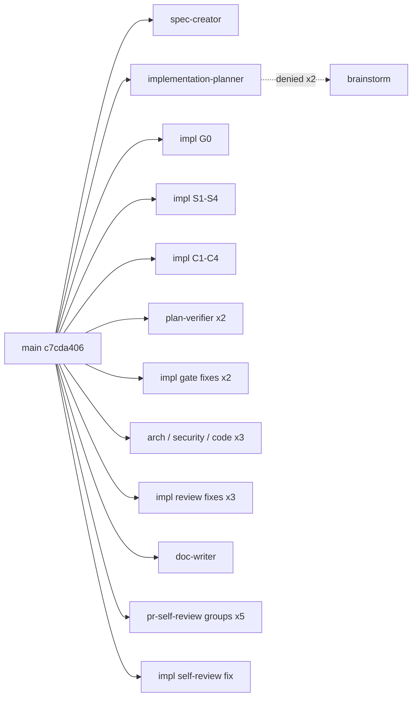

# Workflow retro: spec-04

- 2026-10-08 → 2026-10-09 · sessions: `c7cda406` (L06-HW, spec+plan+impl+gate+review+PR+demo), `3452c533`, `7dcd5f78`, `575fc959`, `a957204b`, `9570632e` (L06-HW, short side sessions) · `python3 .claude/skills/workflow-retro/scripts/collect.py SPEC-04`

## Summary

- **Went well:** the parallel Build (G0 → server ∥ client worktrees, 8 chunks of 2 steps) finished in ~1 h of wall time with fresh sonnet implementers (0.5–2.1M processed each, peak ≤ 136K). Review round 1 was clean for architecture and security; every review fix was red-first.
- **Biggest cost:** the orchestrator. Main session 95.9M processed (71%, the highest so far: 48–57% before), peak context **541K**, 301 turns. The browser gate, live LLM runs, model switching, the demo video and `/pr-self-review` orchestration all ran in the one long session.
- **Biggest friction:** defects that only real runs or a fresh reader found. The browser gate found 2 bugs (Promote gate, duplicated diff view). A live LLM run found that Gemini rejects the `Review` schema. `doc-writer` found that the round-1 F1 fix could never fire (dashboard `latest` is done-only); code-reviewer re-review had passed it.
- **Tooling:** `implementation-planner` could not spawn any `brainstorm` (2 denials). The guard requires an explicit `run_in_background: false`, and the Agent tool in the planner's context does not pass that field. The four forks were decided without brainstorm, and an external `agy` cross-review covered the gap.
- Two implementers (S1, C2) were cut by an account rate limit and resumed with SendMessage. No work was lost.

## Metrics

Totals: 6 sessions · 30 agents · processed main 95.90M / sub 39.09M · orchestrator 71% · subagent cache hit 92% · review rounds 2 · plan-verifier runs 2 · human interventions 16 · tool errors 25.

| # | type | model | dur s | turns | processed | peak | errors |
|---|---|---|---|---|---|---|---|
| 1 | spec-creator (3 rounds + 3 amendments) | opus | 11799* | 58 | 6.05M | 199.5K | 3 |
| 2 | implementation-planner | opus | 1085 | 58 | 7.57M | 238.9K | 7 (4 hook-denied) |
| 3–11 | implementer ×9 (G0, S1–S4, C1–C4) | sonnet | 129–2879 | 11–25 | 0.47–2.12M | 56–136K | 0–3 each |
| 12, 21 | plan-verifier ×2 | sonnet | 311 / 110 | 20 / 8 | 1.88M / 0.39M | 147K / 60K | 0 / 1 |
| 13, 14, 18, 19, 23, 29 | implementer fix ×6 | sonnet | 97–278 | 8–20 | 0.35–1.45M | 45–98K | 0–1 |
| 15 | architecture-reviewer | sonnet | 69 | 9 | 0.19M | 27K | 2 |
| 16 | security-reviewer | opus | 133 | 15 | 0.72M | 62K | 1 |
| 17, 20, 24 | code-reviewer ×3 (r1, r2, r3) | sonnet | 139 / 52 / 26 | 14 / 7 / 4 | 0.73 / 0.27 / 0.10M | 74 / 47 / 30K | 0–1 |
| 22 | doc-writer | sonnet | 419 | 21 | 2.40M | 150K | 0 |
| 25–28, 30 | general-purpose ×5 (pr-self-review groups + delta) | sonnet | 30–66 | 3–9 | 0.22–0.85M | 65–128K | 0 |

\* duration includes idle time between Q&A rounds (rubric: "long duration, few turns").

## Timeline

```mermaid
gantt
    dateFormat HH:mm
    axisFormat %H:%M
    section Spec / plan
    spec-creator (discovery → write → amend)   :17:40, 20:55
    implementation-planner                      :18:25, 18:43
    agy cross-review (main)                     :18:46, 18:50
    section Build
    G0 contracts                                :19:01, 19:03
    S1 (rate-limited, resumed)                  :19:03, 19:51
    C1                                          :19:03, 19:07
    C2 (rate-limited, resumed)                  :19:07, 19:52
    S2                                          :19:51, 19:55
    C3                                          :19:52, 19:58
    S3                                          :19:55, 20:01
    C4                                          :19:58, 20:02
    S4                                          :20:01, 20:09
    section Gate
    browser gate + live LLM runs (main)         :20:09, 20:25
    plan-verifier pass 1                        :20:13, 20:18
    gate fixes server ∥ client                  :20:24, 20:29
    section Review
    arch ∥ security ∥ code r1                   :20:30, 20:33
    fixes F1 ∥ F2+F5                            :20:42, 20:47
    code r2 ∥ plan-verifier pass 2              :20:47, 20:49
    doc-writer                                  :20:52, 20:59
    F1 reopen fix + code r3                     :20:56, 20:59
    section Self-review / demo
    pr-self-review ×4 groups                    :00:51, 00:53
    major fixes + delta review                  :06:39, 06:43
```

## Per agent

**spec-creator (opus):** Easy — discovery report with 12 grouped questions and recommended defaults. The user answered "усе рекомендоване" twice, and the spec linted OK first time. Struggled: re-read the design HTML ×5 and `server/INSIGHTS.md` ×5 across its rounds. Missing input: none. Missed: did not ask whether `latest` on the dashboard should include running runs, which the F1 reopen later needed. Model fit: keep (judgement-heavy discovery).

**implementation-planner (opus):** Easy — the chunk table with owned files kept the 8 parallel chunks free of file conflicts, and both merges were clean. Struggled: 4 hook-denied calls, 2 of them brainstorm spawns ("the hook requires `run_in_background: false`, but the tool schema drops that parameter"). Missed vs reality: "B4 in-house LCS, O(n·m) is fine" was wrong for 3k-token prompts (the `agy` review caught it). Several "not verified" items were left (MetricCard delta, icon names) and implementers resolved them. Model fit: keep.

**implementers (sonnet, 15 runs):** Easy — all chunks green on first full-suite run, and every report listed deviations. Struggled: C2 skipped red-first after the rate-limit resume ("wrote components and tests in one pass"). C4's "red" runs were import failures only. S4 tried to split a secret-shaped literal and was denied by the permission classifier ("Security Weaken") — correct behaviour. Missing input: fresh worktrees needed `pnpm install` plus `npm ci` in `reviewer-core/` (S1 discovered the latter). Missed: S3 reported "case deleted mid-run fails the whole run" itself; plan-verifier escalated it (G5). Model fit: keep.

**plan-verifier (sonnet ×2):** Easy — pass 1 found 6 real partial gaps (AC-38 PR title dropped, NFR-6 metrics missing from the log, EC-13, NFR-7, AC-49 copy, G5). Pass 2 flagged the `provider_error` contract deviation, which became a spec amendment. Model fit: keep.

**architecture-reviewer (sonnet):** pass, no findings. Its INSIGHTS reads were truncated by the rtk `grep` rewrite ("rtk collapsed about 33 and 17 entries"), and the user asked for a fix. Fixed in-session: an rtk `exclude_commands` regex plus a root INSIGHTS entry. Model fit: keep.

**security-reviewer (opus, round 1):** pass, no findings, and traced every source→sink in the spec's untrusted-input table. Model fit: keep (rubric: opus for round 1).

**code-reviewer (sonnet ×3):** Round 1 found 1 major and 4 minor, all real. **Missed in round 2:** it marked F1 "resolved" and traced the client loop, but never checked that the server can emit `latest.status === "running"`. `doc-writer` found it (the polling could never fire). Round 3 verified the full loop. Model fit: keep. Prompt gap: see P2.

**doc-writer (sonnet):** Easy — it checked claims against code and, through that, caught the F1 defect. It also asked about undefined N1 instead of inventing a meaning. Model fit: keep.

**pr-self-review groups (general-purpose ×5):** the client-tests and client-src groups found 6 real majors (own-component mocks, a 296-line component, a render factory, a `useEffect` for an event). Builders and the three reviewers had not reported these. One false positive (`userEvent` while user-event is not installed) is already covered by `client/INSIGHTS.md`. Model fit: keep.

## Duplication

- `server/INSIGHTS.md` was read by 14 agents and `client/INSIGHTS.md` by 15. That is expected, because every prompt asks for it.
- The plan was read by 10 agents. That is expected, since each chunk reads its own step.
- Within one agent: spec-creator re-read the design HTML ×5. S4 re-read `src/db/seed.ts` ×5 and `service.ts` ×4. `doc-writer` re-read `client/src/lib/api/eval.ts` ×3. Slice reading, minor cost.
- No duplicated Bash commands across agents.

## Rework and human interventions

| Rework | Root cause | Artifact that should have carried it |
|---|---|---|
| Gate: Promote enabled though config current; diff shown twice | browser-only defects; component tests mocked the agent query | gate step (worked as designed) |
| G1–G6 partial gaps | implementers skipped AC text details (title in prDescription, log fields) | chunk prompts quoted the plan step, not the AC text |
| F1 reopened after r2 "resolved" | reviewer verified the client half of a client↔server condition only | code-reviewer re-review instructions (P2) |
| Gemini 400 on every case | `Review` JSON schema uses `$ref` Google rejects (pre-existing) | live-model check before gate (P3) |
| self-review majors (6) | builder/reviewers don't apply react-testing-library / react-best-practices rules | client implementer skills table already lists them; pr-self-review caught them |
| demo: wrong finding card clicked; `globalThis` lost between Playwright calls | main-session scripting | n/a (one-off) |

Human interventions (16) were all decisions: approvals, "усе рекомендоване", the Q11 range filter (the spec-creator recommendation was overridden), the model fallback rule, F1/F2/F5 selection, spec amendment, the rtk fix and the demo. None corrected an agent's misunderstanding.

## Proposed changes

### P1. `.claude/agents/scripts/agent-type-guard.sh` — let a nested spawn through when the field is absent and the caller cannot set it
Evidence: planner `ab14fdba0`, 2 brainstorm spawns denied; its report: "the hook requires `run_in_background: false`, but the tool schema drops that parameter". 0 brainstorms ran this run; earlier runs did spawn them.
Current: > `[ "$BG" = false ] || deny "run_in_background must be set to false (got: $BG) …"`
Proposed: > accept `false` **or** an absent field (`null`), and keep denying an explicit `true`. Update `agent-type-guard.test.sh` (the `{"subagent_type":"researcher","prompt":"q"}` and `"run_in_background":null` cases → allow).
Expected effect: brainstorm spawns per planner run 0 → ≥1. Trade-off: in `-p` / SDK runs an omitted flag may background the child; this is the reason the guard was written.

### P2. `.claude/agents/code-reviewer.md` — in re-review, verify both ends of a client↔server condition
Evidence: code-reviewer `aa7c68971` marked F1 resolved, and `doc-writer` `a3b3e560e` then found `latest` is built from `done` runs only (`repository.ts:261`), so `latest.status === "running"` never holds. (single observation)
Current: > (re-review mode: "For each prior finding: resolved | open | regressed, with evidence")
Proposed: > add: "When a fix makes the client branch on a value from the API (a status, a flag), open the server code that produces that field and confirm the value can actually be emitted; a client-only trace is not evidence of `resolved`."
Expected effect: reopened findings after a "resolved" verdict 1 → 0.

### P3. `.claude/skills/impl/SKILL.md` Phase 2 — one live run on the configured model before plan-verifier when the feature calls an LLM
Evidence: in this run, the deepseek default timed out on 2 of 8 cases, Gemini returned 400 on 8 of 8 (schema `$ref`) and Haiku passed 8/8. All of this surfaced only in the main session's manual gate, because every test mocks the provider. (single observation)
Current: > "0. Change touches `client/` → the main session runs the app … clicks through every new screen"
Proposed: > add "0b. Feature makes LLM calls → trigger one real run through the app on the agent's configured model; record model, pass rate, duration and cost in the plan's Review log; a provider error is a gate finding."
Expected effect: model or provider problems found before review rounds instead of during the demo.

### P4. `.claude/skills/impl/SKILL.md` — move the resume hint from optional to a threshold
Evidence: the main session peaked at 541K context with 301 turns, and orchestrator share was 71% (earlier rows 48–57%).
Current: > "`/impl SPEC-NN` in a fresh session continues where the last one stopped — suggest it after Build when this session's context is large."
Proposed: > "After Build, and again after Review, if this session has passed ~250K context: stop and tell the user to run `/impl SPEC-NN` in a fresh session (state lives in artifacts)."
Expected effect: orchestrator processed share 71% → ≤ 50%; main peak < 300K.
