# Architecture: The Review Engine Pipeline

The `@devdigest/reviewer-core` library implements the core review logic: **diff → prompt → LLM → grounded findings → Review**. This document describes the pipeline stages, the mandatory grounding gate, and the public API.

## The Pipeline

```mermaid
flowchart LR
  IN["Diff + Prompt Parts<br/>system prompt · PR body · skills<br/>memory · specs · repo map · callers"]
  IN --> PROMPT["assemblePrompt()<br/>prompt.ts:85-141"]
  PROMPT --> WRAP["wrapUntrusted() + INJECTION_GUARD<br/>prompt.ts:30-34, 16-28<br/>All untrusted content wrapped"]
  WRAP --> LLM["LLMProvider (injected)<br/>llm/openrouter.ts<br/>OpenRouter-compatible"]
  LLM --> STRUCT["Structured Output Parse<br/>llm/structured.ts:19-86<br/>Zod schema → JSON schema<br/>Parse with repair retry"]
  STRUCT --> GROUND["groundFindings()<br/>grounding.ts:52-84<br/>Citation gate:<br/>each finding must cite real diff lines"]
  GROUND --> SCORE["scoreFromFindings()<br/>review/reduce.ts:27-30<br/>Deterministic 0-100 from findings<br/>NOT from model score"]
  SCORE --> OUT["Review<br/>verdict · summary · grounded findings · score"]
```

Each stage in this pipeline is **pure**: no database, GitHub, or filesystem access. The only side effect is the injected `LLMProvider` call, which makes the entire engine **mock-testable** and portable across the server (local reviews) and CI runner (GitHub Actions).

### Prompt Assembly (`prompt.ts`)

The `assemblePrompt()` function takes a `PromptParts` object (prompt.ts:39-72) and produces a `ChatMessage[]` array. Key behaviors:

- **System message hardening** (prompt.ts:16-28): The `INJECTION_GUARD` constant is appended to every system prompt. It explicitly frames all untrusted content (diff, PR description, specs, code comments) as DATA, not instructions, and directs the model to report real defects regardless of stated intent or context claims.

- **Wrapping untrusted content** (prompt.ts:30-34): The `wrapUntrusted()` function wraps external content in `<untrusted source="label">…</untrusted>` delimiters. This includes the diff, PR description (truncated to 4000 chars, line 37), specs, repo map, and callers. Trusted content (agent system prompt, skill bodies, curated memory) is NOT wrapped.

- **Sections rendered in order** (prompt.ts:104-122): task line → PR description → skills → memory → repo map → specs → callers → diff. This order ensures the model sees structure (repo map, callers) before the detailed diff.

- **Omission by presence** (prompt.ts:111-120): Empty or undefined optional fields are omitted entirely, so the prompt is compact when extra context (memory, specs, callers) is not provided.

### Structured Output & Parse-with-Repair (`llm/structured.ts`)

The LLM is called with a Zod schema serialized to JSON Schema (strict mode). The response is validated against the schema:

- **Schema conversion** (llm/structured.ts:19-22, `toJsonSchema`): Uses OpenAI's bundled `zodResponseFormat` helper to convert a Zod schema to a JSON Schema (draft-07, strict object).

- **JSON extraction** (llm/structured.ts:25-48, `extractJson`): Best-effort extraction of JSON from model text. Tries to parse the full response as JSON first; if that fails, strips \`\`\`json fences or extracts the first balanced `{…}` or `[…]` object.

- **Parse with repair** (llm/structured.ts:54-85, `parseWithRepair`): Validates parsed JSON against the Zod schema. On validation failure, returns both an error description and a **reprompt message** that the caller uses to retry. This allows the review orchestrator (review/run.ts) to loop up to `maxRetries` times (default 2, line 32) before giving up.

### Grounding: The Mandatory Citation Gate (`grounding.ts`)

This is the critical defense against hallucination. Every diff-finding returned by the model must cite a line (or line range) that actually exists in a diff hunk, or it is **dropped**.

**How grounding works** (grounding.ts:24-84):

- `buildLineIndex()` (lines 24-39): Scans the unified diff and builds a map: file path → set of new-side line numbers covered by hunks.

- `groundFindings()` (lines 52-84): For each finding:
  - If the file is not in the diff at all, drop it with reason "file not present" (line 62).
  - If the finding's `kind` is in `FULL_FILE_KINDS` (line 16: `secret_leak`, `lethal_trifecta`, `phantom`, `hook`), keep it if the file exists (lines 66-69). These are full-file scanners that are not anchored to specific diff hunks.
  - Otherwise, check if `[start_line, end_line]` intersects the hunks in that file (line 73). If yes, keep it; if no, drop it with reason "lines do not intersect any diff hunk" (lines 76-79).

- `groundingSummary()` (lines 87-90): Returns a human-readable count, e.g., "3/4 passed", for the trace.

**Why mandatory**: The model can confidently emit a finding at a line it never saw, or confuse line numbers between files. Grounding is the gate that makes hallucinations visible — they are dropped, and the UI and logs surface how many findings were discarded. The score is **recomputed from the surviving (grounded) findings**, not trusted from the model's self-reported score (which has no anchor and drifts between models).

### Score Derivation (`review/reduce.ts`)

The score is deterministically computed from findings, not from the model:

- **Severity penalties** (review/reduce.ts:13-17): CRITICAL subtracts 35 points, WARNING subtracts 12, SUGGESTION subtracts 3.
- **Calculation** (review/reduce.ts:27-30): Sum penalties, subtract from 100, clamp to [0, 100]. This ensures the score is consistent with the findings: zero findings → score 100, one suggestion → 97, one warning → 88, one critical → 65.

This mirrors how the **review event** (APPROVE / COMMENT / REQUEST_CHANGES) is already computed from finding severities (output/to-review.ts:37-51, `gateTriggered`), so the number on screen can never contradict the findings.

### Orchestration: Single-Pass vs. Map-Reduce (`review/run.ts`)

The `reviewPullRequest()` function (review/run.ts:1-100+) is the entry point. It:

1. Assembles the prompt (line 10: `assemblePrompt`).
2. Decides strategy (lines 53, 34-35: 'single-pass' by default; 'map-reduce' if `strategy: 'auto'` AND the diff is large and multi-file).
3. For **single-pass**: calls the LLM once with the entire diff.
4. For **map-reduce**: slices the diff per file, calls the LLM for each slice, then reduces partials via `reduceReviews()` (line 12).
5. Grounds findings via `groundFindings()` (line 11).
6. Computes score via `scoreFromFindings()` (from reduce.ts:27-30).
7. Wraps in a `Review` (Review schema from @devdigest/shared).
8. Emits progress events (ReviewEvent) via the optional `onEvent` callback (ReviewInput.onEvent, lines 86).
9. Respects cancellation checkpoints (ReviewInput.checkCancelled, lines 92) before expensive LLM calls.

The orchestrator owns no I/O beyond the injected LLM provider. Persistence, streaming (SSE in the server), and artifact writing (in the CI runner) stay in the caller.

## The Severity / Finding / Review Contract

All types are defined in `@devdigest/shared` (shared by reviewer-core, client, and server). Reviewer-core does not vendor its own copy; it consumes the types via the `@devdigest/shared` import.

**Severity** (client/src/vendor/shared/contracts/findings.ts:11-12): `'CRITICAL' | 'WARNING' | 'SUGGESTION'`. Severity drives both the grounding gate (`gateTriggered`, output/to-review.ts:37-40) and the score penalty.

**Finding** (client/src/vendor/shared/contracts/findings.ts:47-63): An atomic review unit with:
- `id`: unique identifier
- `severity`: one of the three levels above
- `category`: `'bug' | 'security' | 'perf' | 'style' | 'test'`
- `title`, `rationale` (markdown), `suggestion` (nullable markdown)
- `file`, `start_line`, `end_line`: the citation that grounding validates
- `confidence`: 0–1 (strength of the finding)
- `kind`: nullable; in `{ 'finding', 'secret_leak', 'lethal_trifecta', 'phantom', 'hook' }` — determines grounding behavior
- `trifecta_components`, `evidence`: present only for `kind === 'lethal_trifecta'`

**Verdict** (client/src/vendor/shared/contracts/findings.ts:26): `'request_changes' | 'approve' | 'comment'`. Computed deterministically from findings via `gateTriggered()` (output/to-review.ts), NOT trusted from the model's self-reported verdict.

**Review** (client/src/vendor/shared/contracts/findings.ts:66-79): The consolidated output:
- `verdict`: the computed event
- `summary`: markdown summary
- `score`: 0–100, deterministically derived from findings (review/reduce.ts:27-30)
- `findings`: array of grounded findings

## Public API

All exports are re-surfaced from `src/index.ts` (src/index.ts:15-60):

### Prompt Assembly
- `assemblePrompt(parts: PromptParts): AssembledPrompt` — assemble messages + trace metadata (prompt.ts:85-141)
- `wrapUntrusted(label: string, content: string): string` — wrap untrusted content in delimiters (prompt.ts:30-34)
- Types: `PromptParts`, `AssembledPrompt`

### Grounding
- `groundFindings(findings: Finding[], diff: UnifiedDiff): GroundingResult` — apply citation gate (grounding.ts:52-84)
- `groundingSummary(result: GroundingResult): string` — e.g., "3/4 passed" (grounding.ts:87-90)
- Type: `GroundingResult`

### Structured Output
- `toJsonSchema<T>(schema: ZodType<T>, name: string): JsonSchema` — Zod → JSON Schema (llm/structured.ts:19-22)
- `extractJson(text: string): string` — best-effort JSON extraction (llm/structured.ts:25-48)
- `parseWithRepair<T>(schema: ZodType<T>, raw: string): ParseResult<T>` — parse + repair retry (llm/structured.ts:54-85)
- Types: `JsonSchema`, `ParseResult`

### Map-Reduce
- `reduceReviews(partials: Review[]): Review` — merge partial reviews (review/reduce.ts:43-50+)
- `sliceDiff(diff: UnifiedDiff, path: string): string` — extract one file's diff (review/reduce.ts:58)
- Constant: `DEFAULT_MAP_THRESHOLD_LINES` (review/run.ts:30)

### Engine Entry Point
- `reviewPullRequest(input: ReviewInput): Promise<ReviewOutcome>` — the main entrypoint (review/run.ts:1-100+)
- Types: `ReviewInput`, `ReviewOutcome`, `ReviewEvent`, `ReviewStrategy`, `ReviewMode`
- Constants: `DEFAULT_REVIEW_MAX_RETRIES` (review/run.ts:32)

### Output Formatting
- `toReviewPayload(review: Review, opts?: ToReviewOptions): GitHubReviewPayload` — grounded Review → GitHub payload; `opts.diff` (not a positional arg) feeds inline-comment line mapping (output/to-review.ts:148)
- `gateTriggered(findings: Finding[], failOn: CiFailOn): boolean` — deterministic gate (output/to-review.ts:37-40)
- `countBlockers(findings: Finding[], failOn: CiFailOn): number` — blockers count for UI (output/to-review.ts:48-51)
- Type: `ToReviewOptions`

### LLM Provider
- `OpenRouterProvider` class — the one structured provider (llm/openrouter.ts)
- Type: `OpenRouterProviderOptions`

## PR Intent & scope filter (`intent.ts`)

`src/intent.ts` is a second pure module, alongside `prompt.ts`/`grounding.ts`:
zod + `@devdigest/shared` only, no I/O. It backs the **Intent Layer** — a
cheap, separate LLM call the server runs before the main review, so findings
can be scoped to what the PR is actually trying to do. Full flow (which
sources feed it, caching, logging) is documented server-side:
[`server/docs/intent-layer.md`](../../server/docs/intent-layer.md).

Exports (all re-surfaced from `src/index.ts`):

- `IntentModelOutput` / `clampIntentOutput(output)` — the classifier's raw
  schema has no `.max()` (the default `review_intent` model's strict-schema
  support is unverified), so length caps are enforced in code instead
  (`intent.ts:19-44`).
- `deriveConfidence(sources: IntentSource[]): IntentConfidence` —
  deterministic, computed by code, never the model (`intent.ts:54-63`).
- `hunkHeaders(diff)` — the one place that may look at a diff for this
  feature; it extracts only `^@@ …@@` lines, never a body line, which is the
  mechanical guarantee that diff bodies never reach the intent prompt
  (`intent.ts:82-107`).
- `buildIntentPrompt({title, description, docs, diff})` — wraps every source
  through `wrapUntrusted` and returns `{messages, sections}` (`intent.ts:148-179`).
- `renderIntentBlock(intent)` — renders the stored `Intent` into the block
  `prompt.ts` injects into the reviewer's own prompt (`intent.ts:182-189`).
- `ScopedReview` — `Review` extended with `findings[].in_scope: boolean`,
  **local to reviewer-core**; the shared `Finding`/`Review` contracts are
  unchanged (`intent.ts:198-201`).
- `applyScopeFilter(findings): {kept, dropped, signal}` — drops
  `in_scope: false` findings (an untagged finding is treated as in-scope —
  fails open), and keeps at most one out-of-scope `CRITICAL` as a `signal`,
  retitled with a `(out of scope) ` prefix (`intent.ts:221-241`).

`prompt.ts` only changes shape when an intent is supplied:
`SCOPE_RULE` (`prompt.ts:36-43`) is appended to the system prompt right after
`INJECTION_GUARD`, and a `## PR intent (derived, unverified)` section is
added to the user message. **Without an intent, the prompt and schema stay
byte-identical to the no-intent baseline** (`prompt.ts:93`) — `ScopedReview`
is only selected over `Review` when `input.intent` is set
(`review/run.ts:152`), and `applyScopeFilter` only runs under the same guard
(`review/run.ts:217-221`), so intent-less callers (e.g. the CI runner, until
it opts in) see no behaviour change at all.

## Pure, Testable, Portable

Reviewer-core is **pure TypeScript** with no runtime side effects except the injected `LLMProvider`. This design enables:

- **Testability**: Tests stub the LLM and verify logic (prompt assembly, grounding, reduce, scoring) without keys or network.
- **Portability**: The same source code runs in the server (tsx in dev, vitest in tests) and the CI runner (ncc bundled in GitHub Actions).
- **Composability**: Callers (server, runner) own I/O, persistence, streaming, and orchestration. Reviewer-core remains a focused, reusable library.
