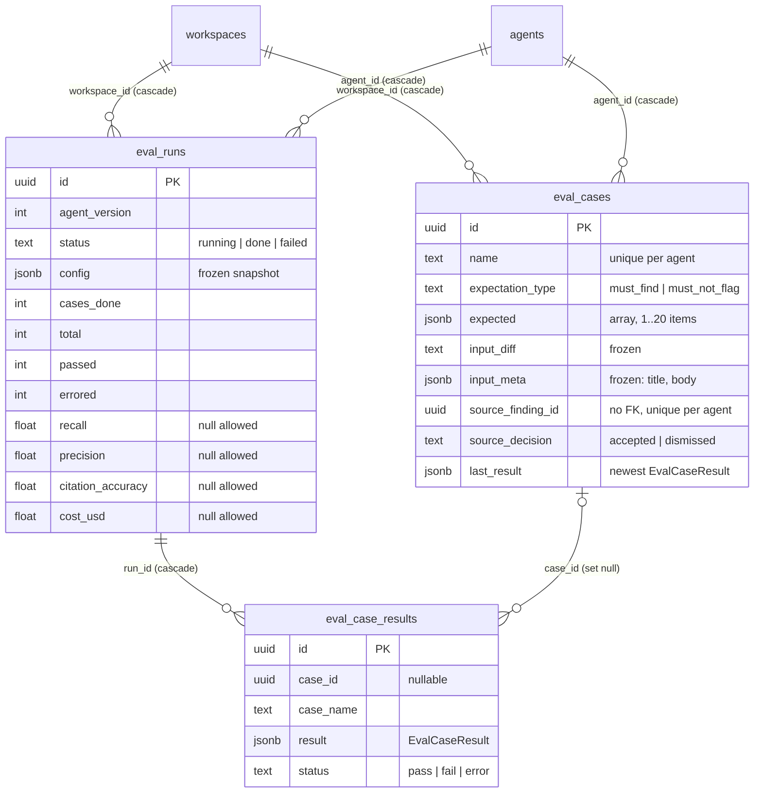
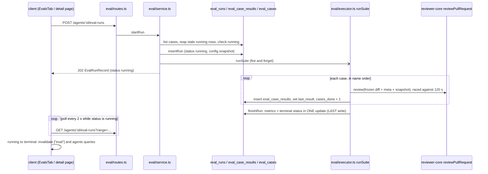
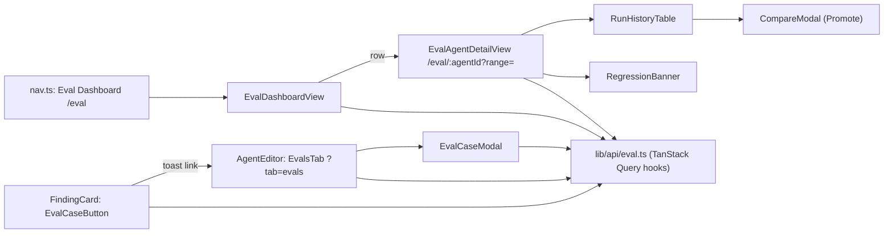

# Eval pipeline

Regression tests for review agents. You save a diff plus what the agent must (or must not) report as an **eval case**. A **suite run** replays every case of one agent through the real review pipeline and scores recall, precision and citation accuracy, so you can see whether a prompt, model or skill change made the agent better or worse. Spec: `specs/SPEC-04-eval-pipeline.md` (read it for AC ids; this page describes the code, not the spec). Plan: `docs/cc-plans/2026-10-08+eval-pipeline.md`.

Code: server `server/src/modules/eval/` (`routes.ts`, `service.ts`, `executor.ts`, `scoring.ts`, `helpers.ts`, `repository.ts`, `constants.ts`), schema `server/src/db/schema/eval.ts`, fixtures `server/src/db/seed-evals.ts`. Contracts: `vendor/shared/contracts/eval.ts` (byte-identical in `server/` and `client/`). Client: `client/src/lib/api/eval.ts`, `client/src/lib/eval.ts`, `client/src/app/(shell)/eval/**`, the agent editor's Evals tab, and a button on each finding card.

## Data model

Defined in `server/src/db/schema/eval.ts:11-100`. Migration `0017_drop_reserved_eval.sql` drops the empty placeholder `eval_cases` / `eval_runs` tables that earlier migrations reserved; `0018_eval_pipeline.sql` creates the three tables below (both appended to `meta/_journal.json`).

- **`eval_cases`** — unique `(agent_id, name)` and unique `(agent_id, source_finding_id)` (`schema/eval.ts:35-37`). Postgres treats NULLs as distinct, so hand-made cases (no source finding) never collide. `source_finding_id` has no FK on purpose: the case outlives the finding (`schema/eval.ts:26`). `expected` is CHECKed to be a JSON array.
- **`eval_runs`** — the partial unique index `eval_runs_one_running_per_agent` on `(agent_id) WHERE status = 'running'` (`schema/eval.ts:77`) is the in-flight guard: a second `running` insert for the same agent conflicts, `insertRun` uses `ON CONFLICT DO NOTHING` and returns `null` (`repository.ts:155-158`). `config` is the frozen snapshot (see below). The metric columns are nullable doubles.
- **`eval_case_results`** — one row per case per run. `case_name` is copied so the result survives deleting the case; `case_id` is `ON DELETE SET NULL` (`schema/eval.ts:89`).
- **`last_result`** — `eval_cases.last_result` holds the newest `EvalCaseResult` of the case. It is written after each case of a suite run (`executor.ts:202`) and by the single-case run (`service.ts:248`). An edit that changes the diff, the PR meta or the expectation sets it back to `null`; a name-only edit keeps it (`service.ts:148-160`). The expectation type never changes on update.

## Frozen input

A case run uses only what is stored, so the same case gives comparable results across agent versions (`executor.ts:46-90`).

- **Diff** — `eval_cases.input_diff` is parsed with `parseUnifiedDiff`. It is never refetched from GitHub.
- **PR text** — `input_meta.title` and `input_meta.body` are joined with a blank line and passed as `prDescription`. Nothing else is passed: no intent, repo-intel, project context or memory.
- **Task** — a fixed prompt, `EVAL_TASK` (`executor.ts:43`).
- **Agent config** — `buildSnapshot` (`executor.ts:21-32`) copies provider, model, system prompt, strategy (default `single-pass`) and the skills that are enabled on the link **and** on the skill itself. The snapshot is stored in `eval_runs.config` at run start, so a later edit to the agent does not change a run in progress, and Compare can diff two runs. `source` is stored per skill but removed from the API response (`service.ts:271`).
- **From a finding** — `createFromFinding` (`service.ts:71-121`) requires the finding to be accepted or dismissed (409 `finding_undecided`), the agent to still exist (`agent_missing`), and the finding's lines to be in the stored PR patch (`finding_not_in_diff`). It freezes **only that file's** patch (`fileDiffFragment`, `helpers.ts:18`), the PR title (cut to 300) and body (cut to 10 000). Accepted becomes `must_find`, dismissed becomes `must_not_flag`; the name is `must-find-<slug>` / `no-<slug>` with `-2`, `-3` on a clash (`helpers.ts:8`). A second call for the same finding returns the existing case with `created: false`.
- **Input rules** (`validateCaseInput`, `helpers.ts:35-51`): name 1-80 chars; the diff must parse and have at least one hunk and be at most 200 KB (`MAX_DIFF_BYTES`); 1-20 expectation items; each item's file must be in the diff and its range must contain a changed new-side line; title at most 300, body at most 10 000. A violation is 400 `invalid_eval_case` with `details.field`. At most 50 cases per agent (`case_limit_reached`). A too-large finding diff is 422 `case_input_too_large`.

## Scoring

Pure functions in `server/src/modules/eval/scoring.ts`; no LLM and no I/O.

**Match.** A produced finding matches an expectation item when the file is equal and the inclusive line ranges share at least one line (`scoring.ts:23-25`). Severity, category and title are not compared.

**Per case** (`scoreCase`, `scoring.ts:28-41`), over the findings that survived reviewer-core's grounding (`kept`):

| Type | Pass when | `expected_count` | `matched_count` |
|---|---|---|---|
| `must_find` | every item is matched by at least one kept finding | item count | matched items |
| `must_not_flag` | no kept finding matches any item | 0 | matching findings |

A case that throws or exceeds 120 s becomes status `error` with zero findings (`executor.ts:106-115`).

**Per run** (`scoreRun`, `scoring.ts:46-61`). Errored cases are left out of every metric.

| Metric | Formula |
|---|---|
| `recall` | sum of `matched_count` / sum of `expected_count`, over `must_find` cases |
| `precision` | `tp / (tp + fp)`; `tp` = kept findings matching a `must_find` item, `fp` = kept findings matching a `must_not_flag` item |
| `citation_accuracy` | `kept / (kept + dropped)`; `dropped` = findings grounding removed because they cite lines outside the diff |
| `cost_usd` | sum over cases; `null` if any non-errored case has no cost |
| `passed`, `errored` | counts of `pass` and `error` cases (`total` = all cases) |

**Null on a zero denominator.** `ratio(num, den)` returns `null`, not 0, when `den === 0` (`scoring.ts:43`). A `null` is stored as SQL NULL, shown as "—" by the client (`pct`, `client/src/lib/eval.ts:29`), skipped in trend lines, and gives no delta in the Compare modal. Examples: a suite of only `must_not_flag` cases has `recall = null`; a run where nothing was kept or dropped has `citation_accuracy = null`.

**Worked example.** Four cases:

| Case | Type | Items | Kept / dropped | Result |
|---|---|---|---|---|
| A | `must_find` | 2 | 3 / 1; one kept finding hits item 1 | fail; matched 1, tp 1 |
| B | `must_find` | 1 | 1 / 0; hits the item | pass; matched 1, tp 1 |
| C | `must_not_flag` | 1 | 2 / 0; one kept finding hits the item | fail; fp 1 |
| D | `must_find` | 1 | timed out | error, ignored |

- recall = (1 + 1) / (2 + 1) = 2/3, shown 67%
- precision = tp 2 / (tp 2 + fp 1) = 2/3, shown 67%
- citation accuracy = kept 6 / (6 + dropped 1) = 6/7, shown 86%
- passed 1, errored 1, total 4. Cost is the sum of A, B, C (D is errored, so a missing cost on D does not null the sum).

Tests: `server/test/eval-scoring.test.ts`.

## Suite-run lifecycle

- **Start.** `begin` checks, in this order: no cases (409 `no_eval_cases`), run in progress (409 `eval_run_in_progress`), no API key for the agent's provider (400 `no_api_key`), then inserts the run (`service.ts:196-214`). If the insert loses a race with the partial unique index it reports `eval_run_in_progress`. The route answers `202` with the `running` record; the suite continues in the background (`void runSuite(...)`, `service.ts:208`). `runSuite` never rejects.
- **Per case.** Cases run one after another. Each gets a 120 s budget (`CASE_TIMEOUT_MS`) raced with `Promise.race`; the provider's own `timeoutMs` does not bound the call (`server/INSIGHTS.md`, "`timeoutMs` on `completeStructured` does not bound the call"). The underlying HTTP request is not cancelled and may still bill. After each case the result row is inserted, `last_result` set and `cases_done` bumped (`executor.ts:199-204`), so a crash keeps finished cases.
- **Terminal status last.** Metrics and `done` / `failed` go in one update after all case rows exist (`executor.ts:170-197`), so a poller that sees `done` can read every result (`server/INSIGHTS.md`, "Marking a run `done` before its trace is written"). A run where every case errored is `failed` with error `all cases errored`; any other thrown error is `failed` with its message.
- **Retry.** The final write is retried 3 times after 200, 500 and 1000 ms. If all fail it logs `eval run final write failed`; the row stays `running` until a reaper clears it (`executor.ts:178-190`).
- **Reapers.** On boot, `server.ts` calls `reapInterrupted` before `listen`: every `running` row (all workspaces) becomes `failed` with `interrupted by server restart` (`server/src/server.ts:26`, `repository.ts:197-204`). It is not in `buildApp`, so tests do not touch a dev DB. At the next start for an agent, a `running` row older than `STALE_RUN_MS` (50 cases x 120 s + 5 min, `constants.ts:8`) is marked `failed` / `interrupted` (`service.ts:186-189`). A single API instance is assumed.
- **Case deleted mid-run.** The in-memory case list is used to the end. If the case vanished, the result insert fails on the FK (`23503`) and is re-inserted with `case_id = null` and the saved name (`repository.ts:160-170`). The run does not fail. `setLastResult` then updates no row.
- **Run all.** `POST /eval/run-all` calls `begin` for each agent in turn and does not wait for the suites (`service.ts:222-237`). It answers `202` with `started` records and `skipped` entries; skip reasons are `disabled`, `no_eval_cases`, `eval_run_in_progress`, `no_api_key` and `provider_error`. An exception while setting up one agent becomes `provider_error` for that agent only and the loop continues.
- **Single case.** `POST /eval-cases/:id/run` runs one case in the request (up to about 125 s, the client sets no fetch timeout), returns the `EvalCaseResult` and writes only `last_result`; no run row. It is refused with 409 while a suite run is in progress for the agent (`service.ts:240-250`).
- **Promote.** `POST /eval-runs/:id/promote` copies the run's provider, model, system prompt and strategy onto the agent through `AgentsService.update` (skills untouched). Only `done` runs (409 `run_not_done`), and not when the agent already matches (409 `already_current`) (`service.ts:276-293`).

## API

All routes are in `server/src/modules/eval/routes.ts`, workspace-scoped. Errors use the standard `AppError` envelope with the `code` below.

| Method and path | Success | Notes and error codes |
|---|---|---|
| `POST /findings/:id/eval-case` | 201 created / 200 existing, `{case, created}` | 404; 409 `finding_undecided`, `agent_missing`, `finding_not_in_diff`, `case_limit_reached`, `duplicate_case_name`; 422 `case_input_too_large` |
| `GET /agents/:id/eval-cases` | 200 `EvalCase[]` (by name) | 404 agent |
| `POST /agents/:id/eval-cases` | 201 `EvalCase` | 400 `invalid_eval_case` (+`details.field`); 409 `duplicate_case_name`, `case_limit_reached` |
| `PUT /eval-cases/:id` | 200 `EvalCase` | same validation; `expectation_type` ignored |
| `DELETE /eval-cases/:id` | 204 | past results keep the name |
| `POST /agents/:id/eval-runs` | 202 `EvalRunRecord` | 409 `no_eval_cases`, `eval_run_in_progress`; 400 `no_api_key` |
| `POST /eval-cases/:id/run` | 200 `EvalCaseResult` | 409 `eval_run_in_progress`; 400 `no_api_key` |
| `GET /agents/:id/eval-runs?range=` | 200 `EvalRunRecord[]`, newest first, max 100 | `range` is `7d`, `30d` (default), `90d`, `all`; else 400 `invalid_range` |
| `GET /eval-runs/:id` | 200 `EvalRunDetail` (config + results by case name) | 404 |
| `POST /eval-runs/:id/promote` | 200 `Agent` | 409 `run_not_done`, `already_current` |
| `POST /eval/run-all` | 202 `{started, skipped}` | see Run all |
| `GET /eval/dashboard` | 200 `EvalDashboard` | three queries, no per-agent loop |

Dashboard (`service.ts:295-315`): every agent with its case count and `running` (true while the agent has an `eval_runs` row with status `running`, from `repository.agentIdsRunning`); `latest` is the newest **done** run; `recall_trend` is the non-null recall of up to 10 newest done runs, oldest first; `recent_runs` is the 6 newest done runs across agents.

## Client

- **Dashboard** `/eval` (`eval/_components/EvalDashboardView`): one row per agent with latest metrics and recall sparkline, recent runs table, "Run all" button (toast with started / skipped counts).
- **Agent detail** `/eval/[agentId]` (`EvalAgentDetailView`): three KPI tiles with delta against the previous done run, a trend line chart, `RegressionBanner`, `RunHistoryTable` (tick two done runs, Compare). Run eval is disabled while a run is running or the agent has no cases.
- **Range.** `?range=` is read with `parseRange`; anything other than `7d|30d|90d|all` falls back to `30d` (`EvalAgentDetailView/helpers.ts:4-8`), so the client never sends an invalid range. Buttons call `router.replace` with the new range. The Evals tab asks for `all`.
- **Regression banner.** Shown only when a metric dropped by at least 1 point between the two newest done runs; it adds "started failing" case names by fetching both run details (`RegressionBanner/helpers.ts`).
- **Compare** (`CompareModal`): metric deltas, word diff of the system prompt (plain text spans), config changes, case-set note. Promote is disabled when the newer run's config already equals the live agent; it asks for confirmation.
- **Evals tab** (`agents/[id]/_components/AgentEditor/_components/EvalsTab`): metrics of the latest done run, case list with per-case Run and Delete, New case, run-all-cases. The tab is listed in both `TABS` (`AgentEditor/constants.ts`) and `VALID_TABS` (`AgentEditorView.tsx:16`).
- **Case modal** (`EvalCaseModal`): validates with the shared `EvalCaseInput` before sending and maps server `invalid_eval_case` / `duplicate_case_name` to field errors. "Run on save" (default on) fires the single-case run after saving.
- **Finding card** (`FindingCard/EvalCaseButton.tsx`): enabled once the finding is accepted or dismissed. On success it toasts with a link to `/agents/:id?tab=evals`, with different copy when the case already existed.

**Data flow** (`client/src/lib/api/eval.ts`):

- Query keys live under `["eval", ...]` (`evalKeys`).
- Every case or run mutation invalidates `evalKeys.all` on success. Error toasts are defined on the mutation options so they still show after the user leaves the page; codes in `EVAL_ERROR_CODES` (`client/src/lib/eval.ts:5-16`) have translated copy, others show the server message. Create and update show 400 / 409 inline instead.
- `useEvalRuns` polls every 2 s while any returned run is `running`. When that flips from true to false, `useRefreshWhenRunFinishes` invalidates `["eval"]` and the agents queries (so case `last_result`, the dashboard, run lists and Compare's live agent refresh).
- `useEvalDashboard` polls every 2 s while any `agents[].running` is true and uses the same refresh hook, so the dashboard updates when a run finishes. `latest` holds done runs only, which is why the separate `running` flag exists.

## Seed fixtures and verification

`seedEvalCases` (`server/src/db/seed-evals.ts:90`) is called from `seed()` (`server/src/db/seed.ts`) for the built-in **Security Reviewer**, so `pnpm db:seed` gives it 8 cases: 5 `must_find` (SQL injection, hard-coded key, SSRF, command injection, XSS) and 3 `must_not_flag` (parameterised query, key read from env, fake token in a test). Each fixture goes through the same `validateCaseInput` as user input, so a broken fixture fails the seed loudly. Insert is idempotent by `(agent, name)`: an existing case is never overwritten, so edits survive a re-seed. The seeded agents default to `deepseek/deepseek-v4-flash` (`seed.ts:22`), which `server/INSIGHTS.md` reports as slow or invalid on the first try; pick a faster model in the editor before a live demo.

`pnpm verify:l06` (in `server/`, `package.json:12`) runs seven vitest files with `EVAL_REQUIRE_DOCKER=1`: `eval-scoring`, `eval-frozen-input`, `eval-executor`, `eval-contracts`, `eval-seed`, `contracts`, `eval.it`. The integration file uses Testcontainers Postgres. Normally `*.it.test.ts` skip without Docker; with `EVAL_REQUIRE_DOCKER` set, `eval.it.test.ts` throws at load (`server/test/eval.it.test.ts:17`), so **`verify:l06` fails without Docker**. Plain `pnpm test` still skips.

## Known limitations

- **Gemini via OpenRouter rejects the review JSON schema.** Reported when SPEC-04 was run against a real model: the structured call sends the Review schema as strict `response_format: json_schema` (`reviewer-core/src/llm/openrouter.ts:75-76`), and a Gemini model on OpenRouter answers 400 because of a `$ref` in that schema. Every case then ends as `error`, and an all-error run is `failed`. This repo has no test or doc that reproduces it; treat it as an external report. Use a model known to accept the schema.
- **Follow-up F3** (review log, deferred): two concurrent create-from-finding calls with the same title for different findings can race on the case name and one gets 409 `duplicate_case_name` (`service.ts:118-120`).
- **Follow-up F4** (deferred): editing a case while a suite run is in flight can be overwritten by the run, because `runSuite` writes `last_result` from the case it loaded at start (`executor.ts:202`), so a stale result can reappear after the edit cleared it.
- **Follow-up N1** (deferred): switching agent or range on `/eval/[agentId]` while a run is running changes the query key, which has no data yet, so `useRefreshWhenRunFinishes` sees running go true to false and fires one extra invalidation of the eval and agent queries. It does not loop (`client/src/lib/api/eval.ts`).
- A timed-out case does not cancel the provider call (it may still bill). No `AbortSignal` in `LLMProvider`; reviewer-core is unchanged.
- Single API instance only: the boot reaper fails every `running` run.
- The case list is capped (50 per agent), run history at 100 rows per query, and results at 50 per run.
