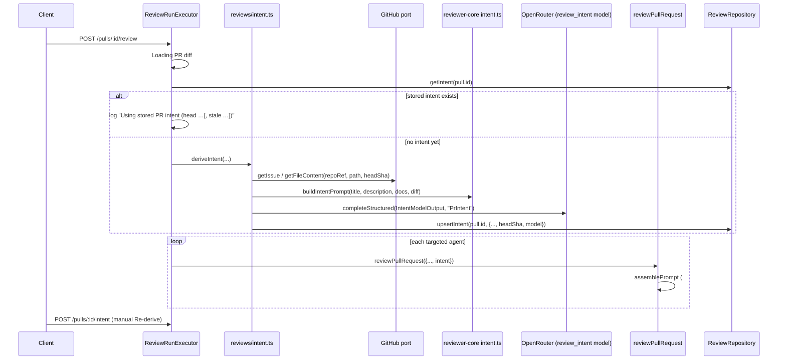

# PR Intent Layer

Before a review runs, `server` derives the PR's **intent** — a cheap, separate
LLM call that summarizes what the PR is trying to do and tags a set of
`in_scope` / `out_of_scope` statements. The intent is stored per PR, shown as
a card on the Overview tab, injected into every reviewing agent's prompt, and
used to filter out findings the reviewer flagged as out of the PR's stated
scope (minus one CRITICAL kept as a signal). See the shared pipeline
architecture in [`reviewer-core/docs/README.md`](../../reviewer-core/docs/README.md#pr-intent-scope-filter-intentts).

## Flow: PR import to review



Source: `server/src/modules/reviews/run-executor.ts:109-137` (`executeRuns`),
`server/src/modules/reviews/intent.ts:21-158` (`deriveIntent`),
`reviewer-core/src/review/run.ts:217-231` (scope filter call site).

## Context sources and caps

`deriveIntent` (`server/src/modules/reviews/intent.ts:21-158`) assembles a
fixed set of sources, each recorded with a `status` of `used` or
`unavailable`:

| Source kind | Where it comes from | Cap |
|---|---|---|
| `title` | `pull.title` | 300 chars (`intent.ts:96`) |
| `description` | `pull.body`, only when non-empty | 4000 chars (`intent.ts:41`) |
| `issue` | `#N`, `Fixes/Closes/Resolves #N`, or a same-repo issue/PR URL → `github.getIssue(repoRef, n)` | ≤5 followable links (`MAX_INTENT_LINKS`, `constants.ts:17`), 8000 chars each (`intent.ts:59`) |
| `plan_file` | A same-repo GitHub blob URL, or a bare relative `*.md` path (including a root-level file like `SPEC.md`) → `github.getFileContent(repoRef, path, pull.headSha)` | Same 5-link cap, 8000 chars (`intent.ts:70`) |
| `files` | `diff.raw`, hunk headers only | ≤100 files, ≤20 headers/file, 160 chars/header (`reviewer-core/src/intent.ts:72-74`) |

`MAX_INTENT_SOURCES = 10` (`constants.ts:19`) bounds the total number of
recorded sources (used + unavailable combined); once that budget is hit the
loop stops recording new links (`intent.ts:54`).

**Link extraction is GitHub-only — no arbitrary URL fetch.** `extractIntentLinks`
(`server/src/modules/reviews/helpers.ts:188-279`) is a pure function: it never
performs I/O itself, only classifies links found in `pull.body`:

- Same-repo `#N`, `Fixes/Closes/Resolves #N`, or a same-repo `.../issues|pull/N`
  URL → `issue` (the PR's own number is skipped, `helpers.ts:207`).
- A same-repo GitHub `blob` URL ending `.md`, or a bare relative path ending
  `.md` (root-level `SPEC.md` matches the same regex as a nested
  `docs/plan.md` — `REL_MD_RE`, `helpers.ts:163`) → `plan_file`, but only when
  `isSafeRelativePath` accepts it (`helpers.ts:170-174`): no `/`-absolute
  path, no `..` segment, and only `[\w./-]` characters — this is the SSRF/
  path-traversal guard.
- Everything else (Jira, Notion, other domains, other repos, a link past the
  5-link cap) → `external`, which `deriveIntent` records as `unavailable` and
  **never fetches** (`intent.ts:82-85`). `owner`/`name` for a same-repo check
  always come from the caller's `RepoRef`, never parsed out of the link
  itself, so a same-repo-looking-but-forged host can't smuggle a fetch.

A `plan_file` link is fetched at the PR's **head SHA**
(`github.getFileContent(repoRef, link.path!, pull.headSha)`,
`intent.ts:68`), not whatever ref the URL happened to name.

## Confidence with an empty description

Confidence is computed deterministically in code — never self-reported by
the model (`reviewer-core/src/intent.ts:54-63`, `deriveConfidence`):

| Condition | Confidence |
|---|---|
| `description` used AND ≥1 `issue`/`plan_file` used AND no source `unavailable` | `high` |
| `description` used OR ≥1 `issue`/`plan_file` used | `medium` |
| Only `title` and/or `files` used (e.g. PR body is empty and no links resolve) | `low` |

An empty PR description (`pull.body` blank) means the `description` source is
never pushed to `sources` (`intent.ts:40-42`), so confidence falls to `medium`
(a resolved issue/plan link) or `low` (title + diff only).

## Caching, staleness, and Re-derive

- `pr_intent` is keyed by `pr_id` (primary key,
  `server/src/db/schema/reviews.ts:48-61`) and stores `head_sha`, `model`,
  `confidence`, `sources`, `missing_context`, and `created_at` alongside the
  summary/in-scope/out-of-scope arrays.
- `executeRuns` reuses a stored intent **even when the PR's head has moved
  past `head_sha`** — it only logs the mismatch
  (`run-executor.ts:113-124`: `Using stored PR intent (head abc1234, stale —
  PR head is now def5678)`); it never auto-re-derives.
- The client marks the card `stale` by comparing `head_sha !== pr.head_sha`
  at render time (`docs/cc-plans/2026-09-23+intent-layer.md` step 10 —
  verified in code at
  `client/src/app/(shell)/repos/[repoId]/pulls/[number]/_components/OverviewTab/_components/IntentCard/`,
  which reads `useIntent`/`useRederiveIntent` from `client/src/lib/api/reviews.ts`).
- `GET /pulls/:id/intent` returns the stored `PrIntentRecord | null`
  (`server/src/modules/reviews/routes.ts:154-157` → `service.getIntent`).
- `POST /pulls/:id/intent` re-derives synchronously (manual "Re-derive"):
  it reloads the diff and calls `deriveIntent` again, always overwriting the
  stored row via `upsertIntent` (`server/src/modules/reviews/service.ts:169-185`,
  `routes.ts:162-169`). It shares the `/review` route's rate limit (10/min).
- A review run only calls the classifier **once per PR** as long as a row
  exists — a second `/pulls/:id/review` call with a stored intent does not
  invoke the model again (`run-executor.ts:115-123`).

## Scope filter and the single CRITICAL signal

The scope filter only runs when an intent was actually supplied to
`reviewPullRequest` — without one, the review schema has no `in_scope` tag
and the filter step is skipped entirely, so an intent-less review is
untouched (`reviewer-core/src/review/run.ts:152` picks `ScopedReview` over
`Review` only `if (input.intent)`; the filter call at `run.ts:217-221` uses
the same guard).

`applyScopeFilter` (`reviewer-core/src/intent.ts:221-241`):

- A finding tagged `in_scope: false` is dropped; a finding with **no tag is
  treated as in-scope** — the filter fails open, it never silently swallows
  an untagged finding (`intent.ts:225-226`).
- Among the dropped out-of-scope findings, the highest-confidence `CRITICAL`
  one survives as a **signal**, renamed with a `(out of scope) ` prefix
  (`intent.ts:229-235`) — every other out-of-scope finding is discarded.
- The `in_scope` tag itself is a transport detail of `ScopedReview` and is
  stripped before a `Finding` leaves `applyScopeFilter` (`stripScope`,
  `intent.ts:244-247`) — it never reaches the shared `Finding` contract.

The model is instructed with `SCOPE_RULE`
(`reviewer-core/src/prompt.ts:36-43`), appended to the system prompt right
after `INJECTION_GUARD` **only when an intent is present**
(`prompt.ts:113-115`): any defect introduced by the diff's own added/changed
lines is always `in_scope: true`; `false` is reserved for pre-existing code
the intent explicitly marks out of scope; scope never lowers severity or
excuses a finding from being reported. Without an intent, the prompt and
schema stay byte-identical to the no-intent baseline (`prompt.ts:93`,
verified by `reviewer-core/test/prompt.test.ts`).

## Logging (Live Log, via `RunLogger`)

Exact log lines emitted by `deriveIntent` (`server/src/modules/reviews/intent.ts`):

```
tool   Deriving PR intent…
info   intent: model <provider>/<model>
info   intent: sources — title pr-title used; description pr-description used; issue #12 used; plan_file docs/plan.md used; issue jira.example.com/browse/X-1 unavailable
info   intent: prompt — system ~N tok, pr-title ~N tok, pr-description ~N tok, issue:#12 ~N tok, plan_file:docs/plan.md ~N tok, changed-files ~N tok (14 files, 37 hunk headers; no diff bodies)
result Deriving PR intent done (Nms) — confidence medium, 3 in scope / 2 out of scope, cost $0.0012
```
(`intent.ts:32,35,91-93,103-105,151-155`)

And from `executeRuns` when a stored intent is reused
(`run-executor.ts:118-121`):

```
info   Using stored PR intent (head abc1234[, stale — PR head is now def5678])
```

On any classifier failure (missing key, GitHub error, timeout), the run logs
an `info` line and continues **without** an intent — never `error` (an
`error` event triggers a UI toast, which this failure mode is not meant to):

```
info   Intent unavailable — continuing without it: <error message>
```
(`run-executor.ts:135-136`)

From `reviewer-core/src/review/run.ts:222-231`, when an intent was present:

```
info   scope filter dropped "<title>" (out of scope)
result Scope filter: dropped N out-of-scope finding(s); kept 1 critical as signal: "<title>"
result Scope filter: dropped N out-of-scope finding(s); no signal kept
```

**What is redacted:** the log never includes the body text of the PR
description, issue, or plan file, the derived summary, the diff, query
strings from URLs, or any secret/key. `intent: sources` logs only
`kind ref status` triples (e.g. `plan_file docs/plan.md used`), and
`intent: prompt` logs only per-section token counts
(`container.tokenizer.count`, `intent.ts:102`) — never the section text
itself.

## Structured prompt-assembly log (`prompt.assembled`)

Every LLM call — the intent classifier and each reviewer call (one per chunk in map-reduce) — writes one structured record to the **server log only** (pino, `info`). It is not streamed to the Live Log and not stored in the trace; the Live Log gets a one-line summary instead (`review prompt: ~61.9k tok — system ~1.0k, …, diff ~58.2k (openrouter/…)`, first call only).

| Field | Meaning |
|---|---|
| `event` | always `prompt.assembled` |
| `call` | `intent` or `review` |
| `provider`, `model` | the model actually used for this call |
| `correlation_id` | review: the batch id (`agent_runs.batch_id`) shared by the intent call and every agent of one "Run Review"; re-derive: a fresh id per request (pino also adds Fastify's `reqId`) |
| `prId`, `runIds`, `agent` | from the `RunLogger` context |
| `chunk` | map-reduce file label; absent for single-pass |
| `sections[]` | `{name, source, chars, tokens}` in prompt order |
| `total_chars`, `total_tokens` | sums over sections (tokens via the tiktoken port) |

Sources: `agent` (agent system prompt), `engine` (guard / classifier system text), `pr` (title, task line, description), `intent-classifier`, `skill`, `memory`, `repo-intel` (repo map, callers), `project-context` (specs), `github-issue`, `repo-file` (plan/spec `.md`), `git` (diff / hunk headers).

**Never logged:** section text of any kind — no secrets, diff lines, spec / issue / PR text or model output. The record is built from lengths, counts, names and sources only (`server/src/modules/reviews/prompt-log.ts`); `server/test/prompt-log.test.ts` asserts a secret, diff lines and spec text never appear in it.

### Verbose mode (local only)

`PROMPT_LOG_VERBOSE=true` in `server/.env` adds, still without content:
- `sha256` — first 12 hex of each section's hash, to see which parts changed between two runs;
- `items[]` — per-skill / per-spec sizes (by index);
- `diff_files[]` — per-file `{path, chars, tokens, hunks}` of the diff section.

It is forced off when `NODE_ENV=production` (`config.promptLogVerbose`), so a stray variable in a deployment cannot enable it.

## Settings: which model runs the classifier

`review_intent` is a `FeatureModelId`
(`server/src/vendor/shared/contracts/platform.ts:14-20`), selectable per
workspace in Settings → Models (`SettingsModels.tsx`, already renders every
`FEATURE_MODELS` entry). Its default is
`openrouter` / `google/gemini-2.5-flash-lite`
(`platform.ts:51-57`). The default was **changed after a live latency
probe**: `deepseek/deepseek-v4-flash` (the default used elsewhere, e.g.
`onboarding` and `conventions`, `platform.ts:49,77`) took ~71s to classify a
74-file PR's intent, against ~2s for `gemini-2.5-flash-lite` on the same
payload — with `INTENT_TIMEOUT_MS = 60_000` (`constants.ts:21`), the
`deepseek` default would routinely time out on larger PRs.
`resolveFeatureModel(container, workspaceId, 'review_intent')`
(`server/src/modules/reviews/intent.ts:34`, imported from
`../settings/index.js` per the module's cross-module-import convention)
resolves the workspace's override or this default.

## Failure behaviour

- **Auto-derive (inside a review run):** any error from `deriveIntent` —
  missing provider key, a GitHub fetch failure, or the classifier not
  answering within `INTENT_TIMEOUT_MS` — is caught in `executeRuns` and
  logged as `info`; the review proceeds for every targeted agent **without**
  an intent block (`run-executor.ts:113-137`). It never fails the run.
- **Manual Re-derive (`POST /pulls/:id/intent`):** the same failure is *not*
  swallowed — a raw SDK/HTTP/schema error from the model call is wrapped in
  `ExternalServiceError` (`intent.ts:120-125`), which the global error
  handler turns into an HTTP **502**; an `AppError` (e.g. a `ConfigError` for
  a missing provider key) keeps its own status code instead.
- The intent classifier's own `timeoutMs` option is not trusted — the call is
  raced against a manual `setTimeout` (`Promise.race`,
  `intent.ts:109-132`), per the `completeStructured` timeout caveat in
  `server/INSIGHTS.md`.
