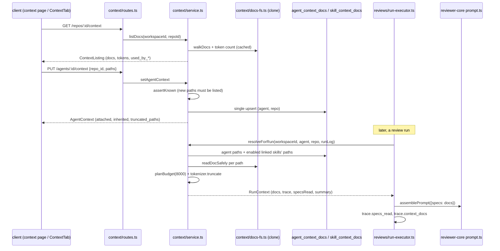

# Project Context folder

Repo markdown docs (specs, docs, insights) that you attach to an agent or a skill. At run time the server reads them from the repo clone and injects them into the review prompt as untrusted `## Project context` blocks. Spec: `specs/SPEC-01-project-context-folder.md`. Storage/glob/token decisions: [ADR 0001](../../docs/adr/0001-project-context-storage-glob-budget.md).

Code: `server/src/modules/context/` (routes, service, repository, `docs-fs.ts`, `helpers.ts`, `token-cache.ts`), run hook in `server/src/modules/reviews/run-executor.ts`, prompt rendering in `reviewer-core/src/prompt.ts`. Client: `/repos/:repoId/context` page, `components/context/{ContextTab,DocPreviewDrawer}` (used by `AgentEditor` and `SkillEditor`).

## Data flow

Routes (`modules/context/routes.ts`): `GET /repos/:id/context`, `GET /repos/:id/context/file?path=`, `GET|PUT /agents/:id/context`, `GET|PUT /skills/:id/context` (`repo_id` in the query for GET, in the body for PUT). Wire shapes: `ContextListing`, `ContextDocFile`, `AgentContext`, `SkillContext`, `SetContextAttachmentsInput` in `vendor/shared/contracts/platform.ts` (both vendor copies).

## Discovery and `CONTEXT_DOCS_GLOB`

- Default `**/{specs,docs,insights}/**/*.md` (`platform/config.ts:84`). The env var is validated at boot against one regex of that exact shape. Roots must be a non-empty subset of `specs|docs|insights`, otherwise `loadConfig` throws (`config.ts:85-96`). Any other glob is rejected, not interpreted.
- A doc's `type` is the first *directory* segment that is a configured root, never the file name (`helpers.ts:8`). The extension must be exactly lowercase `.md` (`helpers.ts:14`).
- `walkDocs` skips `repo-intel` `EXCLUDED_DIRS` plus `.git`, never follows symlinks, and drops files over `MAX_FILE_SIZE` (400 KB) (`docs-fs.ts:15-52`). Dot-folders such as `.devdigest/specs/` are walked.
- No clone directory: the listing returns `status: 'no_clone'` and no docs (`service.ts:66-70`, `:87`).
- Token counts are cached per `abs|mtimeMs|size` in a process-wide map; every snapshot prunes the repo's stale keys (`token-cache.ts`, `service.ts:78`).

## Path safety

- Shape check of a client-supplied `path`: rejects a leading `/`, `\`, NUL, drive letters and any `..` segment (`helpers.ts:19-24`). `GET .../file` answers 400 `invalid_path`, and 404 `context_doc_not_found` when the path is not in the walk (`service.ts:273-282`).
- `readDocSafely` is the only reader (do not use `GitClient.readFile`). It re-checks the shape, `lstat`s every path component and rejects symlinks, requires the `realpath` to stay under the real clone root, and requires a regular file within `MAX_FILE_SIZE` (`docs-fs.ts:56-69`).
- `UNSAFE_PATH_CHARS` (control chars, `"`, backtick, `<`, `>`) excludes a file from the listing, because the path is printed raw in the prompt's `### <path>` heading (`constants.ts:7-12`, `helpers.ts:14`).
- In the prompt each doc is one `<untrusted>` block via `wrapUntrusted`. The label is whitelisted; the full path lives in the heading (`reviewer-core/src/prompt.ts:62-70`).

## Attachments and workspace scoping

- Tables `agent_context_docs` / `skill_context_docs` (migration `0016_slim_random.sql`, schema `db/schema/context.ts`): PK (owner, repo), `paths jsonb` ordered array (CHECK `jsonb_typeof = 'array'`), cascade FKs. A PUT replaces the set with one upsert (last write wins).
- Every read joins the owner to `workspace_id` (`repository.ts`: `agentPaths`, `skillPathsFor`, `usedByCounts`, `repoInWorkspace`). Foreign repo, agent or skill ids give 404 (`service.ts:56-60`).
- PUT validation: body paths unique, max 500 (`SetContextAttachmentsInput`). Each new path must exist in the current walk, but paths already stored are kept even if the file vanished (`service.ts:173-178`) and show as `not_found`. An unknown path gives 400 `unknown_path`.
- `AgentContext.inherited` = paths of the agent's enabled links to enabled, in-workspace skills (`service.ts:108-117`). Merge order: agent paths, then each skill's; the first occurrence of a path wins (`helpers.ts:34`).

## Run injection and budget

`ReviewRunExecutor` calls `resolveForRun` first inside the `try`, before the provider is resolved, so a keyless or early failure still records the docs (`run-executor.ts:205`). No LLM call is involved.

- The budget is `CONTEXT_BUDGET_TOKENS = 8000` for the whole section (`constants.ts:2`), counted with the container tokenizer.
- `planBudget` (`helpers.ts:62`) walks docs in merged order. A doc that fits is read whole. The doc that crosses keeps the remaining tokens (`tokenizer.truncate`) plus `\n[truncated]`. Every later doc keeps 0 tokens: the heading plus `[truncated]` only (`service.ts:247-253`).
- `TiktokenTokenizer.truncate` encodes, slices, decodes, drops a trailing U+FFFD and re-checks the count. It falls back to `maxTokens * 4` chars if the encoder breaks. Special-token text in docs is encoded as plain text (`adapters/tokenizer/index.ts:36-60`).
- An unreadable or missing doc is skipped, with a `warn` run-log line naming only its path (`service.ts:235`).
- `GET /agents/:id/context` reports `budget_tokens` and `truncated_paths` from the same `planBudget` (`service.ts:119-150`), so the editor can warn before a run.

## Trace and logs

| Field | Where | Meaning |
|---|---|---|
| `specs_read` | `RunTrace` | Injected paths in prompt order (read + truncated, not missing) (`run-executor.ts:353`) |
| `context_docs` | `RunTrace`, optional | One `ContextDocTrace` per attached path: `path, tokens, origin (agent/skill), origin_name, status (read/truncated/missing)`. Written only when something was attached (`run-executor.ts:354`) |
| `specs` prompt slot | `RunTrace.prompt` | `renderProjectContext(docs)` on the failure path (`traceFromBuffer`, `run-executor.ts:545`) |
| `warn` log kind | `RunEventKind` | New kind, mapped to pino `warn` (`platform/run-logger.ts:34`, `:72`); highlighted in `LiveLogStream` |
| `project_context` | `prompt.assembled` record | Counts only: `docs, tokens, truncated, missing`; never doc text (`reviews/prompt-log.ts`) |

Both trace builders (success path and `traceFromBuffer`) set `specs_read` and `context_docs`; keep them in sync when you add a slot (see `server/INSIGHTS.md`). The client trace drawer prefers `context_docs` and falls back to `specs_read` for old traces (`TraceBody.tsx:42-56`).

## Tests

`server/test/context-helpers.test.ts`, `context-fs.test.ts`, `config.test.ts`, `tokenizer.test.ts`, `prompt-log.test.ts`, `context.it.test.ts` and `context-run.it.test.ts` (Docker), `reviewer-core/test/prompt.test.ts`, e2e flow `e2e/flows/08-project-context.flow.json` (see `e2e/flows-docs/08-project-context.md`).
