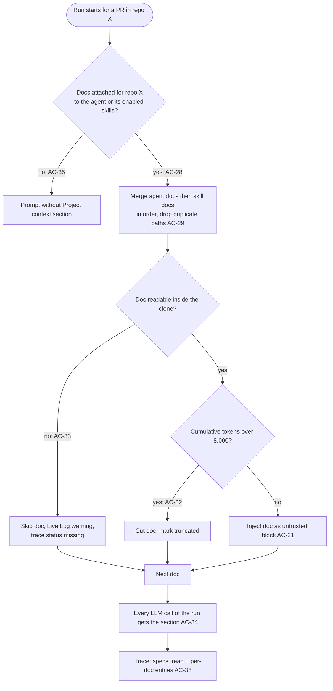
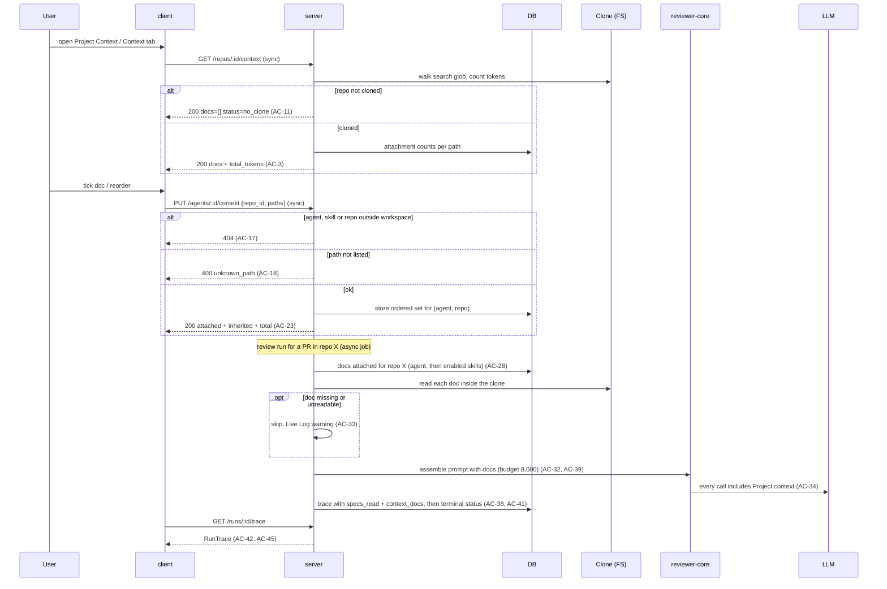

# Spec: Project Context Folder — attach repository markdown docs to agents and skills
Spec ID: SPEC-01
Status: approved
Supersedes: none

## Problem and user

**User:** a DevDigest workspace member who configures review agents and skills (Skills Lab) and reads review runs on the PR page.

**Pain today:** a team's specs, architecture docs and incident insights live as markdown in the repository, but a review agent never sees them. The reviewer cannot flag a PR that breaks a documented invariant ("module `api/` does not import `db/` directly"), and there is no way to tell whether a spec influenced a review. The prompt already has an empty `## Project context` slot and the run trace already has an empty "Specs read" row; nothing fills them.

**Why now:** this is the smallest feature that shows directly in a run trace whether a spec changed reviewer behavior. Automatic selection of docs by PR content is a later, separate feature.

**User's words (source of truth):** "The user can find all specs or other MD documents in the project. On the Project Context page the user can attach these documents to skills or agents via the corresponding tabs shown in the design. Tokens must be counted in place according to the size of these MD docs, so we know how many tokens each attached doc adds to every prompt. When an agent starts, its attached documents must be read from the project and added as text into the prompt. When we open the run view to see what was added in Prompt Assembly, there must be an entry 'Project context — attached specs (untrusted)' that can be opened to read the full text added to the request."

**Modules:** `server` (doc listing from the repo clone, attachment storage, injection into a review run, run trace), `client` (Project Context page, agent and skill Context tabs, doc preview drawer, run trace), `reviewer-core` (rendering of the `## Project context` section), `e2e` (attach → run → trace flow). `mcp` is not changed.

**Domain terms:** a *doc* is a markdown file in a repo that matches the search glob; an *attachment* links a doc path to an agent or a skill for one repo; a *run* is one agent's review of a PR; the *trace* is the run's persisted record shown in the run drawer.

## Goals / Non-goals

**Goals**
- List every markdown doc under the configured search roots of a repo's default-branch clone, read-only, with per-doc token counts.
- Let the user attach docs to an agent and to a skill, separately for each repo, in a user-defined order, seeing per-doc and total token cost before any run.
- At run time, read the attached docs of the PR's repo from the clone and inject them as untrusted, delimited text into one `## Project context` section, within an 8,000-token budget, with no extra LLM call.
- Show in the run trace which docs were injected, their tokens, origin and status, and the full injected text.

**Non-goals**
- Automatic selection of docs by PR content (separate future feature).
- Editing, creating, uploading, or creating folders for docs from DevDigest (the design's Edit / New / Folder / Upload controls) — separate future feature.
- The design's coverage ring and vector indexing / chunk counts on the Project Context page.
- A UI for configuring the search roots (server configuration only).
- Reading docs from the PR head or base commit; docs always come from the default-branch clone at its last sync.
- Versioning attachments: changing them does not create a new agent or skill version.
- The skill tab's "Serializes as `## Project specifications`" preview; skill docs merge into the single `## Project context` section.
- Any MCP tool change.
- Remote images in previewed markdown.

## User stories

- **US-1:** As a workspace member, I want to browse all markdown docs of the selected repo with a preview and their token size, so that I know which project knowledge exists and what it would cost in a prompt.
- **US-2:** As a workspace member, I want to attach and order docs for an agent per repo and see the per-doc and total tokens, including docs inherited from its skills, so that I control exactly what context the agent gets and what it costs.
- **US-3:** As a workspace member, I want to attach docs to a skill per repo, so that every agent using that skill inherits them.
- **US-4:** As a workspace member, I want a review run to read the attached docs from the repo and add them to the prompt as untrusted context, so that the reviewer checks the PR against my project's documented rules.
- **US-5:** As a workspace member, I want the run trace to show which docs were injected, their tokens and status, and the full injected text, so that I can verify what the reviewer saw.
- **US-6:** As a workspace member, I want a reviewer to cite the attached doc when a PR breaks a documented invariant, so that I can see that the spec influenced the review.

### Workflow

## Acceptance criteria (EARS)

### US-1 — Browse docs

- **AC-1:** The server shall list for a repo every file in that repo's default-branch clone whose repo-relative path matches the configured search glob, defaulting to `**/{specs,docs,insights}/**/*.md` and including dot-folders such as `.devdigest/specs/`. [verify: it]
- **AC-2:** The server shall leave out of the listing every matching file larger than 400 KB, every symbolic link and every path that contains a control character, a double quote, a backtick, `<` or `>`. [verify: unit]
- **AC-3:** The server shall report for each listed doc its repo-relative path, its type (`specs`, `docs` or `insights`, taken from the first path segment that equals a root name), its size in bytes, its token count and the number of agents and of skills that attach it for that repo. [verify: it]
- **AC-4:** WHEN the user opens the Project Context page for the repo selected in the sidebar, the client shall show the repo's docs grouped by type with path and token count per doc. [verify: unit]
- **AC-5:** WHEN the user types in the Project Context page search field, the client shall show only the docs whose path contains the typed text ignoring case. [verify: unit]
- **AC-6:** WHEN the user selects a doc on the Project Context page, the client shall show its rendered markdown together with its path, type badge, token count and "Used by N agents · M skills". [verify: unit]
- **AC-7:** The client shall render each image in previewed markdown as its alt text or a link without requesting the image URL. [verify: unit]
- **AC-8:** The client shall show on the Project Context page the footer "Indexed: N files · M tokens total · last <time since the clone's last sync>". [verify: unit]
- **AC-9:** WHEN the user clicks Refresh on the Project Context page, the client shall start the existing repo resync and re-list the docs once the resync has finished. [verify: unit]
- **AC-10:** IF the repo has no doc that matches the search glob, THEN the client shall show an empty state that names the search glob. [verify: unit]
- **AC-11:** IF the repo has no clone yet, THEN the server shall answer the listing with an empty doc list and status `no_clone`. [verify: it]
- **AC-12:** IF a requested doc path is absolute or contains a `..` segment or is not in the repo's current listing, THEN the server shall refuse it with 400 `invalid_path` or 404 `context_doc_not_found` without reading any file. [verify: unit, it]
- **AC-13:** The server shall read a doc only when its resolved real path lies inside the repo's clone directory and no component of the path is a symbolic link. [verify: unit]
- **AC-14:** The client shall show a "Project Context" item in the sidebar WORKSPACE group that opens the Project Context page of the repo selected in the sidebar. [verify: unit]

### US-2 — Agent Context tab

- **AC-15:** WHEN the user opens the agent editor's Context tab, the client shall list every doc of the repo selected in the sidebar with a checkbox, file name, folder, type badge, token count and a Preview action. [verify: unit]
- **AC-16:** WHEN the user ticks or unticks a doc in the agent Context tab, the server shall store the agent's ordered attachment set for the selected repo and leave the agent's sets for other repos unchanged. [verify: it]
- **AC-17:** IF an attachment read or write names an agent or skill or repo outside the caller's workspace, THEN the server shall respond 404 and store nothing. [verify: it]
- **AC-18:** IF an attachment write adds a path that is not in the repo's current listing, THEN the server shall respond 400 `unknown_path` and store nothing. [verify: it]
- **AC-19:** The server shall return inherited docs only from skills that belong to the caller's workspace and are linked to the agent. [verify: it]
- **AC-20:** The client shall show the agent's attached docs in their stored order followed by the docs inherited from the agent's enabled linked skills as read-only rows labelled "via <skill name>". [verify: unit]
- **AC-21:** WHEN the user drags an attached doc to a new position, the client shall store the new order. [verify: unit]
- **AC-22:** WHEN the user activates the move-up or move-down control of an attached doc from the keyboard, the client shall move the doc by one position and store the new order. [verify: unit]
- **AC-23:** The client shall show in the agent Context tab the count "N of M attached" and the total "≈ T tokens" of attached and inherited docs counted once per path. [verify: unit]
- **AC-24:** IF the token total of the agent's docs for the selected repo exceeds 8000, THEN the client shall show an over-budget warning that names the docs the run will truncate. [verify: unit]
- **AC-25:** The server shall count a doc's tokens with the same tokenizer that measures the injected project context of a run, so an unchanged doc that is not truncated shows the same number in the editor and in the trace. [verify: it]
- **AC-26:** IF a stored attachment path is no longer in the repo's listing, THEN the client shall show the row as "not found in <repo>" with a Detach action. [verify: unit]
- **AC-27:** WHEN the user clicks Preview on a doc row, the client shall open a drawer with the doc's path, type badge, "Used by" counts, token count, an Attached toggle that shows and changes the attachment, and the rendered markdown. [verify: unit]
- **AC-36:** WHEN attachments of an agent or a skill change, the server shall keep the agent's and skill's version numbers unchanged. [verify: it]

### US-3 — Skill Context tab

- **AC-30:** WHEN the user opens the skill editor's Context tab, the client shall show "Project context to use" with the note "Any agent using this skill inherits these documents" and the same doc list, attach toggle, order controls, token total and over-budget warning as the agent Context tab for the repo selected in the sidebar. [verify: unit]
- **AC-31:** WHEN the user ticks or unticks a doc in the skill Context tab, the server shall store the skill's ordered attachment set for the selected repo and leave the skill's sets for other repos unchanged. [verify: it]

### US-4 — Injection into a run

- **AC-28:** WHEN a review run starts for a PR in repo X, the server shall take the agent's docs attached for repo X followed by the docs attached for repo X to each enabled linked skill in skill link order. [verify: it]
- **AC-29:** The server shall inject each doc path at most once per run, keeping its first occurrence and that occurrence's origin. [verify: unit]
- **AC-32:** IF the cumulative tokens of a run's docs exceed 8000, THEN the server shall cut the doc that crosses the limit to the remaining budget followed by a `[truncated]` marker and inject every later doc as its path heading followed by `[truncated]` only. [verify: unit]
- **AC-33:** IF an attached doc is missing or unreadable when the run reads it, THEN the server shall skip the doc and write a Live Log warning naming its path and continue the run. [verify: it]
- **AC-34:** WHERE the agent's strategy makes more than one LLM call for a run, the system shall include the same `## Project context` section in every call. [verify: unit]
- **AC-35:** IF no doc is attached for the PR's repo to the agent or its enabled linked skills, THEN the system shall leave the `## Project context` section out of the prompt. [verify: unit]
- **AC-37:** The server shall never inject into a run a doc that is attached only for a repo other than the PR's repo. [verify: it]
- **AC-39:** The system shall render each injected doc inside the `## Project context` section as its own untrusted-delimited block whose source label is the path reduced to the characters `[\w.:/-]` and whose content starts with the line `### <path>`. [verify: unit]
- **AC-40:** The server shall read every attached doc from the PR repo's default-branch clone as it stands at the clone's last sync. [verify: it]

### US-5 — Run trace

- **AC-38:** The server shall record in the run trace `specs_read` as the injected doc paths in prompt order and one entry per resolved doc with its path, injected token count, origin (agent or skill name) and status `read`, `truncated` or `missing`. [verify: it]
- **AC-41:** IF a run fails or is cancelled after its docs were resolved, THEN the server shall persist that run's `specs_read` and per-doc entries in its trace before writing the terminal status. [verify: it]
- **AC-42:** The client shall label the project-context entry of the trace's Prompt assembly "Project context — attached specs (untrusted)" and show a token badge with the section's token count. [verify: unit]
- **AC-43:** WHEN the user expands the "Project context — attached specs (untrusted)" entry, the client shall show the full injected text in a modal with a search field and a Copy action. [verify: unit]
- **AC-44:** The client shall list under the trace's "Specs read" row each doc's path with its token count and a marker for `truncated` and `missing` docs. [verify: unit]
- **AC-45:** WHERE a trace has no per-doc entries, the client shall render its "Specs read" row from `specs_read` alone without an error. [verify: unit]

### US-6 — Verification scenario

- **AC-46:** WHEN the user attaches a doc in the agent Context tab and runs that agent on a PR of the same repo, the run trace shall show the doc's path under "Specs read" and its text in the "Project context — attached specs (untrusted)" entry. [verify: e2e]
- **AC-47:** WHEN a doc stating "module `api/` does not import `db/` directly" is attached to an agent for repo X and that agent reviews a PR in repo X that adds such an import, the system shall produce a finding whose text cites that doc's path. [verify: manual]

Manual check for AC-47: attach the invariant doc on the default branch, open a PR adding `import … from '../db/…'` under `api/`, run the agent three times; at least one finding per run names the doc path (LLM output is non-deterministic, so this is not automated).

### Traceability

| US | AC | EC | NFR | Verify |
|---|---|---|---|---|
| US-1 | AC-1, AC-2, AC-3, AC-4, AC-5, AC-6, AC-7, AC-8, AC-9, AC-10, AC-11, AC-12, AC-13, AC-14 | EC-1, EC-2, EC-8, EC-9, EC-12 | NFR-3, NFR-5, NFR-6 | unit, it |
| US-2 | AC-15, AC-16, AC-17, AC-18, AC-19, AC-20, AC-21, AC-22, AC-23, AC-24, AC-25, AC-26, AC-27, AC-36 | EC-2, EC-3, EC-4, EC-5, EC-6, EC-7, EC-10, EC-11, EC-15 | NFR-5, NFR-6 | unit, it |
| US-3 | AC-30, AC-31, AC-36 | EC-4, EC-5, EC-11 | NFR-5, NFR-6 | unit, it |
| US-4 | AC-28, AC-29, AC-32, AC-33, AC-34, AC-35, AC-37, AC-39, AC-40 | EC-8, EC-10, EC-13, EC-14 | NFR-1, NFR-2, NFR-4 | unit, it |
| US-5 | AC-38, AC-41, AC-42, AC-43, AC-44, AC-45 | EC-13 | NFR-4, NFR-7 | unit, it |
| US-6 | AC-46, AC-47 | — | NFR-1 | e2e, manual |

## Edge cases

- **EC-1:** The repo is not cloned yet → the server answers per AC-11 and the client shows "Repository not cloned yet" with the Refresh action of AC-9.
- **EC-2:** No repo is selected in the sidebar → the Project Context page and both Context tabs shall show a "Select a repository" message and no doc list (AC-4, AC-15).
- **EC-3:** The filter on a Context tab matches no doc → the list shows a "No documents match" message and the attached count and token total stay unchanged (AC-23).
- **EC-4:** The same path is attached to the agent and to one or more of its skills → the agent tab shows it once as an agent row, the total counts it once (AC-23) and the run injects it once with origin agent (AC-29).
- **EC-5:** A skill is disabled, or its link to the agent is disabled or removed → its docs are no longer inherited in the agent tab or the run (AC-20, AC-28).
- **EC-6:** Two browser tabs edit the same agent's or skill's attachments for one repo → the last stored write wins and the next load shows it (AC-16, AC-31).
- **EC-7:** The user clicks an attach toggle twice in quick succession → the stored state equals the last click and no path is stored twice (AC-16).
- **EC-8:** A repo, agent or skill is deleted → its attachments shall be deleted with it and no longer counted in "Used by" (AC-3).
- **EC-9:** A path contains two root names, for example `docs/specs/x.md` → its type comes from the first matching segment, here `docs` (AC-3).
- **EC-10:** A doc changes on the default branch after it was attached → the next resync updates its token count in the editor and the next run injects the new content (AC-25, AC-40).
- **EC-11:** An attached doc is renamed or deleted on the default branch and the clone is resynced → the tab shows it as "not found in <repo>" (AC-26) and runs record it as `missing` (AC-33, AC-38).
- **EC-12:** A doc is empty → it is listed with 0 tokens and, when attached, injected as its path heading only (AC-3, AC-39).
- **EC-13:** A single attached doc alone exceeds 8,000 tokens → it is cut at the budget and recorded as `truncated` (AC-32, AC-38).
- **EC-14:** A resync runs while a review run is reading docs → the run reads each doc as it is on disk at the moment of reading; a doc that cannot be read is handled per AC-33.
- **EC-15:** The selected repo has no doc matching the search glob → both Context tabs show an empty state with a link to the Project Context page (AC-15, AC-30).

## Non-functional requirements

- **NFR-1:** The `## Project context` section shall add at most 8,000 tokens of doc content to each LLM call of a run, plus the delimiter and heading lines per doc. [verify: unit]
- **NFR-2:** Attaching and injecting docs shall add 0 LLM calls to a run and 0 LLM calls to any listing or editor request. [verify: unit]
- **NFR-3:** The doc listing of a repo with up to 500 matching docs shall respond within 2 s at p95 on the developer host. [verify: manual]
- **NFR-4:** The server log record of each run's prompt assembly shall include the project-context doc count, token total and the number of truncated and missing docs, and shall never include doc text. [verify: unit]
- **NFR-5:** The Project Context page, both Context tabs and the preview drawer shall meet WCAG 2.2 AA: every checkbox has an accessible name containing the doc path, reordering works by keyboard alone (2.1.1, 2.5.7), focus moves into the drawer on open and returns to the Preview button on close, and text contrast is at least 4.5:1. [verify: unit, manual]
- **NFR-6:** All new user-facing copy shall come from the `context`, `agents`, `skills` and `runs` message namespaces, with plural forms for "N files", "N of M attached", "N agents" and "N skills". [verify: unit]
- **NFR-7:** Traces stored before this feature shall still load and render, because the run trace change only adds 1 optional field and keeps `specs_read` as a list of strings. [verify: unit]

## Inputs and provenance

| Input | Source (user / GitHub API / LLM / DB / FS / config / env) | Via (module + existing contract/endpoint/tool) | Trust (trusted / untrusted) |
|---|---|---|---|
| Doc content (markdown) | FS — repo default-branch clone | server listing, preview and run read | untrusted |
| Doc path / file name | FS — repo default-branch clone | server listing; rendered in UI, prompt heading and delimiter label | untrusted |
| Path in preview / attach requests | user | client → server `GET /repos/:id/context/file`, `PUT /agents/:id/context`, `PUT /skills/:id/context` | untrusted |
| `repo_id`, agent id, skill id in requests | user | client → server context endpoints | untrusted |
| Search glob | config | server configuration, default `**/{specs,docs,insights}/**/*.md` | trusted |
| Run token budget (8,000) | config | server | trusted |
| Attachments (repo, path, order, origin) | DB | server | trusted |
| Clone last-sync time | DB | server listing | trusted |
| Injected project context text | server → reviewer-core → LLM | existing `PromptAssembly.specs`, `RunTrace` | untrusted |

### Communication

The path respects the module boundaries: only the server touches the clone and the DB; reviewer-core receives the resolved doc texts and does no I/O; mcp is not involved.

### Contracts

**`GET /repos/:id/context`** — server → client — changed (existing: `SpecFile`). Non-breaking: no server route has served `SpecFile` before and its only consumer, the client hook, is unused; the response becomes an object instead of an array.

| Field (wire, snake_case) | Type | Required | Meaning / constraints |
|---|---|---|---|
| `status` | enum `ok` \| `no_clone` | yes | `no_clone` when the repo has no clone yet (AC-11) |
| `glob` | string | yes | the configured search glob, shown in the empty state (AC-10) |
| `synced_at` | ISO-8601 string \| null | yes | time of the clone's last sync (AC-8) |
| `total_tokens` | int ≥ 0 | yes | sum of `tokens` over `docs` (AC-8) |
| `docs` | array of doc | yes | listed docs, sorted by path |
| `docs[].path` | string | yes | repo-relative, forward slashes |
| `docs[].type` | enum `specs` \| `docs` \| `insights` | yes | first matching root segment (AC-3) |
| `docs[].size` | int ≥ 0 | yes | bytes, ≤ 409,600 |
| `docs[].tokens` | int ≥ 0 | yes | same tokenizer as the run (AC-25) |
| `docs[].used_by_agents` | int ≥ 0 | yes | agents that attach the path for this repo |
| `docs[].used_by_skills` | int ≥ 0 | yes | skills that attach the path for this repo |

Errors: 404 `not_found` → repo outside the caller's workspace → the client shows its existing repo-not-found state.

**`GET /repos/:id/context/file?path=<path>`** — server → client — new.

| Field (wire, snake_case) | Type | Required | Meaning / constraints |
|---|---|---|---|
| `path` | string | yes | as requested |
| `type` | enum `specs` \| `docs` \| `insights` | yes | as in the listing |
| `tokens` | int ≥ 0 | yes | as in the listing |
| `used_by_agents` | int ≥ 0 | yes | as in the listing |
| `used_by_skills` | int ≥ 0 | yes | as in the listing |
| `content` | string | yes | raw markdown, ≤ 400 KB |

Errors: 400 `invalid_path` → absolute path or `..` segment (AC-12); 404 `context_doc_not_found` → path not in the current listing (AC-12); 404 `not_found` → repo outside workspace. The client shows "Document not found — refresh the list".

**`GET /agents/:id/context?repo_id=<id>`** and **`PUT /agents/:id/context`** — server ↔ client — new. PUT body:

| Field (wire, snake_case) | Type | Required | Meaning / constraints |
|---|---|---|---|
| `repo_id` | uuid | yes | repo the set belongs to; must be in the caller's workspace |
| `paths` | array of string | yes | the full ordered set, no duplicates; each path is in the current listing or already stored (AC-18, AC-26) |

Response (GET and PUT):

| Field (wire, snake_case) | Type | Required | Meaning / constraints |
|---|---|---|---|
| `repo_id` | uuid | yes | |
| `budget_tokens` | int | yes | 8,000 |
| `attached` | array | yes | agent's docs in stored order |
| `attached[].path` | string | yes | |
| `attached[].type` | enum `specs` \| `docs` \| `insights` \| null | yes | null when not found |
| `attached[].tokens` | int ≥ 0 | yes | 0 when not found |
| `attached[].status` | enum `present` \| `not_found` | yes | AC-26 |
| `inherited` | array | yes | docs from enabled linked skills, skill link order, paths already in `attached` removed |
| `inherited[].path`, `.type`, `.tokens`, `.status` | as in `attached` | yes | |
| `inherited[].skill_id` | uuid | yes | first skill the path comes from |
| `inherited[].skill_name` | string | yes | shown as "via <skill name>" |
| `total_tokens` | int ≥ 0 | yes | attached + inherited, once per path (AC-23) |
| `truncated_paths` | array of string | yes | paths the run would truncate under the budget (AC-24) |

Errors: 404 `not_found` → agent, skill or repo outside the workspace (AC-17); 400 `unknown_path` → a new path not in the listing (AC-18); 400 `validation_error` → duplicate paths. The client shows an inline error and reverts the toggle.

**`GET /skills/:id/context?repo_id=<id>`** and **`PUT /skills/:id/context`** — server ↔ client — new. Same body, response and errors as the agent endpoints without `inherited`.

**`GET /runs/:id/trace`** — server → client — changed (existing: `RunTrace`). Non-breaking: one optional field is added; `specs_read` keeps its type (list of strings) and is now filled; `prompt_assembly.specs` keeps its type and is now filled. Old traces load without the new field (NFR-7).

| Field (wire, snake_case) | Type | Required | Meaning / constraints |
|---|---|---|---|
| `context_docs` | array | no | one entry per resolved doc, prompt order (AC-38) |
| `context_docs[].path` | string | yes | |
| `context_docs[].tokens` | int ≥ 0 | yes | injected content tokens (0 when missing) |
| `context_docs[].origin` | enum `agent` \| `skill` | yes | |
| `context_docs[].origin_name` | string | yes | agent or skill name |
| `context_docs[].status` | enum `read` \| `truncated` \| `missing` | yes | |

Unchanged contracts used: `POST /repos/:id/resync` (Refresh, AC-9), the agent and skill endpoints, `PromptAssembly`.

## Untrusted inputs

- **Doc content (prompt injection):** a doc may contain instructions aimed at the reviewer. Each doc is injected inside its own untrusted delimiter block covered by the existing injection guard, and a closing delimiter inside the content is neutralised (AC-39). Size is capped by the 400 KB listing limit and the 8,000-token run budget (AC-2, AC-32, NFR-1).
- **Doc content (XSS in preview):** markdown is rendered without raw HTML or script URLs, and remote images are never requested (AC-7).
- **Doc path / file name (delimiter and heading injection):** paths with control characters, quotes, backticks, `<` or `>` are never listed (AC-2). The delimiter label keeps only `[\w.:/-]` and the `### <path>` heading sits inside the untrusted block (AC-39).
- **Client-supplied path (path traversal, symlink escape):** absolute paths, `..` segments and unlisted paths are refused without any file read (AC-12, AC-18). Reads follow no symbolic link and stay inside the clone directory (AC-2, AC-13).
- **`repo_id` / agent id / skill id (cross-workspace access):** every context read and write checks the agent or skill, the repo and every inherited skill against the caller's workspace (AC-17, AC-19). A run injects only docs of the PR's repo (AC-37).

## Open questions

None
