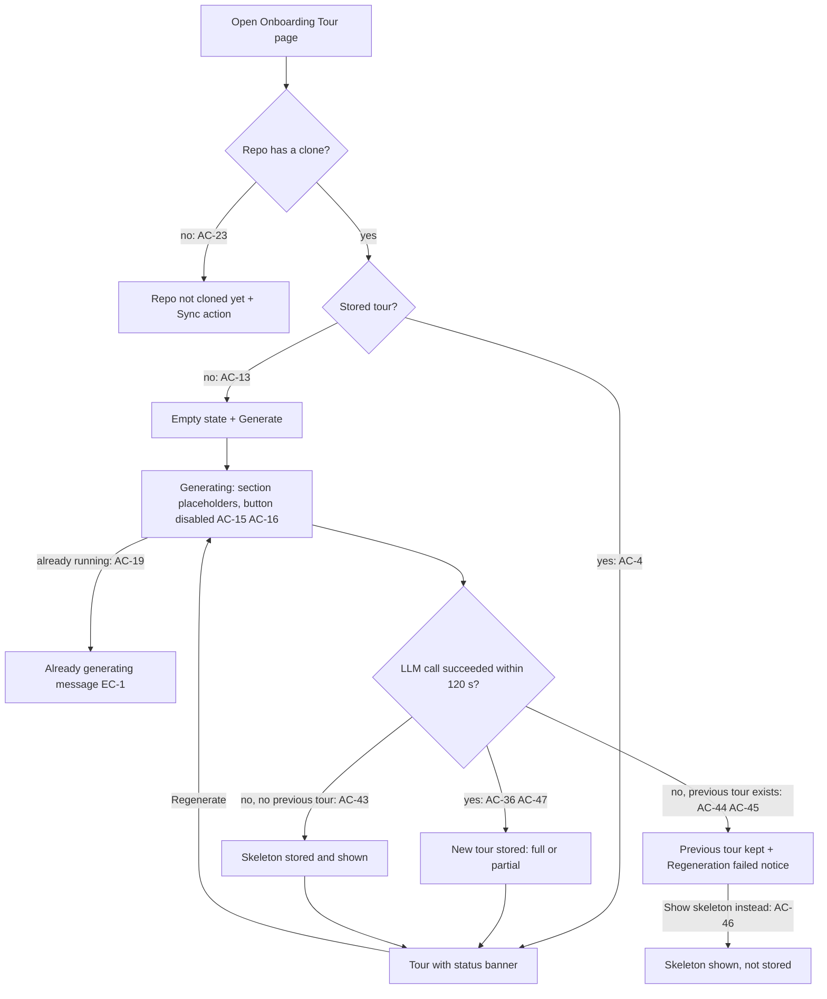
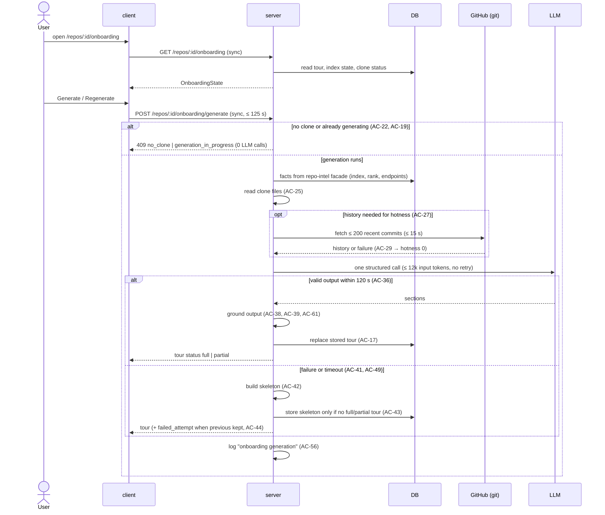

# Spec: Onboarding Generator — a five-part tour of an unfamiliar repository
Spec ID: SPEC-02
Status: approved
Supersedes: none

## Problem and user

**User:** a developer who joins a repository connected to DevDigest and has not worked in it before. A second user is the demo operator (course assignment), who checks the server log for the number of LLM calls and the cost of each tour.

**Pain today:** DevDigest already clones and indexes every connected repository (import graph, PageRank file rank, HTTP endpoints, repo map), but nothing turns that index into a first-day orientation. The sidebar has no Onboarding Tour page. The starter's tour scaffolding (a stored-tour slot, a generic section contract, a prompt and message copy) describes a different set of sections and is not wired to anything.

**Why now:** this is the L05 assignment. It shows that deterministic repository facts plus **one** structured LLM call can produce a useful tour, and that the tour stays honest when the index or the model is unavailable.

**User's words (source of truth):** "The feature generates a tour of an unfamiliar repository in five parts: architecture overview, critical paths, how to run locally, recommended file reading order (guided reading path), and first tasks." Constraints given by the assignment:
- `repoIntel.*` deterministically collects stack, structure, routes and scripts.
- The reading path is computed over the import graph as `PageRank × (1 + hotness)`.
- ONE structured LLM call turns the facts into the five sections.
- If the index is degraded or the LLM call fails, a deterministic skeleton with an honest status is shown.
- Final demo: open an unfamiliar open-source repo, read the generated tour, and check the number of LLM calls and the cost in the logs.

**Modules:**
- `server`: fact collection through the repo-intel facade, hotness, generation, grounding, skeleton, persistence, log line.
- `client`: the Onboarding Tour page, nav item, states, copy actions, diagram rendering.
- `e2e`: navigate → empty state → generate → five sections.

`reviewer-core` and `mcp` are not changed.

**Domain terms:**
- *tour*: the stored five-section result for one repository. There is one tour per repository, shared by the workspace.
- *generation*: one Generate or Regenerate request.
- *facts*: the deterministic data the repo-intel facade collects from the clone and the index.
- *skeleton*: a tour built from facts only, with no LLM output.
- *index*, *file rank*, *import graph*: as in `docs/architecture.md` and the repo-intel module.
- *hotness*: defined in AC-27.
- *note*: a machine code that explains a degradation (AC-33, AC-34, AC-29, AC-31).

## Goals / Non-goals

**Goals**
- Generate, store and show one tour per repository with the five sections of design N5, in a fixed order.
- Collect stack, structure, routes and scripts deterministically through the repo-intel facade. Compute critical paths and the guided reading path from the import graph, ranked by `PageRank × (1 + hotness)`.
- Make exactly one structured LLM call per generation. Never retry it, and make zero calls when the generation is rejected.
- Ground every model output against the facts: files must exist, commands must come from the repository, and task scopes must be real or creatable.
- Degrade honestly. A partial or missing index, missing history or a failed call produces a tour (or skeleton) whose status banner names every degradation.
- Log one line per generation with LLM calls, tokens, cost, duration and status, and show the same numbers in the tour banner.
- Let the reader copy commands, copy the whole tour as Markdown, and open files on GitHub at the tour's commit.

**Non-goals**
- Tour history, versions or diffs between tours. Regenerate replaces the stored tour.
- Per-user tours.
- Automatic generation after indexing or on repository changes. Generation is manual; staleness is only signalled (AC-21).
- A shareable public URL. The design's "Share link" button becomes "Copy as Markdown" (AC-52).
- Writing the tour into the repository folder (the existing `sync_to_folder` setting stays unused).
- An in-app file viewer. "Open" goes to GitHub.
- Languages other than English for the tour text or the UI copy.
- An MCP tool for the tour.
- Changing the indexer's limits (5,000 indexed files, JS/TS only, first-N selection) or its own `file_rank` values. Hotness is computed per generation and is not written back into the index.
- Background-job generation with polling. Generation is a blocking request (NFR-1).
- A dollar cost cap. Cost is bounded by the token budget (NFR-3).
- The keyboard shortcut proposed as U6.

## User stories

- **US-1:** As a new developer, I want to read a five-section tour of a repository on one page, so that I understand its architecture, critical files, how to run it, what to read first and what to try first.
- **US-2:** As a new developer, I want to generate and regenerate the tour on demand and see when it is out of date, so that I control LLM spend and know when to refresh.
- **US-3:** As a new developer, I want the tour to state honestly what it was built from and what failed, so that I can judge how much to trust each section.
- **US-4:** As a new developer, I want the critical paths, the reading order and the run commands to come from the real repository, so that I never chase files or commands that do not exist.
- **US-5:** As a new developer, I want to copy commands, copy the whole tour as Markdown and open files on GitHub, so that I can act on the tour and share it.
- **US-6:** As the demo operator, I want one log line per generation with the LLM call count and cost, so that I can prove one call per tour and its price.
- **US-7:** As a DevDigest user, I want an Onboarding Tour entry in the sidebar, so that I can reach the tour of the active repository.

### Workflow

## Acceptance criteria (EARS)

### US-7 — Navigation

- **AC-1:** The client shall show a sidebar item "Onboarding Tour" in the WORKSPACE group, between "Pull Requests" and "Project Context", linking to `/repos/<active repo id>/onboarding`. [verify: unit]
- **AC-2:** WHILE the current route is `/repos/<id>/onboarding`, the client shall mark the "Onboarding Tour" sidebar item as active. [verify: unit]
- **AC-3:** WHILE the current route is the add-repository route `/onboarding`, the client shall not mark the "Onboarding Tour" sidebar item as active. [verify: unit]

### US-1 — Read the tour

- **AC-4:** WHEN the user opens the tour page of a repository that has a stored tour, the client shall show the heading "Onboarding for `<repo name>`", the line "Generated from index of {files_total} files · {files_indexed} indexed · last refreshed {relative time of generated_at}", and the five sections in this order: Architecture overview, Critical paths, How to run locally, Guided reading path, First tasks. [verify: unit, e2e]
- **AC-5:** WHEN the user activates a title in the "On this page" list of the five section titles, the client shall move the view and keyboard focus to that section's header. [verify: unit]
- **AC-6:** WHEN a section header is activated by click or Enter or Space, the client shall toggle that section between expanded and collapsed, with every section expanded on page load. [verify: unit]
- **AC-7:** The client shall render the Architecture overview body as Markdown with raw HTML not rendered, followed by the diagram when the tour carries one. [verify: unit]
- **AC-8:** IF the diagram cannot be rendered, THEN the client shall hide the diagram area and keep the body text, without an error message. [verify: unit]
- **AC-9:** The client shall render each Critical paths item as a row with the file path in monospace, "— {reason}", and an "Open" button. [verify: unit]
- **AC-10:** The client shall render How to run locally as a numbered list of commands, each in monospace with its comment in muted text when present, an "in `{cwd}/`" label when the command has a working directory, and a copy button. [verify: unit]
- **AC-11:** The client shall render Guided reading path as a numbered list, each item showing the file path as a link and its reason below it. [verify: unit]
- **AC-12:** The client shall render each First tasks item as a card with its title, its scope path in monospace and a badge "Low complexity", "Medium complexity" or "High complexity". [verify: unit]
- **AC-13:** WHEN the user opens the tour page of a cloned repository that has no stored tour, the client shall show the empty state "Generate onboarding tour" whose body names the five sections and states "One AI call to {provider}/{model} · up to 12,000 input tokens · up to 2 minutes", with the call-to-action "Generate onboarding tour". [verify: unit, e2e]
- **AC-14:** IF a section has no items, THEN the client shall show the text "Nothing to show for this section" in it, except First tasks in a skeleton tour, which shows "First tasks need the AI summary — regenerate to try again". [verify: unit]

### US-2 — Generate, regenerate, staleness

- **AC-15:** WHEN the user activates "Generate onboarding tour" or "Regenerate", the client shall send one generation request for the repository and show a loading placeholder in each of the five section areas until the response arrives. [verify: unit]
- **AC-16:** WHILE a generation request from this page is pending, the client shall disable both Generate and Regenerate and label the active button "Generating… {elapsed seconds}s". [verify: unit]
- **AC-17:** WHEN a generation ends with status `full` or `partial`, the server shall replace the repository's stored tour with the new tour. [verify: it]
- **AC-18:** WHEN the generation response arrives, the client shall render the tour it carries without a page reload. [verify: unit, e2e]
- **AC-19:** IF a generation for the same repository is already running, THEN the server shall reject the new request with 409 `generation_in_progress` and make no LLM call. [verify: it]
- **AC-20:** WHILE a generation for the repository is running, the server shall return `generating: true` from the tour read endpoint. [verify: it]
- **AC-21:** WHEN the stored tour's `commit_sha` differs from the repository's current indexed commit, the client shall show the badge "Repo changed since this tour" next to Regenerate. [verify: unit]
- **AC-22:** IF the repository has no clone, THEN the server shall reject a generation request with 409 `no_clone` and make no LLM call. [verify: it]
- **AC-23:** WHILE the repository has no clone, the client shall show "Repo not cloned yet" with a "Sync repository" action that triggers the existing repository refresh, instead of the Generate call-to-action. [verify: unit]
- **AC-24:** WHEN a repository is removed, the server shall delete its stored tour. [verify: it]

### US-4 — Deterministic facts, ranking and grounding

- **AC-25:** WHEN a generation starts, the server shall collect the facts through the repo-intel facade from the repository clone at its current commit: stack (languages by file count per extension; the package manager detected from the lockfile; frameworks and libraries from dependency manifests); structure (top-level directories with file counts); routes (HTTP endpoints from the indexed per-file facts); scripts (manifest scripts with the manifest's directory; Makefile targets; docker-compose service names; `.env.example` variable names; shell commands in fenced code blocks of the root README). [verify: unit, it]
- **AC-26:** The repo-intel facade shall return identical facts for the same repository commit and the same index state. [verify: unit]
- **AC-27:** WHEN the server ranks files for a generation, the server shall set each indexed file's hotness to the number of commits touching the file among the at most 200 most recent default-branch commits dated within the last 90 days, divided by the highest such count in the repository, or to 0 for every file when that highest count is 0. [verify: unit]
- **AC-28:** The server shall build the Guided reading path from at most 10 indexed files, ordered by rank `PageRank × (1 + hotness)` descending with ties broken by path ascending, excluding test, config, type-declaration, migration and generated files. [verify: unit]
- **AC-29:** IF the commit history cannot be read within 15 seconds or cannot be fetched at all, THEN the server shall use hotness 0 for every file and add the note `hotness_unavailable`. [verify: unit, it]
- **AC-30:** The server shall build the Critical paths list from the distinct files of the dependency chains that start at the 5 highest-ranked files, with each chain up to 3 files and each step following the highest-ranked imported file, in chain order, at most 6 files. [verify: unit]
- **AC-31:** IF the import graph has no edges for the repository, THEN the server shall add the note `graph_unavailable` and build the Guided reading path (at most 10) and the Critical paths (at most 6) from the fallback order: existing files linked from the root README, then entry points declared in manifests, then root-level files alphabetically. [verify: unit]
- **AC-32:** The server shall set `files_total` to the number of files in the clone excluding the `.git` directory, and `files_indexed` to the number of files in the repository's index state. [verify: it]
- **AC-33:** IF the repository's index status is not `full` when generation starts, THEN the server shall add the note `index_partial` for status `partial` or `index_degraded` for status `degraded` or `failed` or a missing index. [verify: unit]
- **AC-34:** IF the index left source files out because of its file-count limit, THEN the server shall add the note `files_bounded`. [verify: unit]
- **AC-35:** The server shall send at most one request to the LLM provider per generation, using the workspace's `onboarding` feature model, with no retry and no schema-repair re-request, recording the number of provider requests sent as `llm_calls`. [verify: unit, it]
- **AC-36:** WHEN the LLM call returns valid output, the server shall take from it only the architecture overview body and optional diagram, one reason per listed critical-path and reading-path file, the ordered how-to-run commands and the first tasks, keeping the file lists and their order from AC-28, AC-30 and AC-31. [verify: unit]
- **AC-37:** IF the model output has no reason for a listed file, THEN the server shall use the deterministic reason "Imported by {n} indexed files" for a critical path or "Rank percentile {p}" for a reading-path file. [verify: unit]
- **AC-38:** The server shall keep a model-proposed command only when it equals, after whitespace normalisation, a candidate command derived from the facts (the package manager's install command; running each found manifest script with the detected package manager; `make <target>` for each found target; `docker compose up -d` with any subset of the found services; `cp .env.example .env` when that file exists; each README fenced shell command), dropping every other command and counting it in `dropped_items`. [verify: unit]
- **AC-39:** The server shall keep at most 5 first tasks, each with complexity `Low`, `Medium` or `High` and a scope path that is an existing file or directory in the clone or a new file whose parent directory exists, dropping every other task and counting it in `dropped_items`. [verify: unit]
- **AC-40:** IF no model-proposed command survives grounding, THEN the server shall use the deterministic command list of AC-42 for How to run locally. [verify: unit]

### US-3 — Honest status and skeleton

- **AC-41:** IF the LLM call fails by timeout or rate limit or provider error or missing API key or output that does not match the tour schema, THEN the server shall build a skeleton tour with status `skeleton` and `skeleton_reason` set to `timeout`, `rate_limited`, `provider_error`, `no_api_key` or `invalid_output` respectively. [verify: unit, it]
- **AC-42:** The server shall fill a skeleton tour identically for the same facts: Architecture overview is a Markdown bullet list of stack, top-level structure and route count with no diagram; Critical paths and Guided reading path follow AC-28, AC-30 and AC-31 with the deterministic reasons of AC-37; How to run locally lists at most 8 commands in the order install, then the scripts `dev`, `start`, `build` and `test` when found, then `docker compose up -d` when a compose file exists; First tasks has no items. [verify: unit]
- **AC-43:** IF the LLM call fails and the repository has no stored tour with status `full` or `partial`, THEN the server shall store the skeleton tour as the repository's tour and return it. [verify: it]
- **AC-44:** IF the LLM call fails and the repository has a stored tour with status `full` or `partial`, THEN the server shall keep the stored tour unchanged and return it with `failed_attempt` carrying the reason and the skeleton. [verify: it]
- **AC-45:** WHEN a generation response carries `failed_attempt`, the client shall show above the sections the notice "Regeneration failed: {reason text}" with the action "Show skeleton instead". [verify: unit]
- **AC-46:** WHEN the user activates "Show skeleton instead", the client shall display the attempt's skeleton in place of the stored tour without storing it, so a page reload shows the stored tour again. [verify: unit]
- **AC-47:** The server shall set a tour's status to `full` when the LLM call succeeded and there are no notes, to `partial` when the LLM call succeeded and there is at least one note, and to `skeleton` when the LLM call failed. [verify: unit]
- **AC-48:** The client shall show a status banner above the sections that reads "AI-generated · {llm_calls} LLM call · {tokens_in + tokens_out} tokens · ${cost_usd}" for `full`, the same followed by one line per note for `partial`, and "Skeleton — AI summary unavailable: {reason text}" followed by one line per note for `skeleton`, using the note and reason texts of the table below. [verify: unit]

  | Code | Text shown |
  |---|---|
  | `index_partial` | Index is partial |
  | `index_degraded` | Index unavailable |
  | `graph_unavailable` | Reading path is approximate — import graph unavailable |
  | `hotness_unavailable` | Reading path ranked by structure only |
  | `files_bounded` | Only {files_indexed} source files were indexed |
  | `timeout` | the AI call took longer than 2 minutes |
  | `rate_limited` | the AI provider is rate-limiting requests |
  | `provider_error` | the AI provider returned an error |
  | `no_api_key` | no API key for {provider} — add one in Settings → API Keys |
  | `invalid_output` | the AI answer could not be read |
- **AC-49:** IF the generation has not received the model output within 120 seconds of the request start, THEN the server shall abandon the LLM call and finish the generation with `skeleton_reason` `timeout`. [verify: it]

### US-5 — Copy, share and open

- **AC-50:** WHEN the user activates a command's copy button, the client shall write exactly the command text (without its number, comment or working-directory label) to the clipboard and show "Copied" for 2 seconds. [verify: unit]
- **AC-51:** The client shall label the design's "Share link" button "Copy as Markdown". [verify: unit]
- **AC-52:** WHEN the user activates "Copy as Markdown", the client shall write the displayed tour to the clipboard as Markdown and show the toast "Tour copied as Markdown". [verify: unit]
- **AC-53:** The client shall format the copied Markdown as: an `# Onboarding for <repo full name>` heading; the header line of AC-4 and the banner text of AC-48; one `##` heading per section in tour order; the overview body followed by the diagram in a `mermaid` fenced block when present; critical paths as bullets "`path` — reason"; commands in one `sh` fenced block per working directory; the reading path as a numbered list "`path` — reason"; tasks as bullets "title — `scope` (complexity)". [verify: unit]
- **AC-54:** IF writing to the clipboard fails, THEN the client shall show the toast "Couldn't copy — clipboard access was blocked". [verify: unit]
- **AC-55:** WHEN the user activates "Open" on a critical path or a reading-path file link, the client shall open `https://github.com/<owner>/<name>/blob/<commit_sha>/<path>` with each path segment URL-encoded in a new tab that has no access to the opener. [verify: unit]

### US-6 — Observability

- **AC-56:** WHEN a generation request ends with any outcome including a rejection, the server shall write one log line with the message "onboarding generation" and the fields `repo` (owner/name), `repo_id`, `provider`, `model`, `llm_calls`, `tokens_in`, `tokens_out`, `cost_usd`, `duration_ms`, `status` (`full`, `partial`, `skeleton` or `rejected`), `reason` and `dropped_items`. [verify: it]
- **AC-57:** The server shall store `provider`, `model`, `llm_calls`, `tokens_in`, `tokens_out`, `cost_usd` and `duration_ms` with the tour and return them in the tour. [verify: it]
- **AC-58:** WHEN the demo operator generates a tour for a public open-source repository not previously opened in DevDigest, the server log shall contain exactly one "onboarding generation" line for that request with `llm_calls` 1 and the same `cost_usd` as the tour banner. [verify: manual]

### Safety of inputs and outputs

- **AC-59:** The server shall pass every repository-derived text to the LLM only inside untrusted delimiter blocks whose labels are fixed constants. [verify: unit]
- **AC-60:** The server shall never send the values of `.env.example` variables to the LLM or include them in the tour, keeping only the variable names. [verify: unit]
- **AC-61:** IF a model-returned path is absolute or contains a `..` segment or a control character, THEN the server shall drop the item that carries it and count it in `dropped_items`. [verify: unit]
- **AC-62:** The client shall render the diagram with script execution, HTML labels and click interactions disabled. [verify: unit]

### Traceability

| US | AC | EC | NFR | Verify |
|---|---|---|---|---|
| US-1 | AC-4, AC-5, AC-6, AC-7, AC-8, AC-9, AC-10, AC-11, AC-12, AC-13, AC-14, AC-62 | EC-3, EC-4, EC-9, EC-17 | NFR-6, NFR-7, NFR-8, NFR-9 | unit, e2e |
| US-2 | AC-15, AC-16, AC-17, AC-18, AC-19, AC-20, AC-21, AC-22, AC-23, AC-24 | EC-1, EC-2, EC-6 | NFR-1, NFR-9 | unit, it, e2e |
| US-3 | AC-41, AC-42, AC-43, AC-44, AC-45, AC-46, AC-47, AC-48, AC-49 | EC-10, EC-11, EC-16 | NFR-1, NFR-10 | unit, it |
| US-4 | AC-25, AC-26, AC-27, AC-28, AC-29, AC-30, AC-31, AC-32, AC-33, AC-34, AC-35, AC-36, AC-37, AC-38, AC-39, AC-40, AC-59, AC-60, AC-61 | EC-4, EC-5, EC-7, EC-8, EC-12, EC-13, EC-15 | NFR-2, NFR-3, NFR-4, NFR-8 | unit, it |
| US-5 | AC-50, AC-51, AC-52, AC-53, AC-54, AC-55 | EC-14, EC-18 | NFR-6, NFR-7 | unit |
| US-6 | AC-56, AC-57, AC-58 | — | NFR-4, NFR-5 | it, manual |
| US-7 | AC-1, AC-2, AC-3 | — | NFR-7 | unit |

## Edge cases

- **EC-1:** Second tab or second client sends Generate while one runs → 409 `generation_in_progress` (AC-19). The client shows "A tour is already being generated for this repository" and keeps the current view. A double click in one tab sends one request because the button is disabled (AC-16).
- **EC-2:** The repository is removed while its generation runs → nothing is stored (AC-24), the response is 404 `not_found`, and the client shows the existing repo-not-found state.
- **EC-3:** The stored tour does not match the current tour shape (for example, written by an older branch) → the read endpoint returns `tour: null` and the client shows the empty state (AC-13).
- **EC-4:** Empty repository or no source files → generation is allowed. The fallback order applies (AC-31); empty lists show "Nothing to show for this section" (AC-14), and How to run falls back to the deterministic list (AC-40).
- **EC-5:** A monorepo with several manifests → each command carries the manifest's directory as `cwd` (AC-25, AC-10), and the Markdown copy groups commands per directory (AC-53).
- **EC-6:** The index is being rebuilt while a generation starts → the generation uses the index state stored at that moment, and its notes reflect that state (AC-33).
- **EC-7:** README, manifests or route lists exceed the input budget → input is truncated to the budget of NFR-3, in priority order: deterministic file lists, scripts, stack, routes (first 50), root README (first 4,000 tokens), repo map (AC-25).
- **EC-8:** The model returns more items or longer texts than allowed → items are cut to the limits of AC-39 and NFR-8, and the cut items are counted in `dropped_items` (AC-39).
- **EC-9:** The model returns an invalid or oversized diagram → the diagram is hidden and the prose stays (AC-8, NFR-8).
- **EC-10:** No API key is configured for the onboarding model's provider → the generation finishes as a skeleton with reason `no_api_key`, with `llm_calls` 0 because no request was sent (AC-41, AC-35).
- **EC-11:** The provider answers 429 → the generation finishes as a skeleton with reason `rate_limited`, with no retry (AC-35, AC-41).
- **EC-12:** No commit in the last 90 days, but history was readable → every hotness is 0, rank equals PageRank, and no `hotness_unavailable` note is added (AC-27).
- **EC-13:** Network is offline, or a private repository has no GitHub token, when history is needed → hotness 0 with note `hotness_unavailable` (AC-29).
- **EC-14:** A path with spaces or non-ASCII characters → each segment is URL-encoded in the GitHub link (AC-55).
- **EC-15:** A model-returned path tries to escape the clone (`../`, absolute) → the item is dropped (AC-61).
- **EC-16:** No index row exists for the repository → notes `index_degraded` and `graph_unavailable`, with the fallback order (AC-33, AC-31).
- **EC-17:** The tour read endpoint is called for a repository outside the caller's workspace → 404 `not_found`, and the client shows the existing repo-not-found state (AC-4).
- **EC-18:** The browser blocks clipboard access → error toast (AC-54).

## Non-functional requirements

- **NFR-1:** A generation request shall return a response within 125 seconds of its start (hard 120-second limit of AC-49 plus persistence). [verify: it]
- **NFR-2:** For a repository with at most 5,000 indexed files and 200 commits of history, fact collection, hotness and ranking together shall complete within 20 seconds, with the history step capped at 15 seconds (AC-29). [verify: it, manual]
- **NFR-3:** The LLM request shall contain at most 12,000 input tokens, counted with the server's tokenizer, and request at most 4,000 output tokens. [verify: unit]
- **NFR-4:** Each generation shall make at most 1 LLM provider request, and 0 when rejected (`no_clone`, `generation_in_progress`) or when no API key exists. There is no dollar cap; the cost of each generation is logged (AC-56). [verify: unit, it]
- **NFR-5:** Every generation request shall produce exactly 1 "onboarding generation" log line at info level (AC-56), and the line shall contain no repository file content, no prompt text and no secret. [verify: it]
- **NFR-6:** The tour page shall meet WCAG 2.2 AA: every interactive element is reachable with Tab in visual order; section headers are buttons exposing `aria-expanded` and the id of the section they control; copy buttons have accessible names "Copy command: {command}" and announce "Copied" through a polite live region; complexity and status badges meet a 4.5:1 text contrast ratio; the diagram has the text alternative "Architecture diagram". [verify: unit, manual]
- **NFR-7:** All UI copy of the page and the sidebar item shall come from the `onboarding` and `shell` message namespaces, with ICU plural forms for counts ("1 LLM call" / "{n} LLM calls", "{n} files"). [verify: unit]
- **NFR-8:** A stored tour shall be at most 256 KB, with the architecture body at most 4,000 characters, the diagram at most 3,000 characters, each reason at most 300 characters, each task title at most 120 characters and each command at most 300 characters; a longer body, reason or title is cut at the limit, and a longer diagram or command is dropped and counted in `dropped_items`. [verify: unit]
- **NFR-9:** The tour read endpoint shall respond in at most 300 ms at p95 on a local developer machine with one stored tour of 256 KB. [verify: it]
- **NFR-10:** Automated test suites for this feature shall make 0 network requests to LLM providers, including the `openrouter` provider used by the default onboarding model. [verify: it]

## Inputs and provenance

| Input | Source | Via | Trust |
|---|---|---|---|
| Repository id in the page URL / request path | user | client route → server tour endpoints | untrusted |
| Clone files: manifests, lockfiles, Makefile, docker-compose, `.env.example`, root README, file names | FS (clone of a GitHub repository) | server, repo-intel facade (AC-25) | untrusted |
| Index state, import graph edges, PageRank, per-file endpoints, repo map | DB (written by the indexer from the clone) | server, repo-intel facade (existing `getIndexState`, rank and critical-path reads) | trusted (derived; paths are still repo-controlled strings) |
| Commit history (dates, touched paths), ≤ 200 commits | GitHub via git | server git access (AC-27) | untrusted |
| Onboarding feature model choice | DB (workspace settings) | existing Feature Models setting `onboarding` | trusted |
| LLM API key | config / secrets | existing secrets provider | trusted |
| LLM output (prose, diagram, reasons, commands, tasks, paths) | LLM | server structured call (AC-35) | untrusted |
| Stored tour | DB | server tour endpoints | trusted (validated on read, EC-3) |

### Communication

`server` orchestrates and does all I/O (DB, clone, git, LLM). `client` reaches data only through the server's REST API. `reviewer-core` and `mcp` take no part.

### Contracts

**`GET /repos/:id/onboarding`**: server → client, new (response `OnboardingState`).

| Field (wire, snake_case) | Type | Required | Meaning / constraints |
|---|---|---|---|
| `clone_status` | enum `ok` \| `no_clone` | yes | `no_clone` drives AC-23 |
| `generating` | boolean | yes | a generation for this repository is running (AC-20) |
| `current_commit_sha` | string \| null | yes | the repository's current indexed commit; null when there is no index (AC-21) |
| `model` | object `{provider, model}` | yes | the workspace's onboarding feature model, for the empty-state text (AC-13) |
| `tour` | `Onboarding` \| null | yes | the stored tour; null when there is none or it fails validation (EC-3) |

Errors: 404 `not_found` → the repository is not in the caller's workspace → the client shows the existing repo-not-found state.

**`POST /repos/:id/onboarding/generate`**: client → server, new. No request body.

| Field (wire, snake_case) | Type | Required | Meaning / constraints |
|---|---|---|---|
| `tour` | `Onboarding` | yes | the tour to display: new, skeleton, or the kept previous one (AC-17, AC-43, AC-44) |
| `failed_attempt` | object \| null | yes | non-null only when the call failed and the previous tour was kept (AC-44) |
| `failed_attempt.reason` | enum `timeout` \| `rate_limited` \| `provider_error` \| `no_api_key` \| `invalid_output` | yes (when object) | AC-41 |
| `failed_attempt.skeleton` | `Onboarding` | yes (when object) | the skeleton built for this attempt, not stored (AC-46) |

Errors:
- 404 `not_found` → repository missing or not in the workspace (EC-2) → repo-not-found state.
- 409 `no_clone` → AC-22 → "Repo not cloned yet".
- 409 `generation_in_progress` → AC-19 → the message of EC-1.

LLM failure is not an HTTP error. It returns 200 with a skeleton or `failed_attempt`.

**`Onboarding`**: server → client: changed (existing: `Onboarding`, `OnboardingSection`, `OnboardingLink`). The change is breaking in shape: `sections[]` of generic `{kind, title, body, diagram, links}` becomes the typed fields below. No existing consumer is affected:
- no server route or client code reads or writes the existing shape (only the two `vendor/shared` copies define it);
- both `vendor/shared` copies change together;
- stored rows of the old shape are treated as absent (EC-3).

| Field (wire, snake_case) | Type | Required | Meaning / constraints |
|---|---|---|---|
| `repo_full_name` | string | yes | `owner/name` |
| `commit_sha` | string | yes | clone commit the tour was built from (AC-21, AC-55) |
| `generated_at` | ISO-8601 string | yes | AC-4 |
| `status` | enum `full` \| `partial` \| `skeleton` | yes | AC-47 |
| `skeleton_reason` | enum as `failed_attempt.reason` \| null | yes | non-null iff `status` = `skeleton` |
| `notes` | array of enum `index_partial` \| `index_degraded` \| `graph_unavailable` \| `hotness_unavailable` \| `files_bounded` | yes | AC-29, AC-31, AC-33, AC-34 |
| `files_total` | int ≥ 0 | yes | AC-32 |
| `files_indexed` | int ≥ 0 | yes | AC-32 |
| `provider`, `model` | string | yes | onboarding feature model used |
| `llm_calls` | int 0..1 | yes | AC-35 |
| `tokens_in`, `tokens_out` | int ≥ 0 | yes | 0 when no call was sent |
| `cost_usd` | number ≥ 0 \| null | yes | null when the provider reports no cost |
| `duration_ms` | int ≥ 0 | yes | whole generation |
| `dropped_items` | int ≥ 0 | yes | grounding and limit drops (AC-38, AC-39, AC-61, NFR-8) |
| `architecture.body` | string (Markdown, ≤ 4,000 chars) | yes | AC-7, AC-42 |
| `architecture.diagram` | string (mermaid, ≤ 3,000 chars) \| null | yes | AC-7, AC-8 |
| `critical_paths[]` | array ≤ 6 of `{path, reason}` | yes | AC-30, AC-37 |
| `how_to_run[]` | array ≤ 8 of `{command, comment \| null, cwd \| null}` | yes | AC-38, AC-40, AC-42 |
| `reading_path[]` | array ≤ 10 of `{path, reason, rank, hotness}` | yes | AC-28; `hotness` in 0..1 |
| `first_tasks[]` | array ≤ 5 of `{title, scope_path, complexity: Low \| Medium \| High}` | yes | AC-39 |

Unchanged contracts used: the Feature Models setting `onboarding` and the existing repository refresh endpoint (AC-23).

## Untrusted inputs

- **Clone files and README (prompt injection):** a repository may contain text that addresses the model.
  - Every repository-derived text enters the prompt only inside untrusted delimiter blocks with constant labels (AC-59).
  - The model's output is never trusted. File lists come from the facts (AC-36), commands must match facts (AC-38), and task scopes must exist or be creatable (AC-39).
  - Input size is capped (NFR-3, EC-7).
- **`.env.example` values (secret leakage):** values may hold real credentials. Only variable names are sent or shown (AC-60).
- **LLM output prose (XSS):** rendered as Markdown with raw HTML not rendered (AC-7).
- **LLM diagram (script injection in the diagram renderer):** rendered with scripts, HTML labels and click interactions disabled. Invalid or oversized diagrams are hidden (AC-62, AC-8, NFR-8).
- **LLM commands (malicious command suggestion):** only commands equal to facts-derived candidates survive (AC-38). Commands are display-and-copy only and are never executed by DevDigest (AC-50).
- **Model-returned and repository paths (path traversal, link injection):** absolute, `..` and control-character paths are dropped (AC-61). Links are built only to `github.com/<owner>/<name>/blob/<commit_sha>/` with URL-encoded segments, in a tab without opener access (AC-55).
- **Commit history (oversize, slow fetch):** at most 200 commits within 15 seconds, with hotness 0 on failure (AC-27, AC-29).
- **Repository id in the path (cross-workspace access):** both endpoints answer 404 for a repository outside the caller's workspace (EC-17, EC-2).

## Open questions

None
