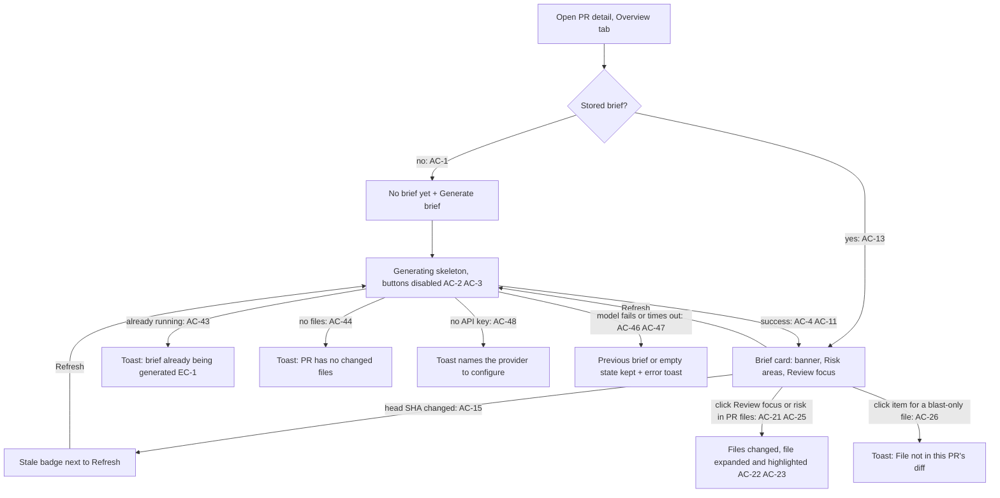
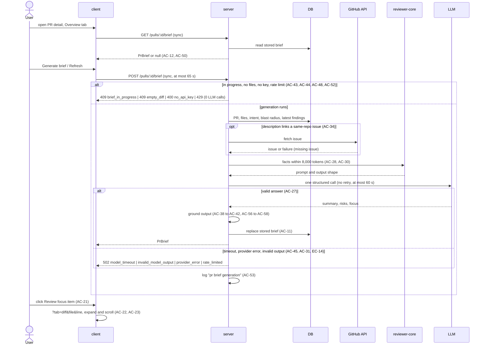

# Spec: PR Why + Risk Brief — one card that says why a PR exists, what is risky and where to read first
Spec ID: SPEC-03
Status: implemented
Supersedes: none

## Problem and user

**User:** a reviewer who opens a pull request on the PR detail page. A second user is the demo operator (course assignment), who checks the server log for the number of LLM calls and the cost of each brief.

**Pain today:** the Overview tab shows the intent of a PR (L03) and its blast radius (L04) as two separate cards, plus the raw description. Nothing tells the reviewer, in one place, what the PR is about in two sentences, which parts of it are risky, and which `file:line` locations to read first. The reviewer reconstructs that from the intent, the blast radius, the diff statistics and the findings of agent reviews by hand. The starter already has an unused stored-brief slot per PR, a brief contract without a summary or review focus, and a `risk_brief` feature model that defaults to a provider with no configured key.

**Why now:** this is the L05 homework "PR Why + Risk Brief". It shows that precomputed facts plus **one** structured LLM call, which never sees diff hunk bodies, can produce a grounded brief.

**User's words (source of truth, condensed from the assignment):**
- The Overview tab gets one PR Brief card that combines the existing Intent, Blast Radius, diff statistics with Smart Diff role groups, attached specs, the PR description and the linked issue, plus three new model-written parts: a summary, Risk areas (`kind`, `title`, `explanation`, `severity` high|medium|low, `file_refs[]`) and Review focus (`file`, `line`, `reason`).
- The model is called exactly once with precomputed facts and never receives diff hunk bodies. The input budget is fixed with a unit.
- The model comes from the `risk_brief` feature model setting, not hardcoded.
- Post-validation drops risk and review-focus items whose files are in neither the PR nor the blast map.
- The brief is cached per PR with the commit SHA inside. GET returns the cache, POST generates. Reload shows the brief without regenerating; Refresh regenerates; a brief from another SHA is marked stale.
- Clicking a review-focus item opens Files changed on that file (P2: scrolled to the line). If Intent or Blast is missing, the brief is generated without them and says which data is missing.

**Modules:**
- `server`: fact collection, the single model call, grounding, persistence, the two brief endpoints, the log line, the changed `risk_brief` default.
- `reviewer-core`: assembling the brief prompt from the facts and the model output shape (prompt assembly is reviewer-core's job per `docs/architecture.md`).
- `client`: the PR Brief card on the Overview tab, navigation into Files changed, message copy.
- `e2e`: open a PR with a stored brief → click a Review focus item → Files changed on that file → reload on that URL keeps the file open → Overview shows the cached brief; a PR without a brief → keyless Generate shows the no-API-key toast.

`mcp` is not changed.

**Domain terms:**
- *brief*: the stored result for one PR (one per PR, shared by the workspace).
- *generation*: one Generate or Refresh request.
- *facts*: the deterministic data the server collects before the model call (AC-28).
- *PR files*: the PR's changed files as stored by the server (at most 100, see AC-51).
- *blast files*: every file named by the PR's blast radius, either as a changed-symbol file or as a caller file.
- *hunk range* of a PR file: the new-side line range `start … start + length − 1` of one hunk of its patch.
- *latest review*: the PR's newest review by creation time; *latest review per agent*: as already used by Smart Diff and the PR list.
- *intent*, *blast radius*, *finding*, *review*, *verdict*: as in `docs/architecture.md`.

## Goals / Non-goals

**Goals**
- Generate, store and show one brief per PR with a summary, Risk areas and Review focus, on demand.
- Make exactly one structured LLM call per generation, with no repair or transport retry, and zero calls when a generation is rejected.
- Build the request only from precomputed facts within 8,000 input tokens and with no diff hunk bodies.
- Ground every model output: every shown file exists in the PR or the blast radius, and every Review focus line exists in the diff or the blast radius.
- Show the cached brief on reload, regenerate only on Refresh, and mark a brief from an older head SHA as stale.
- Let the reviewer jump from a Review focus item or a risk to that file (and line) in Files changed.
- Log one line per generation with LLM calls, tokens, cost, duration and status.

**Non-goals**
- Replacing the live Intent and Blast Radius cards. They stay on the Overview tab with their current behavior (AC-10).
- Prior PRs inside the brief. The brief contract loses its `history` part; the live "Prior PRs touching these files" accordion stays where it is.
- Reading Project Context attachments (SPEC-01) into the brief. Only the paths of spec and doc files that the PR itself changes are used.
- Deriving the intent or computing the blast radius as part of a generation. A missing intent stays missing (AC-32).
- Automatic generation on PR open, on push or after a review. Generation is manual; staleness is only signalled (AC-15).
- A model-written verdict or score. The banner's verdict and score come from the latest agent review (AC-18).
- An "Open on GitHub" link for blast-only files. Clicking them shows a toast (AC-26).
- Background-job generation with polling. Generation is a blocking request (NFR-1).
- Brief history or diffs between briefs. Refresh replaces the stored brief.
- An MCP tool for the brief.
- Languages other than English.

## User stories

- **US-1:** As a reviewer, I want to generate a brief for a PR and read its summary, Risk areas and Review focus on the Overview tab, so that I know why the PR exists, what is risky and where to start.
- **US-2:** As a reviewer, I want the brief to be cached, regenerated only when I ask, and marked when the PR changed, so that I control LLM spend and know when to refresh.
- **US-3:** As a reviewer, I want the brief's banner to show the latest agent review's verdict and PR score next to the brief summary, so that I see the review state and the brief together.
- **US-4:** As a reviewer, I want to click a Review focus item or a risk and land on that file and line in Files changed, so that I can read the code the brief points at.
- **US-5:** As the demo operator, I want the brief to be produced by one model call from precomputed facts within a fixed token budget, using the workspace's `risk_brief` model, so that its cost is bounded and no diff body reaches the model.
- **US-6:** As a reviewer, I want every file and line in the brief to exist in the PR or its blast radius, so that I never chase invented paths.
- **US-7:** As a reviewer, I want clear outcomes when generation is impossible or fails, so that I keep the previous brief and know what to do.
- **US-8:** As the demo operator, I want one log line per generation with the LLM call count and cost, so that I can prove one call per brief and its price.

### Workflow

## Acceptance criteria (EARS)

### US-1 — Generate and read the brief

- **AC-1:** WHEN the Overview tab is shown and the brief read endpoint returns no brief, the client shall show a PR Brief card with the title "No brief yet", the text "Generate a Why + Risk brief for this PR." and a "Generate brief" button. [verify: unit, e2e]
- **AC-2:** WHEN the user activates "Generate brief" or "Refresh", the client shall send one generation request for the PR and show a loading skeleton in the brief area until the response arrives. [verify: unit]
- **AC-3:** WHILE a generation request from this page is pending, the client shall disable "Generate brief" and "Refresh" and label the active control "Generating… {elapsed seconds}s". [verify: unit]
- **AC-4:** WHEN a generation response with a brief arrives, the client shall render its summary, Risk areas and Review focus without a page reload. [verify: unit]
- **AC-5:** The client shall render each risk as a chip with an icon chosen by `kind` (security, db_migration, breaking_api, perf, deps, other) and colored by `severity` (high, medium, low), its `title`, and its first file ref in monospace. [verify: unit]
- **AC-6:** The client shall render each Review focus item, in the order of the brief, as `{file}:{line} — {reason}`, under the heading "Review focus — read these first" with the item count. [verify: unit, e2e]
- **AC-7:** WHEN the user activates a risk's expand control, the client shall show that risk's explanation and all its file refs, and set `aria-expanded` of the control to true. [verify: unit]
- **AC-8:** IF the brief has no risks, THEN the client shall show "No notable risks flagged." in the Risk areas block. [verify: unit]
- **AC-9:** IF the brief has no Review focus items, THEN the client shall show "No review focus items." in the Review focus block. [verify: unit]
- **AC-10:** The client shall keep showing the existing Intent and Blast Radius cards on the Overview tab, with their current data and actions, whether or not a brief exists. [verify: unit]

### US-2 — Cache, refresh, staleness

- **AC-11:** WHEN a generation succeeds, the server shall replace the PR's stored brief with the new brief. [verify: it]
- **AC-12:** WHEN the brief read endpoint is called, the server shall return the stored brief, or null when none exists, without any LLM or GitHub request. [verify: it]
- **AC-13:** WHEN the PR detail page is loaded and a brief is stored, the client shall render the stored brief without sending a generation request. [verify: unit, e2e]
- **AC-14:** WHEN a generation succeeds, the server shall store in the brief the head SHA that the PR detail endpoint reports for the PR at that moment. The PR detail endpoint persists the head SHA it reports. [verify: it]
- **AC-15:** WHILE the stored brief's `head_sha` differs from the head SHA of the loaded PR detail, the client shall show the badge "PR changed since this brief" next to "Refresh". [verify: unit]
- **AC-16:** WHILE a stored brief is stale, the client shall send a generation request only when the user activates "Refresh". [verify: unit]
- **AC-17:** WHEN a brief is shown, the client shall show the caption "Generated with {model} · {first 7 characters of head_sha} · {cost} · {tokens_in}→{tokens_out}". [verify: unit]

### US-3 — Banner

- **AC-18:** WHERE the PR has at least one review, the client shall show the brief banner with the latest review's verdict, its findings count, its blocker count (CRITICAL findings) and its score as "PR score". [verify: unit]
- **AC-19:** IF the PR has no review, THEN the client shall show the brief banner with the neutral label "No agent review yet" and without verdict icon and score. [verify: unit]
- **AC-20:** WHEN a brief is shown, the client shall show the brief's summary and a "Refresh" control with the accessible name "Regenerate the brief for this PR" inside the banner. [verify: unit]

### US-4 — Navigate into Files changed

- **AC-21:** WHEN the user activates a Review focus item whose file is a PR file, the client shall set the page URL to `?tab=diff&file={file}&line={line}` and show the Files changed tab. [verify: unit, e2e]
- **AC-22:** WHEN the Files changed tab is rendered with a `file` parameter that names a PR file, the client shall expand that file's Smart Diff group and file card and give the file card an accent border. [verify: unit, e2e]
- **AC-23:** WHEN the Files changed tab is rendered with `file` and `line` parameters and that new-side line is rendered in the file's diff, the client shall scroll the line into view and highlight it. [verify: unit, manual]
- **AC-24:** IF the `line` parameter is absent or that line is not rendered in the file's diff, THEN the client shall scroll the file card's header into view. [verify: unit]
- **AC-25:** WHEN the user activates a risk's title or one of its file refs, the client shall navigate as in AC-21 to the ref's file, using the ref's first line when the ref has one. [verify: unit]
- **AC-26:** IF the user activates a Review focus item or a risk ref whose file is not a PR file, THEN the client shall show the toast "File not in this PR's diff" and stay on the Overview tab. [verify: unit]

### US-5 — Facts, budget and the single model call

- **AC-27:** WHEN a generation runs, the server shall send exactly one request to the LLM provider and model that the workspace's `risk_brief` feature model resolves to. [verify: unit, it]
- **AC-28:** The server shall build the model request only from these facts: the PR title; the description (at most 1,500 tokens); the stored intent (summary, in scope, out of scope); per PR file its path, additions, deletions, Smart Diff role and hunk ranges with each hunk header's text; the blast radius's changed symbols, caller `file:line` list and endpoint and cron counts; the findings of the latest review per agent as severity, title, file and start line; the title and body of the first same-repository issue linked in the description; and the paths of PR files with extension `.md` under a `specs`, `docs` or `insights` directory. [verify: unit]
- **AC-29:** The server shall send no line of any file patch to the model other than hunk header lines. [verify: unit]
- **AC-30:** IF the request counted with the server's tokenizer exceeds the 8000-token budget of NFR-3, THEN the server shall remove facts in this order until the request fits (spec and doc paths first, then the issue body, then the caller list while keeping the counts, then PR files from the end of the order defined in EC-12) and set `truncated` to true in the brief. Changed symbols and latest-review findings are sent with their PR file and are removed with it. The same removal order also applies while the facts stored as the intent/blast snapshot would exceed the NFR-5 size bound, that is more than 40,000 bytes of serialized snapshot (the 64 KB brief minus room for the model-written parts and metadata). [verify: unit]
- **AC-31:** IF the model's answer does not match the brief output shape, THEN the server shall answer 502 `invalid_model_output` without sending a repair request. [verify: unit]
- **AC-32:** IF the PR has no stored intent, THEN the server shall generate the brief without intent facts, store `intent` as null and add `intent` to `missing`, without deriving an intent. [verify: it]
- **AC-33:** IF the blast radius is degraded or cannot be read, THEN the server shall generate the brief without blast facts and add `blast` to `missing`. [verify: it]
- **AC-34:** IF the description is empty or links a same-repository issue that cannot be fetched, THEN the server shall add `description` or `issue` respectively to `missing` and generate the brief without that fact. [verify: unit]
- **AC-35:** WHEN a brief with a non-empty `missing` list is shown, the client shall show one chip per entry: "Intent not derived" with a "Derive intent" action that calls the existing intent derivation, "Blast radius unavailable", "No PR description" and "Linked issue unavailable". [verify: unit]
- **AC-36:** The system shall use `openrouter` as the default provider of the `risk_brief` feature model, with the default model chosen by the measurement of OQ-1, in both shared contract copies. [verify: unit, manual]
- **AC-37:** WHEN a generation succeeds, the server shall store in the brief the snapshot of the intent and blast radius that were sent to the model. [verify: it]

### US-6 — Grounding

- **AC-38:** The server shall drop every Review focus item whose file is neither a PR file nor a blast file. [verify: unit]
- **AC-39:** The server shall drop every Review focus item whose line lies outside every hunk range of its PR file, or, for a blast file that is not a PR file, is not a caller line of that file. [verify: unit]
- **AC-40:** The server shall drop every risk file ref that is not of the form `path`, `path:line` or `path:start-end` (with 1 ≤ start ≤ end), or whose path is neither a PR file nor a blast file, and drop every risk left with no file ref. [verify: unit]
- **AC-41:** IF a model-returned path is absolute or contains a `..` segment or a control character, THEN the server shall drop the item that carries it. [verify: unit]
- **AC-42:** IF the model returns more than 6 risks or more than 8 Review focus items, THEN the server shall keep the first 6 risks and the first 8 items and count the rest in `dropped_items`. [verify: unit]
- **AC-56:** The server shall cut a `summary` longer than 600 characters, an `explanation` longer than 600 characters and a `reason` longer than 200 characters at that limit. [verify: unit]
- **AC-57:** IF a risk's `kind` is outside the closed set of the `Risk` contract (security | db_migration | breaking_api | perf | deps | other), THEN the server shall store the kind `other`. [verify: unit]
- **AC-58:** The server shall add every item dropped by AC-38 to AC-41 to the brief's `dropped_items` count. [verify: unit]

### US-7 — Rejections and failures

- **AC-43:** IF a generation for the same PR is already running, THEN the server shall reject the new request with 409 `brief_in_progress` and make no LLM call. [verify: it]
- **AC-44:** IF the PR has no changed files, THEN the server shall reject the generation with 409 `empty_diff` and make no LLM call. [verify: it]
- **AC-45:** IF the model does not answer within 60 seconds, THEN the server shall answer 502 `model_timeout`. [verify: unit]
- **AC-46:** IF a generation fails for any reason, THEN the server shall leave the previously stored brief of the PR unchanged. [verify: it]
- **AC-47:** IF a generation request fails, THEN the client shall keep the brief or empty state it showed before and show an error toast with the server's message. [verify: unit]
- **AC-48:** IF no API key is configured for the provider of the `risk_brief` feature model, THEN the server shall reject the generation with 400 `no_api_key`, name the provider in the message and make no LLM call. [verify: it]
- **AC-49:** IF the PR does not exist in the caller's workspace, THEN the server shall answer 404 `not_found` on both brief endpoints. [verify: it]
- **AC-50:** IF the stored brief does not match the current brief shape, THEN the server shall return null from the brief read endpoint. [verify: it]
- **AC-51:** IF the PR's changed-files count is greater than the number of PR files the server holds, THEN the server shall generate the brief from the files it holds and set `files_truncated` to true. [verify: it]
- **AC-52:** IF a caller sends more than 10 generation requests within one minute, THEN the server shall answer 429 to the excess requests without an LLM call. [verify: it]

### US-8 — Observability

- **AC-53:** WHEN a generation request ends with any outcome including a rejection, the server shall write one log line with the message "pr brief generation" and the fields `pr_id`, `repo` (owner/name), `pr_number`, `provider`, `model`, `llm_calls`, `tokens_in`, `tokens_out`, `cost_usd`, `duration_ms`, `status` (`ok`, `rejected` or `failed`), `reason`, `dropped_items` and `truncated`. [verify: it]
- **AC-54:** WHEN a generation succeeds, the server shall store `provider`, `model`, `llm_calls`, `tokens_in`, `tokens_out`, `cost_usd`, `duration_ms` and `generated_at` in the brief and return them with it. [verify: it]
- **AC-55:** WHEN the demo operator generates a brief for a real PR, the server log shall contain exactly one "pr brief generation" line for that request with `llm_calls` 1 and the same cost as the brief caption. [verify: manual]

### Traceability

| US | AC | EC | NFR | Verify |
|---|---|---|---|---|
| US-1 | AC-1, AC-2, AC-3, AC-4, AC-5, AC-6, AC-7, AC-8, AC-9, AC-10 | EC-2, EC-9 | NFR-1, NFR-6, NFR-7 | unit, e2e |
| US-2 | AC-11, AC-12, AC-13, AC-14, AC-15, AC-16, AC-17 | EC-3, EC-4 | NFR-2 | unit, it, e2e |
| US-3 | AC-18, AC-19, AC-20 | EC-5 | NFR-6 | unit |
| US-4 | AC-21, AC-22, AC-23, AC-24, AC-25, AC-26 | EC-6, EC-7, EC-8 | NFR-6 | unit, e2e, manual |
| US-5 | AC-27, AC-28, AC-29, AC-30, AC-31, AC-32, AC-33, AC-34, AC-35, AC-36, AC-37 | EC-10, EC-12 | NFR-3, NFR-4, NFR-8 | unit, it, manual |
| US-6 | AC-38, AC-39, AC-40, AC-41, AC-42, AC-56, AC-57, AC-58 | EC-11, EC-13 | NFR-5 | unit |
| US-7 | AC-43, AC-44, AC-45, AC-46, AC-47, AC-48, AC-49, AC-50, AC-51, AC-52 | EC-1, EC-14, EC-15, EC-16 | NFR-1 | unit, it |
| US-8 | AC-53, AC-54, AC-55 | — | NFR-9 | it, manual |

## Edge cases

- **EC-1:** A second tab, or a second client, sends Generate while a generation runs → 409 `brief_in_progress` (AC-43). The client shows "A brief is already being generated for this PR" and keeps its current view. A double click in one tab sends one request because the controls are disabled (AC-3).
- **EC-2:** The model returns zero risks and zero focus items, or every item is dropped by grounding → the brief is stored with empty lists, and the client shows the empty messages of AC-8 and AC-9.
- **EC-3:** A new commit is pushed after the brief was generated → the stale badge appears (AC-15). The brief, its risks and its focus items stay visible; a focus item whose file left the PR shows the toast of AC-26 on click.
- **EC-4:** The local database holds a brief row written by an older branch (for example a course reference branch) in another shape → the read endpoint returns null and the client shows the empty state (AC-50, AC-1).
- **EC-5:** The PR has reviews from several agents → the banner uses the single newest review by creation time (AC-18), the same "latest review" rule as the PR list's score.
- **EC-6:** The target file is in a Smart Diff group that starts collapsed (`docs`, `boilerplate`, for example `package-lock.json`), or its file card starts collapsed because it has more than 200 changed lines → both are expanded (AC-22).
- **EC-7:** The target file has no patch (binary file, or a patch GitHub omitted) or is deleted → the file card is expanded and its header is scrolled into view (AC-24).
- **EC-8:** The page is reloaded on `?tab=diff&file=…&line=…` → the same file is expanded and the line highlighted again (AC-22, AC-23).
- **EC-9:** A seeded PR whose repository has no clone and no index → blast is degraded, `missing` contains `blast`, and the brief is still generated (AC-33, AC-35).
- **EC-10:** The intent was derived for an older head SHA → it is used as stored; staleness of the intent is shown by the existing Intent card, not by the brief (AC-28, AC-10).
- **EC-11:** Worked example of grounding (AC-38, AC-39). PR file `src/config.ts` has one hunk with new-side range 10–14; the blast radius has caller `src/api/public/health.ts:11`. The model returns four focus items:
  - `src/config.ts:12` → kept (inside 10–14);
  - `src/config.ts:40` → dropped (outside every hunk range);
  - `src/api/public/health.ts:11` → kept (caller line of a blast file);
  - `src/db/orders.ts:3` → dropped (neither a PR file nor a blast file).

  The stored brief has 2 focus items and `dropped_items` 2.
- **EC-12:** Worked example of the file order used for truncation (AC-30). PR files are ordered by Smart Diff role (core, wiring, tests, docs, boilerplate), then by additions + deletions descending, then by path ascending; truncation removes files from the end of this order. Fixture: `src/middleware/ratelimit.ts` (+84 −0, core), `src/api/public/webhooks.ts` (+31 −6, core), `src/config.ts` (+4 −0, core), `src/api/users.ts` (+7 −2, core), `src/api/public/index.ts` (+12 −2, wiring), `package.json` (+3 −1, wiring), `src/middleware/ratelimit.test.ts` (+40 −0, tests), `docs/rate-limit.md` (+20 −0, docs), `package-lock.json` (+92 −24, boilerplate). The order is: `ratelimit.ts`, `webhooks.ts`, `users.ts`, `config.ts`, `public/index.ts`, `package.json`, `ratelimit.test.ts`, `docs/rate-limit.md`, `package-lock.json`. If only five files fit, the request keeps the first five and drops `package.json`, `ratelimit.test.ts`, `docs/rate-limit.md` and `package-lock.json`. `docs/rate-limit.md` is also the only spec/doc path of this PR (AC-28) and is removed first.
- **EC-13:** Worked example of risk refs (AC-40) for the fixture of EC-12: refs `src/middleware/ratelimit.ts:12-18` and `package.json:34` are kept; `src/middleware/ratelimit.ts:18-12` (start > end) and `/etc/passwd` (absolute, AC-41) are dropped; a risk whose only ref was dropped is dropped too.
- **EC-14:** The provider answers 429 or a network error occurs → no retry; 502 with reason `rate_limited` or `provider_error`, previous brief kept (AC-46, AC-47).
- **EC-15:** The PR is closed or merged → generation is allowed like for an open PR (AC-27, AC-11).
- **EC-16:** The PR or its repository is deleted → its stored brief is deleted with it, and both brief endpoints answer 404 (AC-49).

## Non-functional requirements

- **NFR-1:** A generation request shall return a response within 65 seconds of its start (the 60-second model limit of AC-45 plus fact collection and persistence). [verify: it]
- **NFR-2:** The brief read endpoint shall respond within 300 ms at p95 on a local developer machine with one stored brief of 64 KB. [verify: it]
- **NFR-3:** The model request shall contain at most 8,000 input tokens counted with the server's tokenizer, including the system instructions, and request at most 2,000 output tokens. [verify: unit]
- **NFR-4:** Each generation shall make at most 1 LLM provider request: schema-repair attempts and transport retries are disabled, and 0 requests are made when the generation is rejected (`brief_in_progress`, `empty_diff`, `no_api_key`, rate limit). [verify: unit, it]
- **NFR-5:** A stored brief shall be at most 64 KB, with at most 6 risks, at most 8 Review focus items, a summary and each explanation of at most 600 characters, and each reason of at most 200 characters. [verify: unit]
- **NFR-6:** The brief card shall meet WCAG 2.2 AA: Generate, Refresh, each risk chip, each risk expand control and each Review focus item are reachable with Tab in visual order; each risk expand control has the accessible name "Why this is a risk: {title}" and exposes `aria-expanded`; each Review focus item has the accessible name "Open {file}:{line} in Files changed"; severity colors are not the only carrier of severity (the icon has a text alternative "high", "medium" or "low" severity); text meets a 4.5:1 contrast ratio. [verify: unit, manual]
- **NFR-7:** All UI copy of the brief card shall come from the `brief` message namespace, with ICU plural forms for counts; the existing `unavailableHint` copy shall read "Generate a brief to see the summary, risk areas and review focus." instead of "Run a review or open the PR to compute it.". [verify: unit]
- **NFR-8:** The default `risk_brief` model chosen by OQ-1 shall answer the real-PR measurement request within 30 seconds. [verify: manual]
- **NFR-9:** Every generation request shall produce exactly 1 "pr brief generation" log line at info level (AC-53), containing no PR description text, no issue text, no prompt text and no secret; automated test suites for this feature shall make 0 network requests to LLM providers, including `openrouter`. [verify: it]

## Inputs and provenance

| Input | Source | Via | Trust |
|---|---|---|---|
| PR id in the request path | user | client route → server brief endpoints | untrusted |
| PR title, description, head SHA, changed-files count | GitHub API (stored by server) | server, existing PR detail data | untrusted |
| PR files: paths, additions, deletions, patches (only hunk headers and ranges are used) | GitHub API (stored by server) | server, existing PR files data | untrusted |
| Linked issue title and body | GitHub API | server, existing issue fetch used by the intent layer | untrusted |
| Stored intent (summary, in scope, out of scope) | DB (LLM-derived from untrusted PR text) | server, existing intent record | untrusted |
| Blast radius (changed symbols, callers, endpoints, crons) | DB (repo-intel index built from the clone) | server, existing `BlastRadius` | trusted (derived; paths and names are repo-controlled strings) |
| Latest review findings (severity, title, file, start line) | DB (LLM output grounded to the diff) | server, existing reviews data | untrusted |
| Smart Diff roles | server (deterministic classification of paths) | server, existing `SmartDiff` | trusted |
| `risk_brief` feature model choice | config (workspace settings) / shared registry default | server, existing feature-model resolution | trusted |
| LLM API key | config / secrets | existing secrets provider | trusted |
| LLM output (summary, risks, focus items, paths, lines) | LLM | server structured call (AC-27) | untrusted |
| Stored brief | DB | server brief endpoints | trusted (validated on read, AC-50) |
| `file` and `line` URL parameters | user (URL) | client PR detail route | untrusted |

### Communication

`server` orchestrates and does all I/O (DB, GitHub, LLM). `reviewer-core` only turns facts into a prompt and an output shape. `client` reaches data only through the server's REST API; the latest review for the banner comes from the existing `GET /pulls/:id/reviews`. `mcp` takes no part.

### Contracts

**`GET /pulls/:id/brief`**: server → client, new. Response: `PrBrief` or null.

Errors: 404 `not_found` → the PR is not in the caller's workspace → the page's existing load-error state.

**`POST /pulls/:id/brief`**: client → server, new. No request body. Response: `PrBrief` (the new stored brief).

Errors:
- 404 `not_found` → AC-49.
- 409 `brief_in_progress` → AC-43 → toast of EC-1.
- 409 `empty_diff` → AC-44 → toast "This PR has no changed files."
- 400 `no_api_key` → AC-48 → toast "No API key for {provider}. Add it in Settings or choose another Risk Brief model."
- 429 → AC-52 → toast "Too many brief requests. Try again in a minute."
- 502 `model_timeout` | `invalid_model_output` | `provider_error` | `rate_limited` → AC-45, AC-31, EC-14 → toast with the server's message; the previous brief stays (AC-47).

**`PrBrief`**: server → client, changed (existing: `PrBrief`, `Risk`, `Risks`). Breaking in shape (the `history` part is removed, `intent` and `blast` become nullable, new required fields), but no existing consumer is affected: no server route, client code or mcp tool reads or writes `PrBrief` today, and both shared contract copies change together.

| Field (wire, snake_case) | Type | Required | Meaning / constraints |
|---|---|---|---|
| `summary` | string, 1–600 chars | yes | model-written why + risk summary (AC-20) |
| `intent` | `Intent` \| null | yes | snapshot sent to the model; null when missing (AC-32, AC-37) |
| `blast` | `BlastRadius` \| null | yes | snapshot sent to the model; null when missing (AC-33, AC-37) |
| `risks` | `Risks` | yes | `{ risks: Risk[] }`, at most 6 (AC-42) |
| `review_focus` | array of `ReviewFocusItem`, at most 8 | yes | in reading order (AC-6) |
| `head_sha` | string | yes | PR head SHA at generation (AC-14) |
| `generated_at` | ISO-8601 string | yes | AC-54 |
| `provider` | `Provider` | yes | AC-54 |
| `model` | string | yes | AC-54, AC-17 |
| `llm_calls` | int 0–1 | yes | AC-54 |
| `tokens_in` | int ≥ 0 | yes | AC-54 |
| `tokens_out` | int ≥ 0 | yes | AC-54 |
| `cost_usd` | number ≥ 0 \| null | yes | null when the provider reports no cost |
| `duration_ms` | int ≥ 0 | yes | AC-54 |
| `missing` | array of enum `intent` \| `blast` \| `description` \| `issue` | yes | AC-32 to AC-35 |
| `truncated` | boolean | yes | AC-30 |
| `files_truncated` | boolean | yes | AC-51 |
| `dropped_items` | int ≥ 0 | yes | AC-58, AC-42 |

**`Risk`** (changed, part of `PrBrief`):

| Field (wire, snake_case) | Type | Required | Meaning / constraints |
|---|---|---|---|
| `kind` | enum `security` \| `db_migration` \| `breaking_api` \| `perf` \| `deps` \| `other` | yes | was a free string (AC-57) |
| `title` | string, 1–120 chars | yes | AC-5 |
| `explanation` | string, at most 600 chars | yes | AC-7 |
| `severity` | enum `high` \| `medium` \| `low` | yes | unchanged |
| `file_refs` | array of string, at least 1 | yes | each `path`, `path:line` or `path:start-end` (AC-40) |

**`ReviewFocusItem`** (new, part of `PrBrief`):

| Field (wire, snake_case) | Type | Required | Meaning / constraints |
|---|---|---|---|
| `file` | string | yes | a PR file or blast file (AC-38) |
| `line` | int ≥ 1 | yes | inside a hunk range, or a caller line (AC-39) |
| `reason` | string, 1–200 chars | yes | AC-6 |

**Feature-model registry** (entry `risk_brief`, shown in Settings): changed default only (AC-36), non-breaking. A workspace that already chose a `risk_brief` model keeps its choice.

Unchanged and only consumed: `Intent`, `BlastRadius`, `SmartDiff`, `PrDetail`, `ReviewRecord` (via `GET /pulls/:id/reviews`), the intent derivation endpoint (AC-35).

## Untrusted inputs

- **PR id in the path:** risk of reading another workspace's brief → every read and write is scoped to the caller's workspace and answers 404 otherwise (AC-49).
- **PR title, description, linked issue, stored intent, finding titles, file paths, spec/doc paths:** risk of prompt injection and oversize → each is passed to the model only inside untrusted delimiter blocks with fixed labels, the description is capped at 1,500 tokens and the whole request at 8,000 tokens (AC-28, AC-30, NFR-3).
- **File patches:** risk of leaking diff bodies and of injection through code → only hunk header lines reach the model (AC-29).
- **LLM output:** risk of invented paths, path traversal and stored XSS → paths are grounded to PR and blast files (AC-38, AC-39, AC-40), absolute/`..`/control-character paths are dropped (AC-41), lengths are capped (AC-56, NFR-5), and the client renders summary, explanation, reason, title and refs as plain text, never as HTML or Markdown (AC-5, AC-6, AC-7).
- **`file` and `line` URL parameters:** risk of DOM injection through a crafted URL → the client only uses `file` to match an existing PR file path and `line` as an integer; an unmatched value falls back to AC-24 or shows no target (AC-22, AC-24).
- **Stored brief:** risk of a stale or foreign shape breaking the page → validated on read, mismatches return null (AC-50).

## Open questions

- **OQ-1:** CLOSED 2026-10-03. Which model becomes the `risk_brief` default on `openrouter`? Decision: `openrouter` / `google/gemini-2.5-flash-lite` (AC-36, NFR-8). Measured on real PRs via OpenRouter, one generation request each, no retries (AC-27):
  - `google/gemini-2.5-flash-lite`: `burnjohn/quick-blog#31` (74 files) 3.9 s, 4310→1187 tokens, $0.000906, 1 risk + 8 focus items, `dropped_items` 0; `otkachuk777/dev-digest#11` (50 files) 4.4 s, 5556→1252 tokens, $0.001056, 1 risk + 8 focus items, `dropped_items` 0; `otkachuk777/dev-digest#9` (10 files) about 2 s, about 2k→1.0k tokens, $0.000637. All within NFR-8 (at most 30 s).
  - `deepseek/deepseek-v4-flash` (the model the user's reviewers use): on `burnjohn/quick-blog#31`, 3 of 3 runs failed with 502 `invalid_model_output` after 21–23 s (`llm_calls` 1, nothing parseable). With schema-repair retries disabled (AC-27) it does not return valid output on the first try. It stays selectable in Settings but is not recommended for the brief.
  — owner: user — blocking: no — from Q1
- **OQ-2:** CLOSED 2026-10-03. Two fact limits: the user confirmed at most 30 latest-review findings (CRITICAL, then WARNING, then SUGGESTION), sent together with their files so the file truncation of AC-30 removes them too, and the linked issue body capped at 1,000 tokens. — owner: user — blocking: no — from Q2
