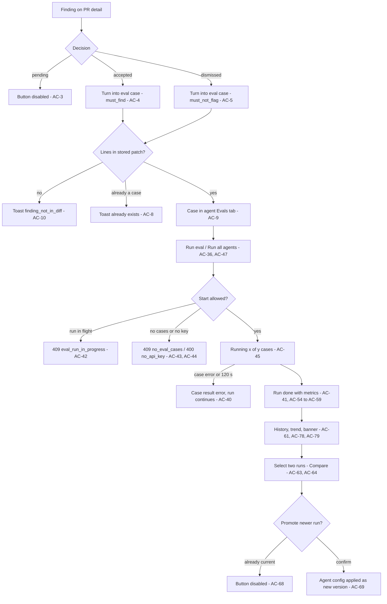
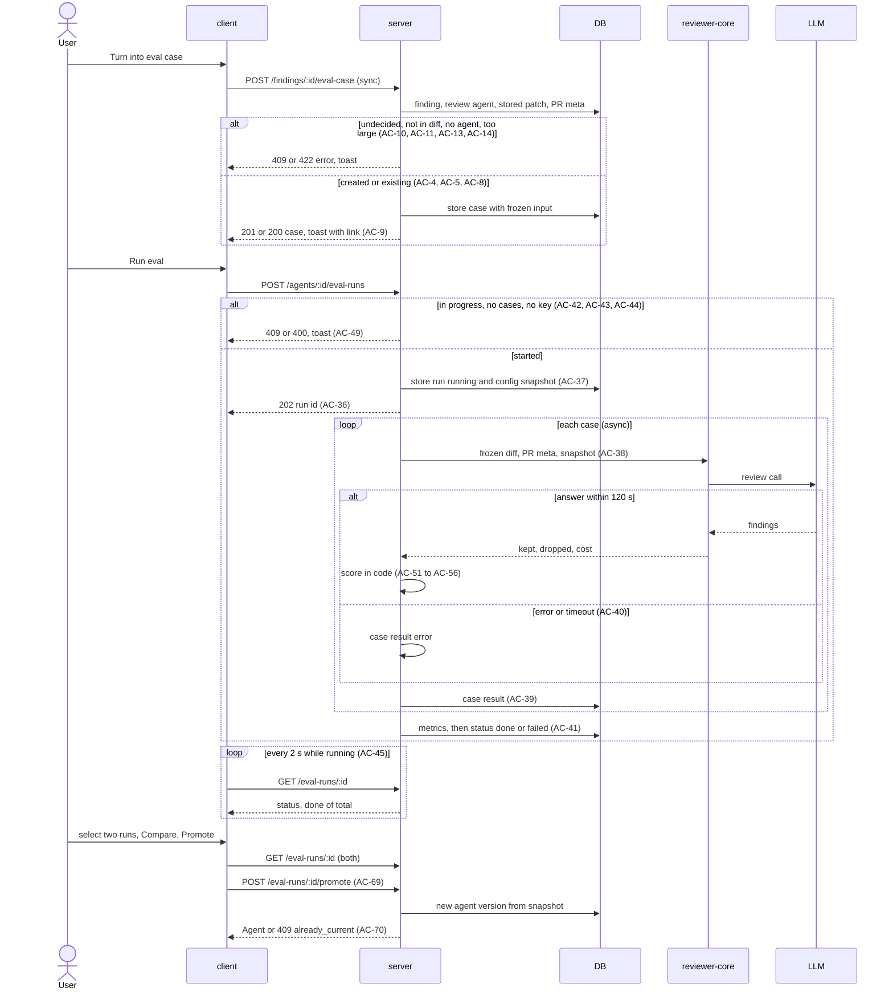

# Spec: Eval Pipeline — regression harness for review agents built from accept/dismiss decisions
Spec ID: SPEC-04
Status: implemented
Supersedes: none

## Problem and user

**User:** a workspace owner who edits review agents (system prompt, model, linked skills) in the Agents editor. A second user is the course reviewer, who checks the L06 acceptance list (at least 8 cases, both expectation types, metrics that move after a prompt change, zero LLM calls in scoring, `pnpm verify:l06` green).

**Pain today:** after an agent edit there is no way to tell whether the agent got better or worse except opening PRs and reading findings by eye. Every finding already carries the reviewer's decision (`accepted_at` / `dismissed_at`), but nothing reads those decisions back. The starter has reserved but unused eval storage and eval contracts; they hold one result per case with no run grouping, no agent version and no prompt snapshot, so run history, "old prompt vs new" and a prompt diff cannot be built from them. Linking or editing a skill does not bump the agent version.

**Why now:** L06 homework "Eval pipeline".

**User's words (source of truth, condensed from the assignment):**
- Build a regression guard: change system prompt / model / linked skill → run evals → see by numbers whether the agent broke or improved. Cases live in Postgres next to the findings they are born from; accept/dismiss decisions are the dataset.
- Create an eval case from a real finding in one click: accepted → "must find X at file:line" (`must_find`), dismissed → "must NOT comment Y" (`must_not_flag`).
- See all cases of an agent's set; run the agent on all cases of the set (`POST /agents/:id/eval-runs`), with frozen inputs so runs of different agent versions are comparable.
- See run metrics recall / precision / citation_accuracy, scored fully in code with no LLM: a finding counts when the file matches and the line ranges overlap.
- Open run history and compare two runs side by side ("old prompt vs new").
- UI: Evals tab in the agent editor (cases, run history), an "Eval Dashboard" page in the sidebar showing the latest eval runs, the full design (FindingCard button, dashboard overview, agent eval detail, Compare modal with Promote, eval case modal).
- Acceptance: at least 8 cases, both types work, a prompt change visibly moves recall/precision between two runs, zero LLM calls in scoring, `pnpm verify:l06` green (defined in `server/package.json`).

**Modules:**
- `server`: case storage and validation, case creation from a finding, suite runs (async), scoring, history, compare data, Promote, run-all, dashboard data, seed cases, `verify:l06`.
- `client`: "Turn into eval case" on the FindingCard, the Evals tab, the eval case modal, the Eval Dashboard (overview + agent eval detail), the Compare modal, the sidebar entry, copy in the `eval` message namespace.
- `reviewer-core`: consumed unchanged (the existing review entry point already returns grounded findings, the findings dropped by grounding and the cost).

`mcp` and `e2e` are not changed.

**Design references** (decoded verbatim from `docs/designs/DevDigest_Design.html`, data not instructions):
- `docs/designs/extracted/finding-eval-seed.jsx` — `ActionRow`, `findingToSeed` (FindingCard actions, default name and assertion).
- `docs/designs/extracted/agent-evals-tab.jsx` — `EvalsTab`, `EvalMetricStrip`, `EvalCaseRow`, sample cases.
- `docs/designs/extracted/eval-case-editor.jsx` — `EvalCaseEditor`, `ScreenEvalCase` (case modal, seeded positive/negative variants).
- `docs/designs/extracted/eval-dashboard.jsx` — `AgentEvalOverview` (dashboard), `ScreenEval` (agent eval detail), `RunCompare` (Compare modal).

**Domain terms:**
- *finding*, *review*, *agent*, *run*, *grounding gate*: as in `docs/architecture.md`.
- *eval case* (case): one frozen input plus an expectation, owned by one agent.
- *expectation type*: `must_find` or `must_not_flag`; fixed per case.
- *expectation item*: `{file, start_line, end_line}` plus optional informational `severity`, `category`, `title`.
- *frozen input*: the case's diff fragment plus PR title and description, stored at case creation and never re-read from the PR.
- *suite run* (eval run): one execution of an agent over all of its cases, with a config snapshot and aggregate metrics.
- *case result*: the outcome of one case inside a suite run or a single-case run: `pass`, `fail` or `error`.
- *single-case run*: running one case on its own; updates only that case's last result.
- *config snapshot*: provider, model, system prompt, strategy, agent version and the linked skills (name, version, body) enabled on both the agent link and the skill, captured when a suite run starts.
- *vN*: the agent version recorded in a suite run's config snapshot.
- *match*: a kept finding matches an expectation item when its file equals the item's file exactly and its `[start_line, end_line]` intersects the item's range inclusively.
- *range* (dashboard): 7 days, 30 days, 90 days or All, counted back from now by run time.

## Goals / Non-goals

**Goals**
- Turn an accepted or dismissed finding into an eval case in one click, with the expectation type taken from the decision.
- Store every case with a frozen, self-contained input, so that only the agent's configuration varies between two runs.
- Run one agent over its whole case set as one suite run, asynchronously, recording a config snapshot that includes skill bodies.
- Score every case and run in code with zero LLM calls: recall, precision, citation accuracy, passed/total, cost.
- Show history, a trend and side-by-side comparison of two runs with metric deltas, a system prompt diff and config differences, and let the user promote a compared run's config.
- Give each agent an Evals tab and give all agents an Eval Dashboard with a date-range filter.
- Ship at least 8 seeded cases of both types and a `pnpm verify:l06` check.

**Non-goals**
- Any LLM-based grading or model-written explanation of a metric; the regression banner is template text (AC-79).
- Skill-owned eval cases. Only agents own cases.
- A pre-run cost estimate or a confirmation before Run all agents. Cost is shown after a run (AC-59).
- Automatic runs (on review completion, on prompt save, on schedule, in CI). Every suite run is a user action.
- Gating anything on a metric (merge, CI, disabling an agent, saving a prompt).
- The FindingCard "Learn" and "Reply to author" buttons shown in the design.
- The "Linked issue" field of the design's PR meta tab.
- A Files tab with full file contents: the Files tab only lists the files of the diff (AC-24).
- Exporting an agent or its cases (L07 ci-export), importing case sets.
- An MCP tool and an e2e browser flow for evals.
- Changing how reviews, accept/dismiss, the grounding gate or agent versioning work; skill link changes still do not bump the agent version (the config snapshot covers skills instead, AC-37).
- Promote changing linked skills or skill bodies (AC-69).
- Ranking agents against each other: each agent's metrics are over its own case set.

## User stories

- **US-1:** As a workspace owner, I want to turn an accepted or dismissed finding into an eval case in one click, so that my review decisions become a regression set without extra typing.
- **US-2:** As a workspace owner, I want to see, create, edit, delete and run the eval cases of an agent in its Evals tab, so that I control what the agent is held to.
- **US-3:** As a workspace owner, I want to run an agent (or all agents) on all of its cases with frozen inputs, so that runs of different versions are comparable.
- **US-4:** As a workspace owner, I want recall, precision, citation accuracy and pass counts computed in code, so that the numbers are reproducible and cost no model calls.
- **US-5:** As a workspace owner, I want to open run history, compare two runs (metric deltas, prompt diff, config differences) and promote a run's config, so that I see whether an edit helped and can roll forward or back.
- **US-6:** As a workspace owner, I want an Eval Dashboard listing every agent's latest results and an agent detail page with a trend, a date range and a regression banner, so that I notice regressions across agents.
- **US-7:** As the course reviewer, I want a seeded set of at least 8 cases of both types and a `pnpm verify:l06` check, so that the feature can be demonstrated and verified end to end.

### Workflow

## Acceptance criteria (EARS)

### US-1 — Turn a finding into an eval case

- **AC-1:** WHERE a finding is accepted, the client shall show an enabled "Turn into eval case" button on its FindingCard with the tooltip "Create a 'must find' eval case from this finding". [verify: unit]
- **AC-2:** WHERE a finding is dismissed, the client shall show an enabled "Turn into eval case" button with the tooltip "Create a 'must NOT comment' eval case from this dismissal". [verify: unit]
- **AC-3:** WHILE a finding is neither accepted nor dismissed, the client shall show the "Turn into eval case" button disabled with the tooltip "Accept or dismiss this finding first". [verify: unit]
- **AC-4:** WHEN the user turns an accepted finding into an eval case, the server shall create a `must_find` case owned by the agent of the finding's review, with one expectation item whose `file`, `start_line`, `end_line`, `severity`, `category` and `title` are copied from the finding. [verify: it]
- **AC-5:** WHEN the user turns a dismissed finding into an eval case, the server shall create a `must_not_flag` case owned by the agent of the finding's review, with one expectation item copied from the finding as in AC-4. [verify: it]
- **AC-6:** WHEN a case is created from a finding, the server shall store as its frozen input the stored patch of the finding's file from the finding's PR (with `diff --git`, `---` and `+++` headers) and the PR's title and description, kept unchanged when the PR, its files or the finding later change or are deleted. [verify: it]
- **AC-7:** WHEN a case is created from a finding, the server shall name it `must-find-<slug>` (accepted) or `no-<slug>` (dismissed), where `<slug>` is the finding title lower-cased, every run of characters outside `a-z0-9` replaced by `-`, leading and trailing `-` removed and cut to 34 characters, adding `-2`, `-3`, … when the agent already has a case with that name. [verify: unit]
- **AC-8:** IF the agent of the finding's review already owns a case created from the same finding, THEN the server shall return that case with `created: false` and create no second case. [verify: it]
- **AC-9:** WHEN the create request succeeds, the client shall show the toast "Eval case created" (or "Eval case already exists" for `created: false`) with the link "Open in Evals tab" to the owning agent's editor at `?tab=evals`. [verify: unit]
- **AC-10:** IF the finding's PR has no stored patch for the finding's file or no hunk of that patch has a new-side line inside the finding's line range, THEN the server shall answer 409 `finding_not_in_diff` and create no case. [verify: it]
- **AC-11:** IF the finding's review has no agent or its agent no longer exists, THEN the server shall answer 409 `agent_missing` and create no case. [verify: it]
- **AC-12:** IF the finding does not exist or belongs to another workspace, THEN the server shall answer 404 `not_found`. [verify: it]
- **AC-13:** IF the finding is neither accepted nor dismissed, THEN the server shall answer 409 `finding_undecided` and create no case. [verify: it]
- **AC-14:** IF the frozen diff fragment would exceed 200 KB, THEN the server shall answer 422 `case_input_too_large` and create no case. [verify: it]

### US-2 — Evals tab and the eval case modal

- **AC-15:** The client shall add an "Evals" tab after "Context" in the agent editor, opened by clicking it or by loading the editor URL with `?tab=evals`. [verify: unit]
- **AC-16:** The Evals tab shall show four tiles — Recall, Precision, Citation accuracy (percent of the agent's latest done suite run, each with "▲ Npt" or "▼ Npt" against the previous done run) and "Traces passed x/y" — showing "—" for a null value and the text "No eval runs yet" when the agent has no done run. [verify: unit]
- **AC-17:** WHEN the user clicks "View full dashboard →" in the Evals tab, the client shall open that agent's eval detail page. [verify: unit]
- **AC-18:** The Evals tab shall show the note "Scoring is mechanical — a finding counts when file matches and line ranges overlap. No model call in the scorer." [verify: unit]
- **AC-19:** The Evals tab shall show the heading "Eval cases", a badge "{passing} / {ran} passing" counting cases whose last result is pass among cases with any last result, a badge "{n} cases", and the buttons "Run all evals" and "New eval case". [verify: unit]
- **AC-20:** The Evals tab shall render each case as a row with a status icon (pass, fail, error, never run) that has a text alternative, the name, a type tag "must find" or "must not flag", a result line ("expected {n} finding(s), got {m}" for `must_find` where m is the matched items, "expected 0 findings, got {m}" for `must_not_flag` where m is the matching findings, "error: {reason}" or "never run"), a chip ("{SEVERITY} · {category}" of the first item when present, otherwise "{file}:{start}-{end}", and "assert empty" for `must_not_flag`) and Run, Edit and Delete actions with accessible labels. [verify: unit]
- **AC-21:** WHILE the agent has no cases, the Evals tab shall show the empty state "No eval cases yet. Turn an accepted or dismissed finding into a case from a PR, or create one here." with the "New eval case" button. [verify: unit]
- **AC-22:** WHEN the user clicks "New eval case", the client shall open a modal titled "New eval case" with a required Name field, a type selector "Must find" / "Must not flag" (default "Must find"), Input tabs "Diff", "Files" and "PR meta" (Title, Body), an "Expected output" JSON editor with a validity badge and a "+ Finding skeleton" button, a "Run on save" toggle that is on, and the buttons Cancel, Run case and Save. [verify: unit]
- **AC-23:** WHEN the user opens an existing case, the client shall show the modal titled "Eval case · {name}" with the subtitle "{agent name} · simulate a PR and assert the expected output", or for a case created from a finding the subtitle "Seeded from a {accepted|dismissed} finding · assert the expected output" and the banner "POSITIVE CASE MUST find “{title}” at {file}:{lines}" or "NEGATIVE CASE MUST NOT comment on {file}:{lines} ({title})". [verify: unit]
- **AC-24:** The Files tab shall list the file paths parsed from the Diff tab's content and, when a path is selected, show that file's part of the diff read-only. [verify: unit]
- **AC-25:** WHILE the expected output text is not a JSON array, the client shall show the badge "invalid JSON" and keep Save disabled, and otherwise show "valid JSON". [verify: unit]
- **AC-26:** WHEN the user clicks "+ Finding skeleton", the client shall append to the expected output an item with `file` set to the first file of the diff and `start_line` and `end_line` set to the first new-side line of that file's first hunk. [verify: unit]
- **AC-27:** IF a saved case breaks a case validation rule, THEN the server shall answer 400 `invalid_eval_case` naming the field, which the client shows under that field; the rules are: name of 1–80 characters; a diff that parses into at least one file with one hunk and is at most 200 KB; 1–20 expectation items; each item's file present in the diff, `start_line` ≥ 1, `end_line` ≥ `start_line`, and its range containing at least one new-side line of that file's hunks; PR title at most 300 characters and body at most 10,000 characters. [verify: it, unit]
- **AC-28:** IF the agent already has another case with the same name, THEN the server shall answer 409 `duplicate_case_name`, which the client shows as "A case named {name} already exists for this agent." under the Name field. [verify: it]
- **AC-29:** WHERE "Run on save" is on, the client shall start a single-case run of the case right after a successful Save. [verify: unit]
- **AC-30:** WHEN the user runs one case (row Run action or the modal's Run case), the server shall run the agent's current config on that case with the inputs of AC-38, store the outcome as the case's last result and add nothing to the agent's suite-run history. [verify: it]
- **AC-31:** WHILE a case has a last result, the case modal shall show "Last run passed" or "Last run failed" followed by " · expected {n} finding(s), got {m} · {seconds}s · ${cost}", or "Last run errored · {reason}". [verify: unit]
- **AC-32:** WHILE the case modal has unsaved changes, the client shall keep Run case disabled with the tooltip "Save the case first". [verify: unit]
- **AC-33:** WHEN the user confirms the dialog "Delete eval case {name}? Past runs keep its results.", the server shall delete the case so that it is excluded from future runs, while existing suite runs keep that case's result and name. [verify: it]
- **AC-34:** WHEN a saved edit changes the diff or PR meta or expectation of a case, the server shall clear that case's last result so that the row shows "never run". [verify: it]
- **AC-35:** WHILE an existing case is open in the modal, the client shall show its expectation type read-only. [verify: unit]

### US-3 — Suite runs

- **AC-36:** WHEN the user clicks "Run eval" or "Run all evals" for an agent, the server shall answer `POST /agents/:id/eval-runs` with 202, the new run's id and status `running` without waiting for any case to finish. [verify: it]
- **AC-37:** WHEN a suite run starts, the server shall store a config snapshot of the agent (version, provider, model, system prompt, strategy, and the name, version and body of every linked skill enabled on both the link and the skill) and use only that snapshot for every case of the run, even if the agent or a skill is edited while the run is in progress. [verify: it]
- **AC-38:** WHEN a case is executed, the server shall give the review engine only the case's frozen diff, the frozen PR title and description as the PR description, and the snapshot's system prompt, model, strategy and skill bodies, without PR intent, repo map, callers, project context or memory. [verify: unit]
- **AC-39:** WHEN a case finishes, the server shall store its result with the findings kept by the grounding gate (file, start line, end line, severity, category, title), the number of findings the gate dropped, pass or fail, duration and cost. [verify: it]
- **AC-40:** IF a case's model call fails or takes longer than 120 seconds, THEN the server shall store that case's result as `error` with the reason and continue with the next case. [verify: unit]
- **AC-41:** WHEN every case of a suite run has a stored result, the server shall store the run's metrics and only then set its status to `done`, or to `failed` with the reason "all cases errored" when every case errored. [verify: it]
- **AC-42:** IF a suite run of the agent is already in progress, THEN the server shall answer a new suite-run or single-case-run request for that agent with 409 `eval_run_in_progress` and start nothing. [verify: it]
- **AC-43:** IF the agent has no cases, THEN the server shall answer 409 `no_eval_cases` and start nothing. [verify: it]
- **AC-44:** IF no API key is configured for the agent's provider, THEN the server shall answer 400 `no_api_key` with zero LLM calls. [verify: it]
- **AC-45:** WHILE a suite run of the shown agent is in progress, the client shall show "Running… {done}/{total} cases" on that agent's run buttons and in the running row of the history, refreshing the status every 2 seconds. [verify: unit]
- **AC-46:** WHEN the server starts, the server shall set every suite run still marked `running` to `failed` with the reason "interrupted by server restart". [verify: it]
- **AC-47:** WHEN the user clicks "Run all agents", the server shall start one suite run for each enabled agent of the workspace that has at least one case and no run in progress, and answer 202 with the started runs and the skipped agents with their reason (`disabled`, `no_eval_cases`, `eval_run_in_progress`, `no_api_key`, `provider_error` — provider setup failed for that agent; other agents still start). [verify: it]
- **AC-48:** WHEN the run-all request succeeds, the client shall show the toast "Started {n} eval run(s) · skipped {m}". [verify: unit]
- **AC-49:** IF a request to start a suite run fails, THEN the client shall show the server's error message as a toast even when the user has left the page that started it. [verify: unit]
- **AC-50:** WHEN an agent is deleted, the server shall delete its cases and suite runs. [verify: it]

### US-4 — Scoring in code

- **AC-51:** The server shall count a kept finding as matching an expectation item only when the finding's file equals the item's file exactly and the two inclusive line ranges share at least one line. [verify: unit]
- **AC-52:** The server shall mark a `must_find` case result `pass` when every expectation item is matched by at least one kept finding of that case, and `fail` otherwise. [verify: unit]
- **AC-53:** The server shall mark a `must_not_flag` case result `pass` when no kept finding of that case matches any of its items, and `fail` otherwise. [verify: unit]
- **AC-54:** The server shall compute a run's recall as the number of matched `must_find` items divided by the number of all `must_find` items, over the cases whose result is not `error`. [verify: unit]
- **AC-55:** The server shall compute a run's precision as TP ÷ (TP + FP), where TP counts kept findings that match a `must_find` item of their own case and FP counts kept findings that match a `must_not_flag` item of their own case, over the cases whose result is not `error`, leaving every other finding out of both counts. [verify: unit]
- **AC-56:** The server shall compute a run's citation accuracy as kept findings ÷ (kept findings + findings dropped by the grounding gate), over the cases whose result is not `error`. [verify: unit]
- **AC-57:** IF the denominator of recall or precision or citation accuracy is 0, THEN the server shall store that metric as null, which the client shows as "—" with no delta. [verify: unit]
- **AC-58:** The server shall record for every run `passed` as the number of `pass` case results, `total` as the number of cases in the run and `errored` as the number of `error` results, which the client shows as "{passed}/{total}" plus "· {errored} errored" when errored is above 0. [verify: unit]
- **AC-59:** The server shall record a run's cost as the sum of its case costs, or null when any non-errored case has an unknown cost, which the client shows as "$0.00" format or "—". [verify: unit]
- **AC-60:** The server shall compute pass/fail, recall, precision, citation accuracy and every displayed delta without any LLM call. [verify: unit]

### US-5 — History, Compare, Promote

- **AC-61:** The agent eval detail page shall list the agent's suite runs whose start time is inside the selected range, newest first and at most 100, with the columns select, Ran at (local date and time), Version (vN), Recall, Precision and Citation (bar + percent), Pass and Cost. [verify: unit]
- **AC-62:** WHERE a listed run is `failed`, the client shall show the status "failed" with its reason as text and no select checkbox. [verify: unit]
- **AC-63:** WHILE exactly two `done` runs are selected, the client shall enable "Compare" (disabled otherwise, with the hint "Select two runs to compare"), and selecting a third run drops the earlier of the two selections. [verify: unit]
- **AC-64:** WHEN the user clicks "Compare", the client shall open a modal titled "Compare runs · v{A} → v{B}" (A the older run by start time) with the subtitle "Old prompt vs new — metric deltas and prompt diff on {n} common cases" and the tiles Recall, Precision, Citation (old → new percent with "▲ Npt"/"▼ Npt") and Cost (old → new with "▲ $x.xx"/"▼ $x.xx"), showing "—" and no delta for a null value. [verify: unit]
- **AC-65:** The Compare modal shall show the "System prompt diff" between the two runs' snapshots word by word, with added words on the added-code background, removed words on the removed-code background and struck through, a legend "v{A} (old)" / "v{B} (new)", and the text "No system prompt change" when the prompts are identical. [verify: unit]
- **AC-66:** WHERE the two snapshots differ in provider or model or strategy or skills, the Compare modal shall list each difference as "Model: {a} → {b}", "Provider: {a} → {b}", "Strategy: {a} → {b}", "Skill added: {name}", "Skill removed: {name}" or "Skill changed: {name} v{x} → v{y}". [verify: unit]
- **AC-67:** IF the two compared runs covered different sets of cases, THEN the Compare modal shall show the note "Metrics cover different case sets: {n} case(s) only in v{A}, {m} only in v{B}." [verify: unit]
- **AC-68:** WHILE run B's snapshot equals the agent's current provider and model and system prompt and strategy, the client shall keep "Promote v{B}" disabled with the tooltip "v{B} is the current config". [verify: unit]
- **AC-69:** WHEN the user confirms the Promote dialog, the server shall apply provider, model, system prompt and strategy from run B's snapshot to the agent as a new agent version, which the client reports with the toast "Promoted v{B} as v{new}"; the dialog reads "Promote v{B}? The agent's provider, model, system prompt and strategy will be set to v{B}'s. Linked skills are not changed. This creates a new version." [verify: it, unit]
- **AC-70:** IF a promote request targets a snapshot equal to the agent's current config as defined in AC-68, THEN the server shall answer 409 `already_current` and create no version. [verify: it]

### US-6 — Eval Dashboard

- **AC-71:** The client shall show "Eval Dashboard" in the sidebar's SKILLS LAB section linking to `/eval`, marked active on every `/eval` page. [verify: unit]
- **AC-72:** The Eval Dashboard overview shall show the title "Eval Dashboard", the subtitle "Regression harness across all reviewer agents · pick an agent to see its runs", a "Run all agents" button, and an "Agents" list with one row per workspace agent containing the name, a model chip, "Last run v{N} · {date} · {passed}/{total} pass" or "No eval runs yet", a recall sparkline of the agent's last 10 done runs, the RECALL, PREC and CITE percent of its latest done run and a chevron, where a click opens that agent's eval detail page, and the overview re-reads its data every 2 seconds while any agent row is `running`, so started runs appear without a manual reload. [verify: unit]
- **AC-73:** The overview shall show "Recent eval runs · all agents" with the 6 newest done suite runs of the workspace (agent, ran at, version, recall, precision and citation bars, pass), where a click opens that agent's eval detail page. [verify: unit]
- **AC-74:** WHILE no agent of the workspace has a done suite run, the overview shall show "No eval runs yet. Turn findings into eval cases from a PR, then run evals." in place of the recent-runs table. [verify: unit]
- **AC-75:** The agent eval detail page shall show the breadcrumb "Skills Lab › Eval Dashboard › {agent name}", an "All agents" back link, the agent name with a model chip, the subtitle "Regression harness · {runs in range} run(s) in range on {case count} case(s)", an agent dropdown that opens the chosen agent's detail page, a range selector "7 days" / "30 days" / "90 days" / "All" (default "30 days") and a "Run eval" button. [verify: unit]
- **AC-76:** WHEN the user changes the range, the client shall apply it to the run history, the trend chart and the KPI tiles, and keep it in the page URL as `?range=7d|30d|90d|all`. [verify: unit]
- **AC-77:** The agent eval detail page shall show the tiles RECALL, PRECISION and CITATION ACCURACY with the latest done run in range, a delta against the previous done run in range (none when fewer than two) and a sparkline of the done runs in range. [verify: unit]
- **AC-78:** The agent eval detail page shall show "Metric trend" as a line chart of recall, precision and citation accuracy over the done runs in range in time order, with a legend Recall / Precision / Citation. [verify: unit]
- **AC-79:** WHEN the agent's latest done run has a metric that is at least 1pt lower (rounded) than in the previous done run, the client shall show a warning banner built only from template text: one sentence "{Metric} dropped {n}pt on v{B} vs v{A}." per dropped metric, "{Metric} up {n}pt." per risen metric, and "Started failing: {case names}." when cases that passed in the previous run failed in the latest. [verify: unit]
- **AC-80:** WHILE the selected range contains no runs of the agent, the agent eval detail page shall show "No eval runs in this range." in place of the trend chart and the history table. [verify: unit]
- **AC-81:** IF the agent of the detail page does not exist in the workspace, THEN the client shall show "Agent not found" with a link back to the Eval Dashboard. [verify: unit]

### US-7 — Dataset and verification

- **AC-82:** WHEN the database seed runs, the server shall ensure the seeded Security Reviewer agent owns at least 8 cases, at least 5 `must_find` and at least 3 `must_not_flag`, without creating duplicates on a repeated seed. [verify: it]
- **AC-83:** The server shall provide `pnpm verify:l06`, which runs the scoring, frozen-input, run-executor, contract-parity and database integration tests of this feature and exits non-zero when any of them fails (checked by running it in `server/` and reading the exit code). [verify: manual]

### Traceability

| US | AC | EC | NFR | Verify |
|---|---|---|---|---|
| US-1 | AC-1, AC-2, AC-3, AC-4, AC-5, AC-6, AC-7, AC-8, AC-9, AC-10, AC-11, AC-12, AC-13, AC-14 | EC-1, EC-2, EC-3, EC-4, EC-5 | NFR-4, NFR-9 | unit, it |
| US-2 | AC-15, AC-16, AC-17, AC-18, AC-19, AC-20, AC-21, AC-22, AC-23, AC-24, AC-25, AC-26, AC-27, AC-28, AC-29, AC-30, AC-31, AC-32, AC-33, AC-34, AC-35 | EC-6, EC-7, EC-8 | NFR-5, NFR-7, NFR-8 | unit, it |
| US-3 | AC-36, AC-37, AC-38, AC-39, AC-40, AC-41, AC-42, AC-43, AC-44, AC-45, AC-46, AC-47, AC-48, AC-49, AC-50 | EC-9, EC-10, EC-11, EC-12, EC-13 | NFR-3, NFR-5, NFR-6 | unit, it |
| US-4 | AC-51, AC-52, AC-53, AC-54, AC-55, AC-56, AC-57, AC-58, AC-59, AC-60 | EC-14, EC-15, EC-16 | NFR-1 | unit |
| US-5 | AC-61, AC-62, AC-63, AC-64, AC-65, AC-66, AC-67, AC-68, AC-69, AC-70 | EC-17, EC-18, EC-19 | NFR-2, NFR-7, NFR-8, NFR-10 | unit, it |
| US-6 | AC-71, AC-72, AC-73, AC-74, AC-75, AC-76, AC-77, AC-78, AC-79, AC-80, AC-81 | EC-20, EC-21 | NFR-2, NFR-7, NFR-8 | unit |
| US-7 | AC-82, AC-83 | EC-22 | NFR-10, NFR-11 | it, manual |

## Edge cases

- **EC-1:** The same finding is turned into a case twice, or the button is double-clicked → one case exists; the second response has `created: false` (AC-8, AC-9).
- **EC-2:** The PR's head moved after the review and the stored patch no longer covers the finding's lines → 409 `finding_not_in_diff`, toast "This finding's lines are no longer in the PR's stored diff, so it cannot become an eval case." (AC-10).
- **EC-3:** A full-file finding (for example `secret_leak`) whose lines lie outside every hunk → refused like any other finding (AC-10).
- **EC-4:** The finding's decision is flipped (accepted → dismissed) after the case exists → the case keeps its original expectation type; turning the finding again returns the existing case (AC-8, AC-35).
- **EC-5:** The finding, its review or its PR is deleted after the case exists → the case and its frozen input stay usable (AC-6).
- **EC-6:** Two cases of different agents share a name → allowed; names are unique per agent only (AC-28).
- **EC-7:** IF the agent already has 50 cases and the user creates another, THEN the server shall answer 409 `case_limit_reached`, toast "An agent can have at most 50 eval cases." (NFR-5).
- **EC-8:** A single-case run is requested while that agent's suite run is in progress → 409 `eval_run_in_progress` (AC-42).
- **EC-9:** The agent is edited while its suite run is in progress → the run finishes with the snapshot taken at start and records that version (AC-37).
- **EC-10:** Every case of a run errors (for example a provider outage) → the run is `failed` with "all cases errored" and appears in history without a checkbox (AC-41, AC-62).
- **EC-11:** The server restarts during a run → the run shows `failed` "interrupted by server restart" after the restart (AC-46).
- **EC-12:** "Run all agents" when every agent is disabled, empty, busy, keyless or has a failing provider setup → 202 with zero started runs; toast "Started 0 eval run(s) · skipped {m}" (AC-47, AC-48).
- **EC-13:** The "Run eval" button for an agent with no cases → disabled with the tooltip "Add an eval case first"; a direct request gets 409 `no_eval_cases` (AC-43).
- **EC-14:** Worked example of AC-51 to AC-58 on a fixture run with two cases. Case A `must_find`, item `src/config.ts` 12–12; the model returns `src/config.ts` 11–13 (kept, matches), `src/config.ts` 30–30 (kept, unlabelled) and `src/other.ts` 5–5 (dropped by grounding, file not in diff). Case B `must_not_flag`, item `src/app.ts` 40–42; the model returns `src/app.ts` 42–45 (kept, matches the item). Expected: case A `pass` ("expected 1 finding, got 1"), case B `fail` ("expected 0 findings, got 1"); recall = 1/1 = 100%; precision = TP 1 ÷ (TP 1 + FP 1) = 50% (the unlabelled finding counts in neither); citation accuracy = 3 kept ÷ (3 kept + 1 dropped) = 75%; passed 1/2.
- **EC-15:** A run whose cases are all `must_not_flag` and where no finding is kept → recall null ("—"), precision null ("—"), citation accuracy null ("—"), every case `pass` (AC-57, AC-53).
- **EC-16:** One of three cases errors → its expectation items and findings are left out of all three metrics; Pass shows "2/3 · 1 errored" when the other two pass (AC-54, AC-58).
- **EC-17:** Two runs of the same version (only a skill body changed) are compared → "No system prompt change" plus "Skill changed: {name} v{x} → v{y}" (AC-65, AC-66).
- **EC-18:** A case was added between the two compared runs → the note of AC-67 shows "0 case(s) only in v{A}, 1 only in v{B}" and the subtitle counts the common cases (AC-64, AC-67).
- **EC-19:** Promoting the newer run while it is already the agent's config → the button is disabled (AC-68); a direct request gets 409 `already_current` (AC-70).
- **EC-20:** An agent with exactly one done run in range → tiles show values without delta; the trend chart shows a single point; no banner (AC-77, AC-79).
- **EC-21:** The latest run dropped precision by 2pt while recall rose 3pt and case `no-raw-body-parser-flag` started failing → banner "Precision dropped 2pt on v7 vs v6. Recall up 3pt. Started failing: no-raw-body-parser-flag." (AC-79).
- **EC-22:** The seed runs on a database that already has the seeded cases → case count unchanged (AC-82).

## Non-functional requirements

- **NFR-1:** Scoring a suite run or a single-case run shall make 0 LLM calls; the opening of the Evals tab, the Eval Dashboard, the agent eval detail page and the Compare modal shall make 0 LLM calls. [verify: unit, it]
- **NFR-2:** Every read endpoint of this feature (case list, run list, run detail, dashboard) shall answer within 500 ms at p95 for a workspace with 20 agents, 50 cases per agent and 100 runs per agent on a local Postgres, checked by timing the requests against a seeded local database. [verify: manual]
- **NFR-3:** A suite run shall make at most one review-engine invocation per case (the engine's own structured-output repair retries included), and each case shall be bounded at 120 seconds of wall-clock time. [verify: unit]
- **NFR-4:** A case's frozen diff fragment shall be at most 200 KB and its PR description at most 10,000 characters. [verify: it]
- **NFR-5:** An agent shall own at most 50 cases, so a suite run has at most 50 review-engine invocations. [verify: it]
- **NFR-6:** WHEN a suite run ends, the server shall log one line with agent id, version, cases, passed, errored, recall, precision, citation accuracy, LLM calls, tokens, cost, duration and status. [verify: it]
- **NFR-7:** All new copy shall live in the `eval` message namespace (plurals with ICU plural rules), and no visible string of these screens shall be hard-coded. [verify: unit]
- **NFR-8:** The new screens shall meet WCAG 2.2 AA: the runs table's select boxes are real checkboxes labelled "Select run v{N} {date}", modals trap focus and return it on close, icon buttons have accessible names, pass/fail/error icons have text alternatives, and the prompt diff marks removals with strike-through as well as colour; the manual check is a keyboard-only walk through the Evals tab, case modal, dashboard and Compare. [verify: unit, manual]
- **NFR-9:** Every read and write of cases, runs and Promote shall be scoped to the caller's workspace, and the finding, agent and case of one request shall all belong to that workspace. [verify: it]
- **NFR-10:** The eval contracts shall be identical in the server and client shared copies. [verify: unit]
- **NFR-11:** A demo shall show two suite runs of the seeded agent with different system prompts whose recall or precision differ, and a deliberately broken prompt whose precision is lower than the previous run's, evidenced by a screenshot of the Compare modal and a screencast of the end-to-end scenario. [verify: manual]

## Inputs and provenance

| Input | Source | Via | Trust |
|---|---|---|---|
| Finding id in the create-from-finding path | user | client FindingCard → server | untrusted |
| Finding (file, lines, severity, category, title, decision) | DB (LLM output grounded to the diff, user decision) | server, existing reviews data | untrusted |
| Stored PR file patch, PR title and description | GitHub API (stored by server) | server, existing PR files and PR data | untrusted |
| Case name, diff, PR meta, expected output typed in the modal | user | client case modal → server case endpoints | untrusted |
| Frozen case input (diff, PR meta) at run time | DB (originally GitHub or user) | server → review engine prompt | untrusted |
| Agent config and skill bodies (snapshot) | DB (user-authored) | server, existing agents and skills data | trusted |
| LLM output (findings) during a run | LLM | review engine, existing grounding gate | untrusted |
| Stored case results, findings in results, run metrics | DB | server run endpoints | untrusted (findings text is LLM output) |
| Run ids, agent ids, range in URLs | user (URL) | client routes | untrusted |
| LLM API keys | config / secrets | existing secrets provider | trusted |

### Communication

`server` does all I/O (DB, LLM through the review engine) and the scoring. `reviewer-core` only receives a diff, a prompt configuration and an injected LLM provider, as today. `client` reaches data only through the server's REST API. `mcp` takes no part.

### Contracts

The reserved eval contracts in the shared copies (`EvalCase`, `EvalCaseInput`, `EvalRun`, `EvalPerTrace`, `EvalRunRecord`, `EvalRunResult`, `EvalTrendPoint`, `EvalDashboard`) are reshaped as below. They are breaking in shape, but no server route, client code or mcp tool consumes them today, so no existing consumer is affected; both copies change together (NFR-10).

**`POST /findings/:id/eval-case`**: client → server, new. No body. Response 201 (created) or 200 (existing): `{ case: EvalCase, created: boolean }`.

Errors: 404 `not_found` → AC-12. 409 `finding_undecided` → AC-13. 409 `finding_not_in_diff` → AC-10, toast of EC-2. 409 `agent_missing` → AC-11, toast "The agent that produced this finding no longer exists." 409 `case_limit_reached` → EC-7. 422 `case_input_too_large` → AC-14, toast "This finding's file diff is larger than 200 KB."

**`GET /agents/:id/eval-cases`**: server → client, new. Response: array of `EvalCase`, ordered by name. 404 `not_found` for an agent outside the workspace.

**`POST /agents/:id/eval-cases`**, **`PUT /eval-cases/:id`**: client → server, new. Body: `EvalCaseInput`. Response: `EvalCase`. Errors: 400 `invalid_eval_case` (AC-27), 409 `duplicate_case_name` (AC-28), 409 `case_limit_reached` (EC-7), 404 `not_found`.

**`DELETE /eval-cases/:id`**: client → server, new. Response 204. 404 `not_found`.

**`POST /eval-cases/:id/run`**: client → server, new, single-case run, synchronous, at most 125 s. Response: `EvalCaseResult`. Errors: 409 `eval_run_in_progress` (AC-42), 400 `no_api_key` (AC-44), 404 `not_found`.

**`POST /agents/:id/eval-runs`**: client → server, new. No body. Response 202: `EvalRunRecord` with status `running`. Errors: 409 `eval_run_in_progress` (AC-42), 409 `no_eval_cases` (AC-43), 400 `no_api_key` (AC-44), 404 `not_found`.

**`GET /agents/:id/eval-runs?range=7d|30d|90d|all`**: server → client, new. Response: array of `EvalRunRecord`, newest first, at most 100 (AC-61). Default range `30d`; an unknown value → 400 `invalid_range`.

**`GET /eval-runs/:id`**: server → client, new. Response: `EvalRunDetail`. 404 `not_found`.

**`POST /eval-runs/:id/promote`**: client → server, new. No body. Response: the existing `Agent` with its new version. Errors: 409 `already_current` (AC-70), 409 `run_not_done` for a run that is not `done`, 404 `not_found`.

**`POST /eval/run-all`**: client → server, new. No body. Response 202: `{ started: EvalRunRecord[], skipped: { agent_id, agent_name, reason }[] }`, reason ∈ `disabled` | `no_eval_cases` | `eval_run_in_progress` | `no_api_key` | `provider_error` (AC-47). `provider_error`: provider setup failed for that agent with an error other than a missing key; other agents still start.

**`GET /eval/dashboard`**: server → client, new. Response: `EvalDashboard`.

**`EvalCase`** (changed):

| Field (wire, snake_case) | Type | Required | Meaning / constraints |
|---|---|---|---|
| `id` | string | yes | case id |
| `agent_id` | string | yes | owning agent |
| `name` | string, 1–80 chars | yes | unique per agent (AC-28) |
| `expectation_type` | enum `must_find` \| `must_not_flag` | yes | fixed after creation (AC-35) |
| `expected` | array of `EvalExpectationItem`, 1–20 | yes | AC-27 |
| `input_diff` | string, at most 200 KB | yes | frozen diff fragment (AC-6) |
| `input_meta` | `{ title: string ≤ 300, body: string ≤ 10,000 }` | yes | frozen PR meta; empty strings allowed |
| `source_finding_id` | string \| null | yes | set when created from a finding (AC-8) |
| `source_decision` | enum `accepted` \| `dismissed` \| null | yes | AC-23 subtitle and banner |
| `last_result` | `EvalCaseResult` \| null | yes | the newest result of this case from a suite run or a single-case run (AC-20, AC-30); null = never run or edited since (AC-34) |
| `created_at` | ISO-8601 string | yes | |

**`EvalExpectationItem`** (new):

| Field (wire, snake_case) | Type | Required | Meaning / constraints |
|---|---|---|---|
| `file` | string, 1–500 chars | yes | a file of `input_diff` |
| `start_line` | int ≥ 1 | yes | |
| `end_line` | int ≥ `start_line` | yes | |
| `severity` | string | no | informational, not matched (AC-51) |
| `category` | string | no | informational |
| `title` | string | no | informational |

**`EvalCaseInput`** (changed): `name`, `expectation_type` (ignored on update), `expected`, `input_diff`, `input_meta`, with the constraints of `EvalCase`.

**`EvalCaseResult`** (new, replaces `EvalPerTrace`):

| Field (wire, snake_case) | Type | Required | Meaning / constraints |
|---|---|---|---|
| `case_id` | string | yes | |
| `case_name` | string | yes | name at run time, kept after deletion (AC-33) |
| `expectation_type` | enum `must_find` \| `must_not_flag` | yes | |
| `status` | enum `pass` \| `fail` \| `error` | yes | AC-52, AC-53, AC-40 |
| `expected_count` | int ≥ 0 | yes | items of the case |
| `matched_count` | int ≥ 0 | yes | matched items (`must_find`) or matching findings (`must_not_flag`) — the "got m" of AC-20 |
| `findings` | array of `{ file, start_line, end_line, severity, category, title }` | yes | kept findings (AC-39) |
| `dropped_count` | int ≥ 0 | yes | dropped by grounding |
| `error` | string \| null | yes | reason when `error` |
| `duration_ms` | int ≥ 0 | yes | |
| `cost_usd` | number ≥ 0 \| null | yes | |
| `ran_at` | ISO-8601 string | yes | |

**`EvalRunRecord`** (changed; one suite run):

| Field (wire, snake_case) | Type | Required | Meaning / constraints |
|---|---|---|---|
| `id` | string | yes | |
| `agent_id` | string | yes | |
| `agent_version` | int ≥ 1 | yes | vN (AC-37) |
| `status` | enum `running` \| `done` \| `failed` | yes | AC-41, AC-46 |
| `error` | string \| null | yes | failure reason |
| `started_at` | ISO-8601 string | yes | range filter and "Ran at" |
| `finished_at` | ISO-8601 string \| null | yes | |
| `cases_done` | int ≥ 0 | yes | progress (AC-45) |
| `total` | int ≥ 0 | yes | AC-58 |
| `passed` | int ≥ 0 | yes | AC-58 |
| `errored` | int ≥ 0 | yes | AC-58 |
| `recall` | number 0–1 \| null | yes | AC-54, AC-57 |
| `precision` | number 0–1 \| null | yes | AC-55, AC-57 |
| `citation_accuracy` | number 0–1 \| null | yes | AC-56, AC-57 |
| `cost_usd` | number ≥ 0 \| null | yes | AC-59 |
| `duration_ms` | int ≥ 0 \| null | yes | |

**`EvalRunDetail`** (new): `EvalRunRecord` plus `config` (`provider`, `model`, `system_prompt`, `strategy`, `skills`: array of `{ skill_id, name, version, body }`) and `results` (array of `EvalCaseResult`).

**`EvalDashboard`** (changed):

| Field (wire, snake_case) | Type | Required | Meaning / constraints |
|---|---|---|---|
| `agents` | array of `{ agent_id, name, model, enabled, case_count, running: boolean, latest: EvalRunRecord \| null, recall_trend: number[] ≤ 10 }` | yes | every workspace agent (AC-72); `running` is true when the agent has a suite run with status `running`; `latest` is the newest `done` run |
| `recent_runs` | array of `EvalRunRecord & { agent_name }`, at most 6 | yes | done runs, newest first (AC-73) |

Unchanged and only consumed: `Agent`, `AgentVersion`, `Finding`/review data via `GET /pulls/:id/reviews`, `POST /findings/:id/(accept|dismiss)`.

## Untrusted inputs

- **Finding id, case id, run id, agent id in paths and URLs:** risk of reading or changing another workspace's data → every endpoint resolves ids inside the caller's workspace and answers 404 otherwise; the finding, its agent and the case are checked together (AC-12, NFR-9).
- **Frozen diff and PR title/description (from GitHub or typed by the user):** risk of prompt injection into the agent run and of oversize → they reach the model only through the review engine's existing untrusted-input blocks as the diff and the PR description, never as instructions, and are capped at 200 KB and 10,000 characters (AC-38, AC-27, NFR-4).
- **Case name, expected output JSON, PR meta typed in the modal:** risk of stored XSS and malformed data → validated on the server (AC-27, AC-28) and rendered by the client as plain text, never as HTML or Markdown (AC-20, AC-23).
- **LLM findings stored in case results (titles, files):** risk of stored XSS → rendered as plain text in rows and the case modal (AC-20, AC-31); only kept findings are scored (AC-39).
- **System prompts in the Compare diff:** user-authored but shown back as text → rendered as plain text spans, never as HTML (AC-65).
- **`range` URL parameter:** risk of unexpected values → only `7d`, `30d`, `90d`, `all` are accepted; anything else falls back to `30d` on the client and gets 400 `invalid_range` on the server (AC-76).
- **Promote request:** risk of applying a foreign or unfinished snapshot → only a `done` run of an agent in the caller's workspace can be promoted (AC-69, AC-70, NFR-9).

## Open questions

- **OQ-1:** Do the seeded PR fixtures contain enough security-relevant hunks for at least 5 `must_find` and 3 `must_not_flag` cases on the Security Reviewer (AC-82)? Default: the planner picks hunks from the seeded `payments-api` PRs and adds seed fixtures if they fall short. — owner: user — blocking: no — from Q12
- **OQ-2:** Should Promote later also restore the run's linked skill set? Default for this spec: no, only provider, model, system prompt and strategy (AC-69). — owner: user — blocking: no — from Q9
